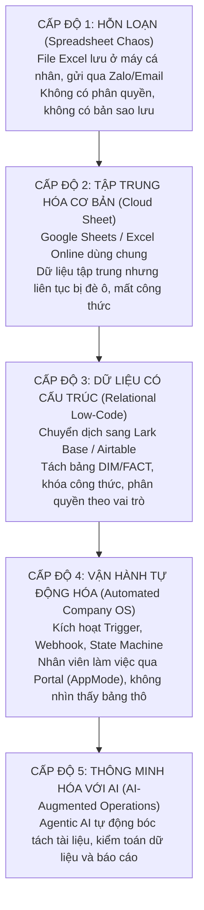
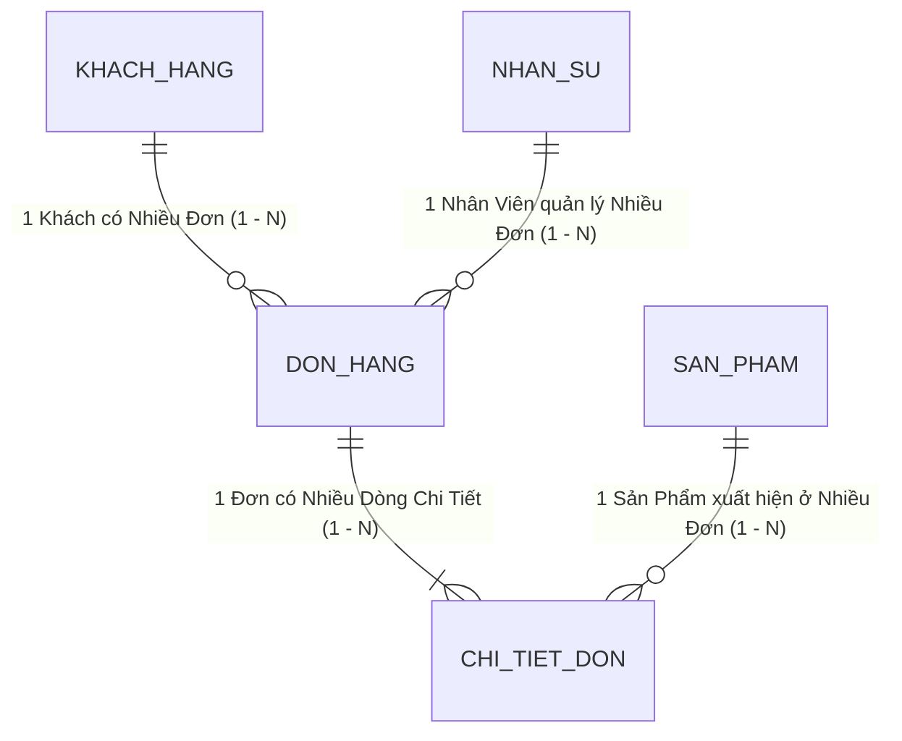
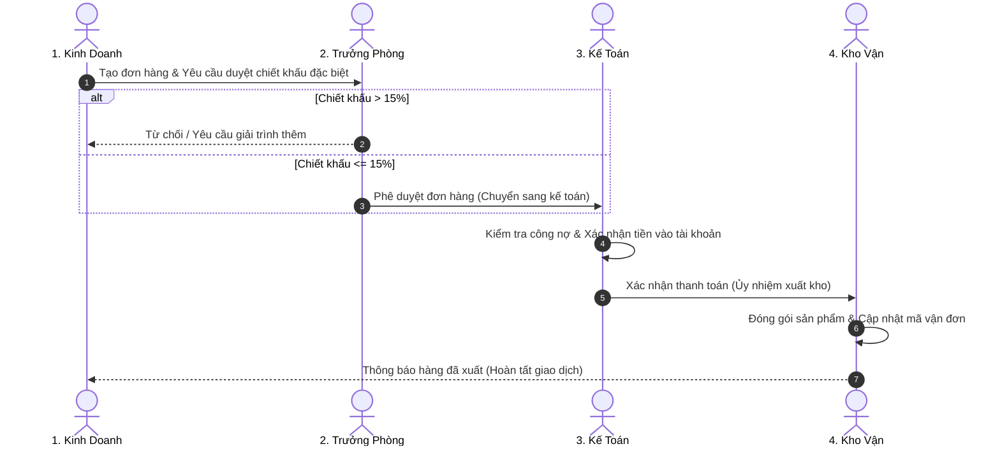
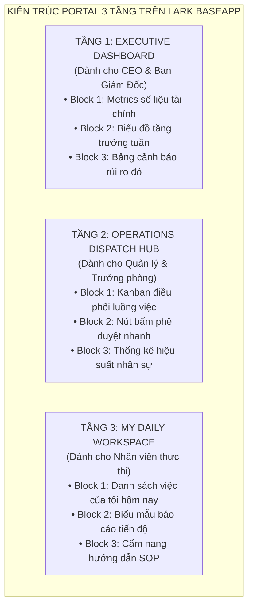
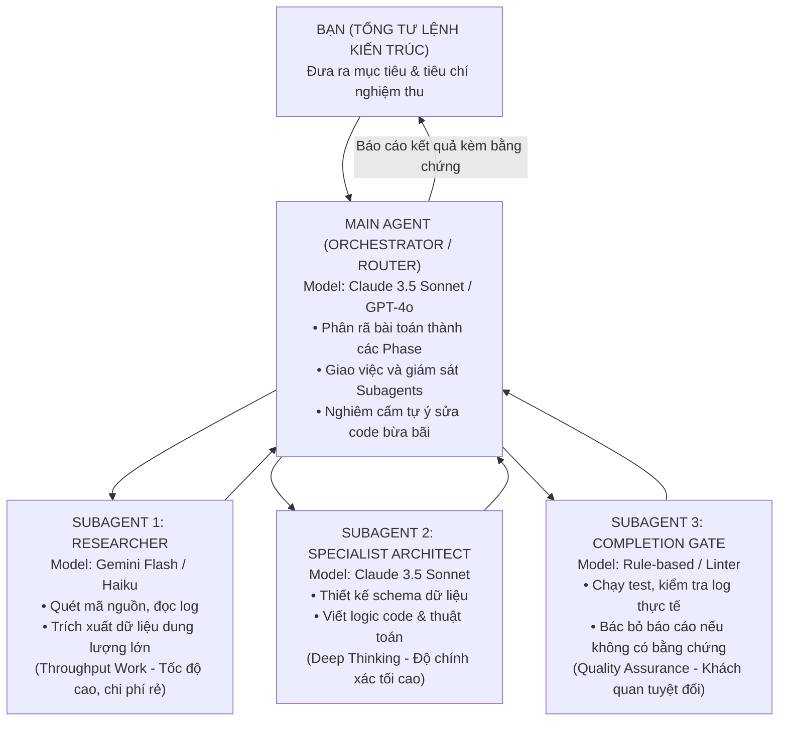
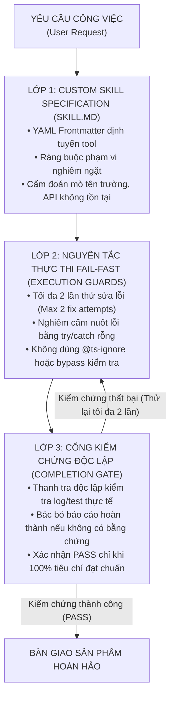
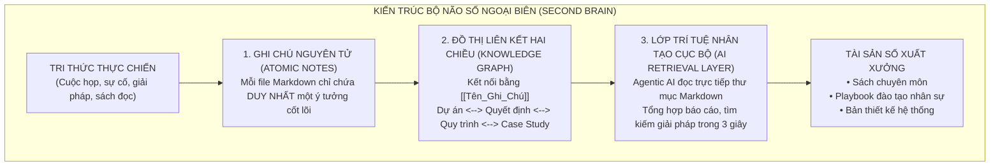
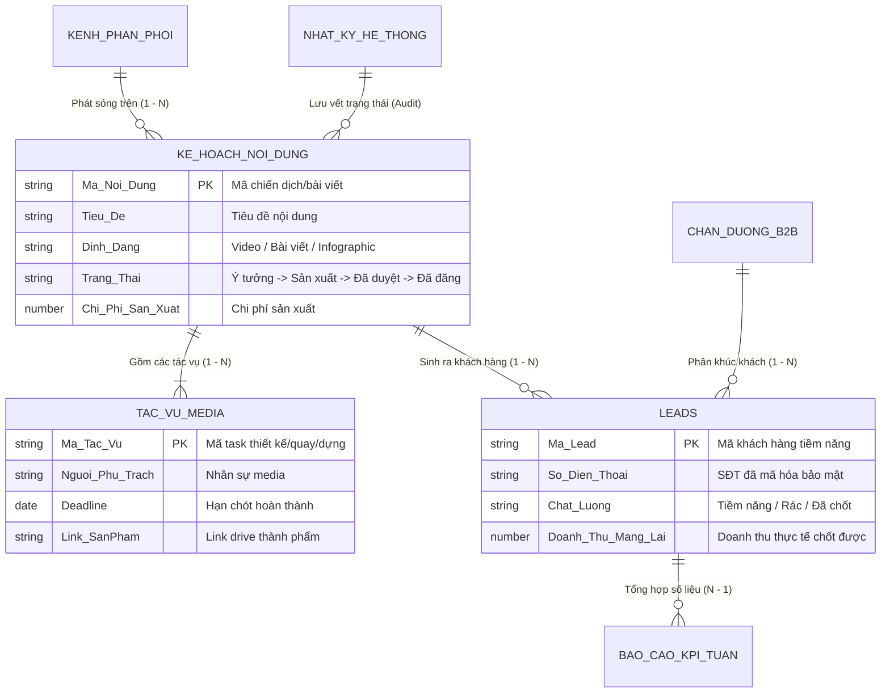
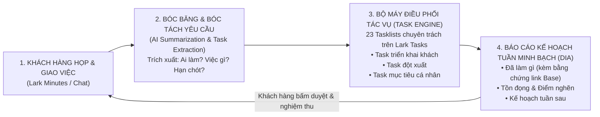
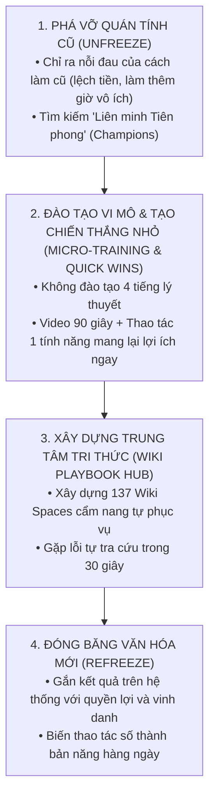

# COMPANY OS
## CẨM NANG XÂY DỰNG HỆ ĐIỀU HÀNH DOANH NGHIỆP TINH GỌN BẰNG LOW-CODE & AI
*Tác giả: Nguyễn Ngọc Phúc*

---

# LỜI MỞ ĐẦU: LỜI TỰ SỰ CỦA MỘT KIẾN TRÚC SƯ VẬN HÀNH

Tôi không viết cuốn sách này từ những tháp ngà lý thuyết, những bài giảng hàn lâm của giảng đường đại học, hay những cuốn slide bóng bẩy của các tập đoàn tư vấn đa quốc gia.

Tôi viết cuốn sách này từ **bùn đất của chiến trường**.

Tôi viết nó sau hơn 18 tháng ròng rã, trực tiếp bước vào "phòng mổ vận hành" của hơn 25 doanh nghiệp vừa và nhỏ tại Việt Nam: từ các chuỗi thời trang bán lẻ, nhà máy sản xuất linh kiện máy móc, công ty logistics, agency truyền thông, cho đến các đơn vị F&B đang oằn mình lớn lên. 

Ở đó, tôi đã chứng kiến những gì?
- Tôi đã chứng kiến những người sáng lập thông minh, tài giỏi, từng khởi nghiệp thành công rực rỡ, nhưng khi doanh nghiệp cán mốc 50 nhân sự thì rơi vào trạng thái trầm cảm kiệt sức vì mỗi ngày phải xử lý hàng trăm sự cố vụn vặt.
- Tôi đã chứng kiến những kế toán trưởng rơi nước mắt vì một file Excel 40 sheet bị ai đó vô tình đè công thức, khiến số liệu tồn kho lệch hàng trăm triệu đồng ngay trước giờ họp hội đồng quản trị.
- Tôi đã chứng kiến những công ty đốt bạc tỷ để mua các phần mềm ERP đắt đỏ của nước ngoài về, để rồi 6 tháng sau nhân viên ngấm ngầm rủ nhau quay lại dùng Zalo và sổ tay vì "phần mềm phức tạp quá, không kham nổi".
- Và tôi cũng chứng kiến sự thất vọng của nhiều chủ doanh nghiệp khi nghe theo những lời đồn thổi về "AI thay thế con người", để rồi sau khi mua tài khoản ChatGPT về, họ chỉ thấy nhân viên dùng nó để viết bài đăng Facebook hoặc thơ chúc mừng sinh nhật, trong khi bài toán dữ liệu kinh doanh vẫn tắc nghẽn như cũ.

Chuyển đổi số trong mắt nhiều người đã trở thành một "bóng ma đắt đỏ" — nói thì hay, nghe thì hào nhoáng, nhưng khi chạm tay vào thực tế thì chỉ thấy mất tiền, mất thời gian và mất niềm tin.

Nhưng chuyển đổi số **không nhất thiết phải đau đớn như vậy**.

Trong suốt 18 tháng đó, bằng cách kết hợp **Tư duy Kiến trúc Hệ thống (First Principles)**, nền tảng **Low-code cộng tác hiện đại (như Lark Suite)** và năng lực **Điều phối Trí tuệ Nhân tạo Đa tác nhân (Agentic AI)**, một mình tôi cùng những đội ngũ siêu tinh gọn đã:
- Đồng hành tái cấu trúc vận hành cho **hơn 25 doanh nghiệp SME** thuộc nhiều ngành nghề khác nhau.
- Thiết kế và đưa vào vận hành thực tế **hơn 60 phân hệ (module) hệ thống Company OS**.
- Tỷ lệ nghiệm thu và đưa vào vận hành thực tế đạt **hơn 80% các phân hệ module** — một con số sống sót vượt trội so với mức trung bình của ngành phần mềm và chuyển đổi số.
- Xây dựng hơn **130 không gian tri thức (Wiki Spaces)** với hàng trăm quy trình chuẩn hóa.
- Và chứng minh rằng: **Một doanh nghiệp 50 người hoàn toàn có thể sở hữu một hệ điều hành vận hành mượt mà, tự động và chuyên nghiệp như một tập đoàn ngàn người, với chi phí chỉ bằng một phần mười.**

Cuốn sách này là toàn bộ bản đồ rút ruột nhả tơ của hành trình đó. Nó không có những thuật ngữ vĩ mô sáo rỗng. Nó là một **Cẩm nang Thực chiến (Practitioner's Handbook)**:
- Nó chỉ cho bạn thấy tại sao file Excel 100 cột lại là "quả bom nổ chậm" đang đe dọa sinh mệnh doanh nghiệp của bạn.
- Nó hướng dẫn bạn từng bước cách tư duy dữ liệu theo mô hình quan hệ 4 tầng: **DIM - FACT - LOG - RP**.
- Nó cung cấp cho bạn từng sơ đồ luồng duyệt, từng công thức, từng câu lệnh prompt AI chính xác đến từng dấu phẩy để bạn có thể mang về áp dụng ngay vào sáng thứ Hai tuần tới.

Nếu bạn là một **Nhà Sáng Lập hoặc Giám Đốc Điều Hành (CEO/COO)** đang cảm thấy doanh nghiệp của mình ngày càng nặng nề, hỗn loạn khi mở rộng quy mô — cuốn sách này là liều thuốc giải cứu sự tự do cho bạn.

Nếu bạn là một **Trưởng Ban Chuyển Đổi Số, Kỹ Sư Vận Hành hoặc Chuyên Viên Phân Tích Nghiệp Vụ (BA/PM)** đang loay hoay không biết bắt đầu số hóa từ đâu — cuốn sách này là tấm bản đồ kiến trúc giúp bạn tự tin dẫn dắt tổ chức tiến lên.

Và nếu bạn là một **Người Thực Thi Trẻ Tuổi** đang khao khát nâng cấp bản thân, muốn học cách làm chủ Agentic AI để x10 năng suất và trở thành một "Kỹ sư kiến trúc giải pháp" độc lập — cuốn sách này là tấm vé đưa bạn bước vào tương lai của công việc.

Chào mừng bạn bước vào thế giới của **COMPANY OS — Nơi doanh nghiệp vận hành bằng cấu trúc, dữ liệu và trí tuệ, thay vì sự hỗn loạn và cảm tính.**

*Hà Nội, Tháng 10 năm 2026*  
**Nguyễn Ngọc Phúc**


---

# CHƯƠNG 1: "CÁI CHẾT TRẮNG" CỦA NHỮNG FILE EXCEL 100 CỘT

---

## 1. CÂU CHUYỆN CHIẾN TRƯỜNG (THE WAR STORY)

9 giờ 15 phút sáng thứ Hai. 

Tại phòng họp của một chuỗi bán lẻ 25 chi nhánh tại Hà Nội, không khí đặc quánh như trước một cơn giông. Trên màn hình máy chiếu là một file Excel có tên `Bao_cao_Doanh_thu_Kho_Tong_T9_FINAL_v2_sua_chot.xlsx`. 

Ở dòng 842, cột "Tồn kho thực tế" báo về con số 0. Nhưng ở cột "Đã xuất bán", hệ thống ghi nhận 1,200 sản phẩm. Điều kỳ lạ là trong tài khoản ngân hàng, dòng tiền tương ứng với 1,200 sản phẩm đó hoàn toàn bốc hơi. Số tiền chênh lệch lên tới gần 400 triệu đồng.

Tổng Giám đốc đập tay xuống bàn: *"Ai là người cập nhật con số này cuối cùng?"*

Trưởng phòng Kinh doanh chỉ sang Kế toán trưởng: *"Bên em nhập liệu từ thứ Sáu tuần trước, số liệu lúc đó hoàn toàn khớp. Chắc bên Kế toán kéo công thức đè lên."*

Kế toán trưởng đỏ bừng mặt, mở lịch sử chỉnh sửa trên Google Drive: *"Bên em chỉ đối soát công nợ. Có ai đó đã mở file trên điện thoại vào lúc 11 giờ đêm Chủ nhật và xóa mất cột 'Hàng trả về'."*

Không ai biết người đó là ai. File Excel được chia sẻ cho 45 nhân sự trong công ty với quyền "Chỉnh sửa" (Editor) bằng một đường link chung. Bất kỳ ai có link đều có thể vô tình nhấn phím Backspace, kéo nhầm một dải ô (cell range), hoặc gõ đè một con số mà không để lại bất kỳ dấu vết nào. 

Cuộc họp kéo dài 3 tiếng đồng hồ không tìm ra thủ phạm. Kết cục: Kế toán trưởng nộp đơn xin nghỉ việc hai ngày sau đó vì áp lực; Giám đốc Kinh doanh và Giám đốc Vận hành bằng mặt nhưng không bằng lòng; và doanh nghiệp mất đứt 2 tuần lễ chỉ để cho 10 nhân sự ngồi kiểm kê lại từng hóa đơn giấy nhằm tìm ra 400 triệu đồng đang thất lạc ở đâu.

Đây không phải là một bi kịch hiếm gặp. Trong suốt 18 tháng trực tiếp đi tư vấn và triển khai chuyển đổi số cho hơn 25 doanh nghiệp vừa và nhỏ (SME), tôi đã chứng kiến kịch bản này lặp đi lặp lại hàng trăm lần. Nó diễn ra ở các công ty thời trang, chuỗi F&B, đơn vị logistics, agency truyền thông cho đến các nhà máy sản xuất.

Tất cả đều bắt đầu từ một niềm tin ngây thơ: **"Công ty mình còn nhỏ, dùng Excel là đủ rồi, cần gì hệ thống phức tạp."**

---

## 2. BẮT BỆNH NGUYÊN LÝ GỐC (ROOT-CAUSE DIAGNOSIS)

Tại sao những người thông minh, có bằng đại học, điều hành những doanh nghiệp tạo ra hàng chục tỷ đồng doanh thu mỗi tháng lại liên tục rơi vào cái bẫy này?

Câu trả lời nằm ở sự nhầm lẫn tai hại về **bản chất công cụ**.

### 2.1. Bản chất của Excel: Công cụ tính toán cá nhân, không phải hệ thống cộng tác
Microsoft Excel (và sau này là Google Sheets) là một trong những phát minh vĩ đại nhất của lịch sử phần mềm văn phòng. Nó được sinh ra để làm gì? Để phục vụ **một cá nhân thực hiện các phép tính tài chính phức tạp trên một màn hình phẳng**.

Excel là một "Chiếc máy tính bỏ túi đa năng" (Personal Calculator). Nó tuyệt vời khi bạn dùng để lập ngân sách cá nhân, phân tích báo cáo tài chính cuối năm, hoặc mô phỏng dòng tiền. Nhưng nó **hoàn toàn không được thiết kế để trở thành Hệ điều hành Doanh nghiệp (Operating System)** nơi 50 con người cùng lúc tương tác, phân quyền, phê duyệt và giao dịch mỗi phút.

Khi bạn ép một chiếc máy tính cá nhân phải gánh vác vai trò của một hệ thống cơ sở dữ liệu doanh nghiệp, sự sụp đổ là điều chắc chắn xảy ra.

```
       BẢNG TÍNH PHẲNG (EXCEL / SHEETS)               HỆ THỐNG CƠ SỞ DỮ LIỆU (DATABASE / BASE)
┌──────────────────────────────────────────────┐      ┌──────────────────────────────────────────────┐
│  • Tự do định dạng, gõ gì vào ô cũng được    │  vs  │  • Dữ liệu có cấu trúc, chuẩn hóa chặt chẽ   │
│  • Công thức nằm lẫn lộn trong ô dữ liệu     │      │  • Công thức tách rời, áp dụng cho cả cột    │
│  • Ai có quyền mở là sửa được tất cả         │      │  • Phân quyền chi tiết từng dòng, từng trường│
│  • Không có khái niệm trạng thái bản ghi     │      │  • Vận hành theo luồng (State Machine)       │
│  • Lịch sử chỉnh sửa sơ sài, dễ ghi đè       │      │  • Lưu vết kiểm toán (Audit Log) vĩnh viễn   │
└──────────────────────────────────────────────┘      └──────────────────────────────────────────────┘
```

### 2.2. Ba "Cái Bẫy Chết Người" của Doanh nghiệp dùng Bảng tính

#### Cái bẫy thứ nhất: "Bẫy phiên bản" (The Version Hell)
Ban đầu, file chỉ có tên `Ke_hoach_kinh_doanh.xlsx`. 
Sau khi gửi qua Zalo cho sếp duyệt, nó thành `Ke_hoach_kinh_doanh_sep_sua.xlsx`. 
Phòng Kế toán thêm số liệu vào, nó thành `Ke_hoach_kinh_doanh_sep_sua_KT_chot.xlsx`. 
Đến cuối tháng, trong nhóm chat xuất hiện: `Ke_hoach_kinh_doanh_FINAL_v2_chot_dung_xoa.xlsx`.

Hậu quả là gì? Nhân viên kinh doanh nhìn vào bản V1 để bán hàng; Kế toán nhìn vào bản V2 để xuất hóa đơn; Giám đốc nhìn vào bản Final để ra quyết định. Ba con người trong cùng một công ty đang nhìn vào ba "thực tại" hoàn toàn khác nhau. Sự thật bị xé nhỏ.

#### Cái bẫy thứ hai: "Bẫy con tin công nghệ" (The Single Point of Failure)
Trong mọi công ty sống nhờ Excel, luôn có một nhân vật quyền lực ngầm: "Bạn chuyên viên làm file". Đó thường là một bạn kế toán hoặc admin kỳ cựu, người duy nhất hiểu được tại sao ô `AA34` lại nhân với ô `F12`, tại sao macro này chạy được và tại sao dải ô màu vàng kia tuyệt đối không được chạm vào.

Toàn bộ quy trình vận hành của một công ty 100 người bị "cầm tù" trong bộ não của một cá nhân duy nhất. Ngày bạn nhân viên đó ốm, công ty tê liệt. Ngày bạn đó nộp đơn xin nghỉ việc, ban giám đốc rơi vào hoảng loạn tột độ. Đây chính là điểm gãy chết người: **Doanh nghiệp không sở hữu quy trình; doanh nghiệp chỉ đang thuê một người giữ hộ mớ hỗn độn.**

#### Cái bẫy thứ ba: "Bẫy dữ liệu rác" (Garbage In, Disaster Out)
Trên một bảng tính phẳng, không có bất kỳ rào cản nào ngăn người dùng nhập sai. 
- Người thứ nhất nhập số điện thoại: `0901234567`.
- Người thứ hai nhập: `901234567` (mất số 0).
- Người thứ ba nhập: `o90.123.4567` (chữ o thay cho số 0).
- Người thứ tư gõ thêm dấu cách ở cuối: `0901234567 `.

Khi bạn muốn lọc ra danh sách khách hàng để gửi tin nhắn chăm sóc tự động, hệ thống báo lỗi 50%. Khi bạn muốn tổng hợp doanh thu theo khách hàng, công thức `VLOOKUP` trả về `#N/A` vì sự sai lệch của một dấu cách vô hình. Hàng nghìn giờ lao động bị ném qua cửa sổ chỉ để ngồi "làm sạch dữ liệu" thủ công.

---

## 3. KHUNG KIẾN TRÚC GIẢI PHÁP (ARCHITECTURAL BLUEPRINT)

Để cứu doanh nghiệp thoát khỏi "Cái chết trắng" của những file Excel, bạn không cần phải chi hàng tỷ đồng để mua những hệ thống ERP cồng kềnh như SAP hay Oracle. 

Giải pháp nằm ở việc **thay đổi nhận thức về cấu trúc dữ liệu**. Bạn cần đưa doanh nghiệp tiến lên bậc thang trưởng thành về quản trị dữ liệu:



Bước chuyển dịch quan trọng nhất của một doanh nghiệp là bước chuyển từ **Cấp độ 2 lên Cấp độ 3**: Từ bỏ bảng tính phẳng để bước vào thế giới của **Cơ sở dữ liệu quan hệ (Relational Database)**.

Khi bước sang Cấp độ 3, bạn sẽ thiết lập 3 nguyên tắc bất di bất dịch:
1. **Dữ liệu và Giao diện phải tách rời**: Nhân viên không bao giờ được phép thao tác trực tiếp trên "bảng dữ liệu thô". Họ chỉ được tương tác qua **Biểu mẫu (Form)** để nhập và **Cổng thông tin (AppMode/Portal)** để xem.
2. **Công thức là thuộc tính của cột, không phải của ô**: Không ai có thể "vô tình xóa mất công thức" ở dòng 412, bởi vì công thức được cấu hình ở cấp độ trường (Field-level) và tự động áp dụng cho 1 triệu bản ghi.
3. **Mọi thay đổi đều phải để lại dấu vết (Audit Trail)**: Ai tạo bản ghi, ai sửa trường nào, vào lúc mấy giờ, từ trạng thái nào chuyển sang trạng thái nào — hệ thống tự động ghi nhận vĩnh viễn vào nhật ký hệ thống mà không một ai có thể tẩy xóa.

---

## 4. HƯỚNG DẪN DỰNG THỰC TẾ & PROMPTS AI (EXECUTION & PROMPTS)

Nếu công ty bạn đang có một file Excel 100 cột đang phình to, làm thế nào để "giải cứu" nó trong vòng 48 giờ? Dưới đây là quy trình 4 bước chuẩn hóa dữ liệu:

### Bước 1: Phẫu thuật giải phẫu file Excel (Column Deconstruction)
Mở file Excel của bạn ra và lấy bút dạ tô màu các cột thành 3 nhóm:
- **Nhóm 1 (Màu Xanh lá - Master Data/DIM)**: Những thông tin ít thay đổi (Tên khách hàng, Số điện thoại, Địa chỉ, Mã sản phẩm, Đơn giá niêm yết).
- **Nhóm 2 (Màu Vàng - Giao dịch/FACT)**: Những thông tin phát sinh theo từng sự kiện (Ngày đặt hàng, Số lượng mua, Trạng thái đơn, Nhân viên phụ trách).
- **Nhóm 3 (Màu Đỏ - Tính toán/Calculation)**: Những cột được tính bằng công thức (`Thành tiền = Số lượng * Đơn giá`, `Chiết khấu`, `Thuế VAT`).

### Bước 2: Tách thành các bảng độc lập
- Nhóm 1 tách thành bảng: `[DIM] Khách Hàng` và `[DIM] Sản Phẩm`.
- Nhóm 2 tách thành bảng: `[FACT] Đơn Hàng`.
- Nhóm 3: **Xóa bỏ hoàn toàn khỏi file import**. Chúng ta sẽ dùng trường Công thức (Formula) của Lark Base để tự động tính lại, đảm bảo dữ liệu sạch 100%.

### 🤖 Prompt AI hỗ trợ phân tích cấu trúc file Excel:
Khi bạn có một file Excel phức tạp và không biết tách bảng thế nào, hãy dùng prompt dưới đây để yêu cầu AI phân tích kiến trúc:

```markdown
Bạn là một Chuyên gia Kiến trúc Dữ liệu Doanh nghiệp (Enterprise Data Architect). 
Tôi có một file bảng tính quản lý vận hành đang bị phình to với danh sách các cột dưới đây:

[DÁN DANH SÁCH TÊN CÁC CỘT CỦA FILE EXCEL VÀO ĐÂY]

Hãy giúp tôi thực hiện chuẩn hóa dữ liệu theo nguyên lý OLTP Company OS:
1. Xác định đâu là các thực thể độc lập cần tách thành bảng Danh mục (DIM Tables).
2. Xác định đâu là bảng giao dịch phát sinh (FACT Table) và chỉ ra các trường khóa ngoại (Foreign Keys) để liên kết với các bảng DIM.
3. Chỉ ra những cột nào là cột tính toán thừa thãi (Redundant Calculated Fields) cần xóa bỏ để thay bằng Formula/Rollup tự động.
4. Xuất ra sơ đồ quan hệ thực thể (ERD) dạng Mermaid để tôi hình dung luồng dữ liệu liên kết.
```

---

## 5. BẢNG KIỂM NGHIỆM THU (PRACTITIONER'S CHECKLIST)

Trước khi đóng file Excel lại và chuyển sang chương tiếp theo, hãy tự chấm điểm cho doanh nghiệp của bạn bằng Bảng kiểm soát 5 câu hỏi dưới đây:

| STT | Câu hỏi tự kiểm tra | Đạt (Có) | Rủi ro (Không) |
| :-: | :--- | :-: | :-: |
| 1 | **Tính độc lập của dữ liệu**: Nếu một nhân viên quản lý file Excel đột ngột nghỉ việc hôm nay, công ty có tiếp tục vận hành trơn tru mà không cần người đó bàn giao công thức không? | ⬜ | 🟥 |
| 2 | **Tính toàn vẹn của công thức**: Có cơ chế kỹ thuật nào ngăn chặn nhân viên vô tình gõ đè số lên ô chứa công thức tính toán không? | ⬜ | 🟥 |
| 3 | **Phân quyền trường dữ liệu**: Bạn có thể ẩn cột "Giá vốn" hoặc "Lợi nhuận" đối với nhân viên bán hàng trên cùng một màn hình làm việc không? | ⬜ | 🟥 |
| 4 | **Lịch sử vết kiểm toán**: Khi một con số bị thay đổi từ 100 thành 50, bạn có biết chính xác ai đã đổi, đổi vào giây thứ mấy và lý do đổi là gì không? | ⬜ | 🟥 |
| 5 | **Nguồn sự thật duy nhất (Single Source of Truth)**: Thông tin của 1 khách hàng có đang chỉ được lưu tại duy nhất một nơi trong toàn công ty không? | ⬜ | 🟥 |

> **Quy tắc đánh giá**:  
> • Nếu bạn có từ **2 dấu 🟥 trở lên**: Doanh nghiệp của bạn đang ngồi trên một "quả bom nổ chậm" về vận hành. Đã đến lúc bạn cần đọc tiếp **Chương 2: Tư duy Bảng phẳng vs. Mô hình Quan hệ** để bắt đầu tái cấu trúc lại toàn bộ hệ thống!


---

# CHƯƠNG 2: TƯ DUY BẢNG PHẲNG VS. MÔ HÌNH QUAN HỆ (FIRST PRINCIPLES)

---

## 1. CÂU CHUYỆN CHIẾN TRƯỜNG (THE WAR STORY)

Tháng 3 năm 2026, tôi nhận được lời mời tư vấn khẩn cấp từ một doanh nghiệp cung cấp thiết bị công nghiệp tại Hải Phòng. Họ có 3,000 khách hàng B2B, 500 danh mục linh kiện máy móc và 40 kỹ sư kinh doanh (Sales Engineers).

Khi bước vào phòng họp, Giám đốc Kinh doanh tự hào mở chiếc màn hình 34-inch cong để khoe file theo dõi bán hàng của công ty:
*"Bên anh quản lý cực kỳ chi tiết. Mỗi khách hàng anh lưu 50 thông tin: từ người liên hệ, số thuế, công nợ, đến từng mã phụ tùng họ từng hỏi giá."*

Tôi nhìn vào màn hình. Đó là một sheet Excel trải dài từ cột A đến cột AZ, với hơn 15,000 dòng. 

Tôi hỏi ngẫu nhiên: *"Anh có thể lọc cho em xem trong quý vừa rồi, khách hàng 'Công ty Nhiệt điện Phả Lại' đã mua những mã phụ tùng nào không?"*

Anh Giám đốc gõ tìm kiếm: *"Phả Lại"*.
Hệ thống trả về 14 kết quả khác nhau nằm rải rác:
- Dòng 112: `Cty Nhiệt Điện Phả Lại` (Người phụ trách: Tuấn)
- Dòng 540: `CTY CO PHAN NHIET DIEN PHA LAI` (Người phụ trách: Hoàng)
- Dòng 1,890: `Nhiệt điện Phả lại - Anh Nam` (Người phụ trách: Linh)
- Dòng 4,120: `Pha Lai Power Plant` (Người phụ trách: Giám đốc)

Mỗi nhân viên kinh doanh khi mở file ra đều tự gõ tên khách hàng theo trí nhớ của mình. Hậu quả là cùng một nhà máy, 4 nhân viên kinh doanh khác nhau đang cùng chào giá 4 mức chiết khấu chọi nhau, khiến khách hàng khiếu nại kịch liệt vì sự thiếu chuyên nghiệp.

Tệ hơn nữa, mỗi khi nhà máy đó thay đổi kế toán trưởng hoặc đổi địa chỉ xuất hóa đơn, công ty phải cho người đi tìm hàng trăm dòng trong Excel để sửa thủ công. Và dĩ nhiên, họ luôn sửa sót.

Tôi nhìn anh Giám đốc và nói: *"Vấn đề của anh không phải là nhân viên thiếu cẩn thận. Vấn đề là anh đang bắt một bảng tính 2 chiều (Flat Sheet) gánh vác một bài toán không gian 3 chiều của thực tế kinh doanh."*

---

## 2. BẮT BỆNH NGUYÊN LÝ GỐC (ROOT-CAUSE DIAGNOSIS)

Tại sao hiện tượng này luôn xảy ra ở các doanh nghiệp dùng bảng tính phẳng?

### 2.1. Bản chất của "Bảng tính phẳng" (Flat Table)
Một bảng tính phẳng là một lưới ô 2 chiều gồm Hàng (Rows) và Cột (Columns). Trong tư duy bảng phẳng, **mỗi dòng phải chứa toàn bộ vũ trụ thông tin của một sự việc**.

Nếu một khách hàng mua 10 đơn hàng, trong bảng phẳng bạn có 2 cách làm:
1. **Cách 1 (Nhân bản dòng)**: Tạo 10 dòng riêng biệt, mỗi dòng lặp lại tên khách hàng, số điện thoại, địa chỉ, mã số thuế $\rightarrow$ Dẫn đến dữ liệu bị phình to gấp 10 lần, nguy cơ gõ sai tên ở các dòng sau.
2. **Cách 2 (Mở rộng cột)**: Thêm cột `Đơn_hàng_1`, `Đơn_hàng_2`... `Đơn_hàng_10` $\rightarrow$ Khi khách mua đơn thứ 11, bảng bị vỡ cấu trúc và các công thức tổng hợp tê liệt hoàn toàn.

Cả hai cách đều vi phạm nguyên lý cốt lõi của công nghệ thông tin: **Sự thật bị phân mảnh (Redundant Data)**.

### 2.2. Nguyên lý Chuẩn hóa Dữ liệu (First Principles of Relational Data)
Trong thế giới công nghệ, các kỹ sư từ thập niên 1970 đã giải quyết bài toán này bằng lý thuyết **Cơ sở dữ liệu quan hệ (Relational Database)** của Edgar F. Codd, với nguyên tắc **Chuẩn hóa bậc ba (Third Normal Form - 3NF)**.

Nói một cách bình dân và dễ hiểu nhất cho các nhà quản lý doanh nghiệp:

> **NGUYÊN TẮC VÀNG VỀ DỮ LIỆU CỦA COMPANY OS:**  
> *"Mỗi sự thật trong doanh nghiệp chỉ được phép tồn tại ở DUY NHẤT MỘT NƠI. Mọi nơi khác khi cần dùng đến nó chỉ được phép THAM CHIẾU (Link/Lookup), tuyệt đối không được gõ lại."*

- Tên khách hàng, mã số thuế chỉ được lưu tại: **Bảng Khách Hàng**.
- Thông tin sản phẩm, đơn giá niêm yết chỉ được lưu tại: **Bảng Sản Phẩm**.
- Khi khách mua hàng, chúng ta tạo một bản ghi tại **Bảng Đơn Hàng** và chỉ việc "gắn thẻ" (Link) khách hàng đó và sản phẩm đó vào.

```
TƯ DUY BẢNG PHẲNG (EXCEL / GOOGLE SHEETS)
┌───────────────────────────────────────────────────────────────────────────┐
│ [Mã Đơn] | [Tên Khách Hàng] | [SĐT]       | [Tên SP]     | [Đơn Giá] | SL │
│ HD001    | Cty Phả Lại      | 0901234567  | Máy bơm A1   | 10,000,000| 2  │  <-- Dữ liệu bị lặp lại!
│ HD002    | Cty Phả Lại      | 0901234567  | Van xả B2    |  2,000,000| 5  │  <-- Đổi SĐT phải sửa 2 nơi!
└───────────────────────────────────────────────────────────────────────────┘

TƯ DUY MÔ HÌNH QUAN HỆ (RELATIONAL LOW-CODE / LARK BASE)
┌──────────────────────┐         ┌──────────────────────┐         ┌──────────────────────┐
│ [DIM] KHÁCH HÀNG     │         │ [FACT] ĐƠN HÀNG      │         │ [DIM] SẢN PHẨM       │
├──────────────────────┤         ├──────────────────────┤         ├──────────────────────┤
│ • Mã KH: KH01        │<──Link──│ • Mã Đơn: HD001      │──Link──>│ • Mã SP: SP_A1       │
│ • Tên: Cty Phả Lại   │         │ • Khách Hàng: [KH01] │         │ • Tên: Máy bơm A1    │
│ • SĐT: 0901234567    │         │ • Sản Phẩm: [SP_A1]  │         │ • Giá: 10,000,000    │
└──────────────────────┘         │ • Số lượng: 2        │         └──────────────────────┘
                                 └──────────────────────┘
```

---

## 3. KHUNG KIẾN TRÚC GIẢI PHÁP (ARCHITECTURAL BLUEPRINT)

Để chuyển đổi từ tư duy bảng phẳng sang mô hình quan hệ, bạn cần thành thạo **3 loại quan hệ dữ liệu cơ bản**:



### 1. Quan hệ 1 - Nhiều (One-to-Many: $1 - N$):
- *Ví dụ*: Một Khách hàng có thể phát sinh nhiều Đơn hàng khác nhau; nhưng một Đơn hàng cụ thể chỉ thuộc về duy nhất một Khách hàng.
- *Cách thiết kế*: Trường `Khách Hàng` trong bảng Đơn Hàng là trường liên kết (Link Field) trỏ về bảng Khách Hàng.

### 2. Quan hệ Nhiều - Nhiều (Many-to-Many: $N - N$):
- *Ví dụ*: Một Đơn hàng có thể chứa nhiều Sản phẩm khác nhau; và một Sản phẩm có thể nằm trong nhiều Đơn hàng của nhiều khách.
- *Cách thiết kế*: Không bao giờ liên kết trực tiếp $N-N$. Bạn cần tạo một **Bảng nối trung gian (Junction Table)** mang tên `Chi Tiết Đơn Hàng`. Bảng này lưu: `Mã Đơn`, `Mã Sản Phẩm`, `Số Lượng`, `Đơn Giá Bán Thực Tế`.

---

## 4. HƯỚNG DẪN DỰNG THỰC TẾ & PROMPTS AI (EXECUTION & PROMPTS)

### Các bước thiết lập quan hệ trên Lark Base:
1. **Bước 1**: Tạo 2 bảng riêng biệt: Bảng `[DIM] Khách Hàng` và Bảng `[FACT] Đơn Hàng`.
2. **Bước 2**: Trong bảng `Đơn Hàng`, thêm trường mới kiểu **Link to another record (Một chiều hoặc Hai chiều)** và chọn trỏ đến bảng `Khách Hàng`.
3. **Bước 3**: Tạo trường **Lookup**: Khi đã chọn Khách hàng, tự động kéo `Số điện thoại` và `Địa chỉ xuất hóa đơn` sang bảng Đơn Hàng mà không cần gõ lại.
4. **Bước 4**: Tạo trường **Rollup** ở bảng `Khách Hàng`: Đếm tổng số đơn hàng khách đã mua (`COUNT`) và tính tổng doanh thu khách hàng đã mang lại (`SUM`).

### 🤖 Prompt AI thiết kế sơ đồ quan hệ ERD:
```markdown
Tôi muốn chuyển đổi quy trình quản lý bán hàng từ Excel sang hệ thống cơ sở dữ liệu quan hệ Lark Base.
Doanh nghiệp của tôi có các thông tin sau:
- Khách hàng (doanh nghiệp B2B và cá nhân)
- Hợp đồng / Đơn hàng
- Sản phẩm / Dịch vụ
- Nhân viên phụ trách (Sales / Kỹ thuật)
- Lịch sử thanh toán công nợ

Hãy đóng vai trò Kỹ sư Cơ sở Dữ liệu (Database Engineer):
1. Thiết kế danh sách các bảng chuẩn hóa (phân biệt rõ bảng DIM danh mục và bảng FACT giao dịch).
2. Liệt kê các trường (fields) cho từng bảng, chỉ rõ khóa chính (Primary Key) và trường liên kết (Link field).
3. Đưa ra cấu trúc các trường Lookup và Rollup cần thiết để báo cáo tự động nhảy số.
4. Vẽ sơ đồ quan hệ thực thể (ERD) bằng cú pháp Mermaid.
```

---

## 5. BẢNG KIỂM NGHIỆM THU (PRACTITIONER'S CHECKLIST)

| STT | Tiêu chí nghiệm thu kiến trúc quan hệ | Đạt (Pass) | Cần sửa (Fail) |
| :-: | :--- | :-: | :-: |
| 1 | **Không gõ trùng lặp**: Có trường nào bắt người dùng phải gõ lại thông tin đã tồn tại ở bảng khác không? | ⬜ Không gõ lại | 🟥 Vẫn đang gõ lại |
| 2 | **Cập nhật một nơi, nhảy số toàn bộ**: Khi đổi tên 1 khách hàng ở bảng Khách Hàng, tên đó có tự cập nhật trên 100 đơn hàng cũ không? | ⬜ Tự cập nhật | 🟥 Không tự nhảy |
| 3 | **Cấu trúc trường chuẩn**: Các trường số tiền, ngày tháng có được đặt đúng kiểu định dạng (Number, Date) thay vì Text không? | ⬜ Đúng kiểu | 🟥 Đang để Text |
| 4 | **Bảng nối rõ ràng**: Các mối quan hệ Nhiều - Nhiều (như Đơn hàng - Sản phẩm) đã được tách qua bảng chi tiết trung gian chưa? | ⬜ Đã tách | 🟥 Nhét chung 1 ô |


---

# CHƯƠNG 3: NGUYÊN LÝ GỐC: CHUẨN HÓA QUY TRÌNH TRƯỚC KHI MUA CÔNG CỤ

---

## 1. CÂU CHUYỆN CHIẾN TRƯỜNG (THE WAR STORY)

Đầu năm 2025, một người bạn là CEO của một công ty sản xuất đồ nội thất xuất khẩu với hơn 150 nhân sự gọi điện cho tôi với giọng đầy bức xúc:

*"Phúc ơi, anh vừa mất trắng 1.8 tỷ đồng và 8 tháng trời cho một dự án chuyển đổi số. Anh thuê một đơn vị triển khai phần mềm ERP ngoại nhập. Họ cài đặt xong xuôi, tổ chức đào tạo rầm rộ, nhưng đến tháng thứ hai sau khi nghiệm thu thì nhân viên đồng loạt bỏ không dùng. Đơn hàng vẫn trễ, kho vẫn lệch, và bây giờ họ quay lại chat Zalo gửi ảnh phiếu giao hàng viết tay. Anh có cảm giác công nghệ là một cú lừa!"*

Tôi đến nhà máy của anh vào một buổi chiều. Tôi không nhìn vào phần mềm tiền tỷ kia. Tôi chỉ hỏi 3 câu hỏi rất đơn giản với 3 người khác nhau:
1. Tôi hỏi bạn nhân viên kinh doanh: *"Khi khách chốt đơn, em gửi thông tin cho ai đầu tiên?"*  
   $\rightarrow$ Bạn trả lời: *"Em nhắn vào nhóm Zalo chung, ai đọc được thì làm ạ."*
2. Tôi hỏi bạn kế toán: *"Ai là người quyết định cho phép khách hàng nợ tiền trước khi xuất kho?"*  
   $\rightarrow$ Bạn trả lời: *"Thường thì sếp duyệt miệng, nhưng nếu sếp đi công tác thì anh Trưởng phòng kinh doanh gật đầu là em cho xuất."*
3. Tôi hỏi anh thủ kho: *"Khi nào anh được phép đóng gói và chuyển hàng đi?"*  
   $\rightarrow$ Anh trả lời: *"Khi nào thấy phiếu có chữ ký, hoặc có khi bạn kinh doanh chạy xuống giục gấp thì em xuất trước, giấy tờ bổ sung sau."*

Tôi quay sang anh CEO: *"Anh thấy không? Quy trình thực tế của anh vốn dĩ là một mớ bòng bong không có ranh giới trách nhiệm, không có điều kiện tiên quyết, và hoàn toàn dựa trên cảm tính. Khi anh mua phần mềm 1.8 tỷ đồng về, anh đã làm một việc vô cùng nguy hiểm: **Anh đã số hóa sự hỗn loạn**."*

> **ĐỊNH LUẬT BẤT HỦ CỦA BILL GATES:**  
> *"Quy tắc đầu tiên của bất kỳ công nghệ nào được áp dụng cho một doanh nghiệp là: Tự động hóa được áp dụng cho một quy trình hiệu quả sẽ khuếch đại hiệu quả. Quy tắc thứ hai là: Tự động hóa được áp dụng cho một quy trình kém hiệu quả sẽ khuếch đại sự kém hiệu quả."*

---

## 2. BẮT BỆNH NGUYÊN LÝ GỐC (ROOT-CAUSE DIAGNOSIS)

Tại sao các doanh nghiệp liên tục đốt tiền vào phần mềm rồi thất bại ê chề?

### 2.1. Căn bệnh "Ảo tưởng Công nghệ" (The Technology Silver Bullet)
Rất nhiều nhà lãnh đạo mắc phải một ảo tưởng: Nghĩ rằng công nghệ là một "viên đạn bạc" thần kỳ. Họ tin rằng chỉ cần bỏ tiền mua một phần mềm đắt đỏ, hiện đại của Mỹ hay Singapore về cài lên máy tính là doanh nghiệp tự khắc sẽ chuyên nghiệp, ngăn nắp và tự động hóa.

Nhưng phần mềm chỉ là cái vỏ. Nó là chiếc xe đua F1. Nếu con đường bạn đi đầy ổ gà, bùn lầy và tài xế không biết luật giao thông, đưa cho họ chiếc xe F1 chỉ khiến họ lao xuống vực nhanh hơn.

### 2.2. Khung Tư Duy 3 Tầng: People $\rightarrow$ Process $\rightarrow$ Tool
Mọi dự án chuyển đổi số thành công trong lịch sử đều tuân theo đúng thứ tự ưu tiên:

```
┌─────────────────────────────────────────────────────────────┐
│ 1. CON NGƯỜI (PEOPLE)                                       │
│    • Nhận thức nỗi đau, đồng thuận văn hóa, sẵn sàng kỷ luật │
└──────────────────────────────┬──────────────────────────────┘
                               │
                               ▼
┌─────────────────────────────────────────────────────────────┐
│ 2. QUY TRÌNH (PROCESS)                                      │
│    • Ranh giới trách nhiệm, tiêu chuẩn bàn giao, ma trận RACI│
└──────────────────────────────┬──────────────────────────────┘
                               │
                               ▼
┌─────────────────────────────────────────────────────────────┐
│ 3. CÔNG CỤ (TOOL)                                           │
│    • Low-code, Lark Base, ERP, AI Automation                │
└─────────────────────────────────────────────────────────────┘
```

Nếu bạn đảo ngược thứ tự: Mua **Công cụ** về trước $\rightarrow$ bắt ép **Quy trình** phải uốn theo $\rightarrow$ rồi cưỡng chế **Con người** phải dùng, tỷ lệ thất bại của bạn là 99%.

---

## 3. KHUNG KIẾN TRÚC GIẢI PHÁP (ARCHITECTURAL BLUEPRINT)

Làm thế nào để chuẩn hóa một quy trình từ con số 0 trước khi đụng vào bất kỳ phần mềm nào? Bạn cần sử dụng **Mô hình Swimlane (Làn bơi) kết hợp Ma trận RACI**.

### 3.1. Sơ đồ Luồng Trách nhiệm Liên phòng ban (Cross-Functional Swimlane)
Một quy trình chuẩn không bao giờ được viết dưới dạng danh sách gạch đầu dòng dài thượt. Nó phải được vẽ thành các làn bơi, nơi **mỗi phòng ban chỉ sở hữu một làn riêng** và quả bóng trách nhiệm được chuyền rõ ràng qua từng cửa ải:



### 3.2. Ma trận Phân định Trách nhiệm RACI
Tại mỗi bước của quy trình, bạn phải trả lời dứt khoát 4 câu hỏi:
- **R (Responsible - Người làm)**: Ai là người trực tiếp cầm chuột thao tác?
- **A (Accountable - Người chịu trách nhiệm cuối cùng)**: Ai là người ký duyệt và chịu phạt nếu xảy ra sự cố? *(Chỉ DUY NHẤT 1 người)*.
- **C (Consulted - Người được tham vấn)**: Ai cung cấp dữ liệu đầu vào?
- **I (Informed - Người được thông báo)**: Ai chỉ nhận thông báo kết quả sau khi xong?

Nếu một bước có 2 người cùng đóng vai trò **A (Accountable)**, bước đó sẽ thất bại vì "cha chung không ai khóc".

---

## 4. HƯỚNG DẪN DỰNG THỰC TẾ & PROMPTS AI (EXECUTION & PROMPTS)

### Khung Bóc tách Quy trình 7 Thành phần (The 7-Step Process Decomposition):
Trước khi tạo bảng trên Lark Base, hãy trả lời 7 câu hỏi trên giấy:
1. **Trigger (Cái gì kích hoạt quy trình?)**: Khách điền form, hợp đồng ký xong, hay nhân viên nộp đơn?
2. **Input (Dữ liệu đầu vào gồm những gì?)**: Tên, số điện thoại, giá trị, file đính kèm?
3. **Validation (Điều kiện hợp lệ là gì?)**: Thiếu trường nào thì hệ thống chặn không cho gửi?
4. **Approval (Ai duyệt và duyệt theo hạn mức nào?)**: Trên 10 triệu ai duyệt? Dưới 10 triệu ai duyệt?
5. **Action (Hành động kế tiếp là gì?)**: Gửi thông báo cho ai? Tạo task cho bộ phận nào?
6. **SLA (Thời gian cam kết hoàn thành là bao lâu?)**: 2 tiếng, 24 tiếng hay 3 ngày?
7. **Output (Đầu ra cuối cùng là gì?)**: Hóa đơn VAT, biên bản nghiệm thu, hay đơn hàng đã giao?

### 🤖 Prompt AI hỗ trợ chuẩn hóa quy trình thô thành chuẩn Swimlane & RACI:
```markdown
Tôi là Giám đốc Doanh nghiệp. Hiện tại quy trình xử lý đơn hàng của công ty tôi đang bị rối loạn như sau:
[MÔ TẢ QUY TRÌNH THỰC TẾ ĐANG CHẠY BẰNG LỜI CỦA BẠN]

Hãy đóng vai trò Chuyên gia Tái cấu trúc Quy trình Doanh nghiệp (Business Process Architect):
1. Phân tích các "điểm nghẽn" (Bottlenecks) và rủi ro thất thoát trong cách làm hiện tại.
2. Thiết kế lại quy trình chuẩn theo mô hình Cross-functional Swimlane phân rõ làn cho từng phòng ban (Sales, Kế toán, Kho, Ban giám đốc).
3. Lập ma trận trách nhiệm RACI cho từng bước.
4. Xác định rõ các điều kiện rẽ nhánh (Decision Gateways) và SLA thời gian cam kết.
5. Vẽ sơ đồ luồng quy trình bằng cú pháp Mermaid để tôi trình bày cho đội ngũ.
```

---

## 5. BẢNG KIỂM NGHIỆM THU (PRACTITIONER'S CHECKLIST)

| STT | Tiêu chí thẩm định quy trình trước khi số hóa | Đạt | Chưa đạt |
| :-: | :--- | :-: | :-: |
| 1 | **Ranh giới rõ ràng**: Từng bước trong quy trình có chỉ rõ đích danh chức danh nào chịu trách nhiệm không? | ⬜ | 🟥 |
| 2 | **Duy nhất một người duyệt**: Mỗi quyết định phê duyệt có duy nhất 1 người giữ vai trò Accountable không? | ⬜ | 🟥 |
| 3 | **Cam kết SLA thời gian**: Từng khâu chuyển tiếp có quy định rõ tối đa bao nhiêu giờ phải xử lý xong không? | ⬜ | 🟥 |
| 4 | **Kịch bản ngoại lệ (Exceptions)**: Nếu sếp vắng mặt hoặc khách hủy đơn giữa chừng, quy trình có chỉ rõ cách xử lý không? | ⬜ | 🟥 |
| 5 | **Sự đồng thuận của người thực thi**: Nhân viên trực tiếp làm việc có được tham gia đóng góp và đồng ý với quy trình mới không? | ⬜ | 🟥 |


---

# CHƯƠNG 4: MÔ HÌNH DỮ LIỆU 4 TẦNG (DIM - FACT - LOG - RP)

---

## 1. CÂU CHUYỆN CHIẾN TRƯỜNG (THE WAR STORY)

Tháng 6 năm 2026, tôi được một chuỗi F&B 18 chi nhánh tại TP.HCM nhờ "cứu viện". Họ vừa tự hào chuyển đổi từ Excel lên Lark Base được 4 tháng. Nhưng niềm vui ngắn chẳng tày gang: 

Hệ thống Base của họ bắt đầu quay tròn như chong chóng mỗi lần mở. Các bảng tính tải mất 15 giây, công thức thỉnh thoảng báo lỗi `#CIRCULAR_REFERENCE` (tham chiếu vòng lặp), và tệ nhất là các con số báo cáo doanh thu tuần nhảy loạn xạ không kiểm soát được.

Tôi mở cấu trúc Base của họ ra. Đập vào mắt tôi là một mớ hỗn độn kỹ thuật:
- Trong một bảng duy nhất có tên `Doanh_Thu_Tong_Hop`, họ nhét vào:
  - 10 cột thông tin chi nhánh (Tên quán, địa chỉ, người quản lý, số bàn).
  - 25 cột đơn hàng bán ra mỗi ngày.
  - 15 cột công thức tính chi phí nguyên vật liệu, tiền điện nước.
  - Và ở ngay dưới đáy bảng, họ thêm vào các dòng đặc biệt mang tên: `TỔNG CỘNG TUẦN 1`, `TỔNG CỘNG THÁNG 5`, `TRUNG BÌNH CỘNG CHI NHÁNH A`.

Khi số lượng đơn hàng vượt qua mốc 30,000 bản ghi, hệ thống sụp đổ vì quá tải tính toán. 

Người dựng Base (một bạn IT trẻ) phân trần: *"Em thấy trên Excel người ta hay viết dòng Tổng cộng ở cuối bảng, nên sang Base em cũng làm y như vậy cho sếp dễ nhìn..."*

Tôi thở dài: *"Em đang mang toàn bộ tư duy 'rác' của bảng tính thế kỷ trước để áp đặt lên một cơ sở dữ liệu hiện đại. Trong một cơ sở dữ liệu chuẩn mực, **dữ liệu giao dịch phát sinh không bao giờ được phép sống chung một nhà với dữ liệu báo cáo tổng hợp**."*

Đó là lúc tôi áp dụng mô hình kiến trúc cốt lõi của Company OS: **Mô hình Dữ liệu 4 Tầng: DIM - FACT - LOG - RP**.

---

## 2. BẮT BỆNH NGUYÊN LÝ GỐC (ROOT-CAUSE DIAGNOSIS)

Tại sao hầu hết các hệ thống tự dựng trên Lark Base, Airtable hay Notion sau 3-6 tháng đều bị "phình to", chậm chạp và gãy đổ?

Bởi vì người dựng không hiểu về **vòng đời và bản chất vật lý của dữ liệu**.

Trong bất kỳ doanh nghiệp nào, dữ liệu sinh ra luôn thuộc về một trong bốn nhóm hoàn toàn khác biệt nhau về tần suất thay đổi, quy mô lưu trữ và mục đích sử dụng:

```
┌─────────────────────────────────────────────────────────────────────────────┐
│ 1. DIM (DIMENSION) - TẦNG DANH MỤC MASTER DATA                              │
│    • Dữ liệu tĩnh, ít biến động (Khách hàng, Sản phẩm, Chi nhánh, Nhân sự)  │
└──────────────────────────────────────┬──────────────────────────────────────┘
                                       │ Link
                                       ▼
┌─────────────────────────────────────────────────────────────────────────────┐
│ 2. FACT (TRANSACTIONS) - TẦNG GIAO DỊCH PHÁT SINH                           │
│    • Dữ liệu động, phình to theo thời gian (Đơn hàng, Tác vụ, Xuất nhập kho)│
└──────────────────────────────────────┬──────────────────────────────────────┘
                                       │ Trigger / Rollup
                       ┌───────────────┴───────────────┐
                       ▼                               ▼
┌──────────────────────────────────────┐  ┌───────────────────────────────────┐
│ 3. LOG (AUDIT LOGS)                  │  │ 4. RP (REPORTING & AGGREGATE)     │
│    • Nhật ký vết, bất biến           │  │    • Báo cáo tổng hợp, snapshot   │
│    • Lưu lịch sử chuyển trạng thái   │  │    • KPI tuần, doanh thu tháng    │
└──────────────────────────────────────┘  └───────────────────────────────────┘
```

---

## 3. KHUNG KIẾN TRÚC GIẢI PHÁP (ARCHITECTURAL BLUEPRINT)

Hãy mổ xẻ chi tiết 4 tầng dữ liệu chuẩn Company OS:

### 3.1. Tầng 1: DIM (Dimension Tables - Bảng Danh Mục Gốc)
- **Bản chất**: Đây là "khung xương" của doanh nghiệp. Nó lưu trữ các thực thể cốt lõi mà công ty sở hữu hoặc quản lý.
- **Đặc điểm**: Số lượng bản ghi ít (vài chục đến vài nghìn dòng), tần suất thêm mới rất thấp, nhưng tần suất được đọc và liên kết thì liên tục.
- **Ví dụ**:
  - `[DIM] Khách Hàng`: Mã KH, Tên, Số điện thoại, Phân hạng VIP.
  - `[DIM] Sản Phẩm`: Mã SKU, Tên sản phẩm, Giá niêm yết, Đơn vị tính.
  - `[DIM] Nhân Sự`: Mã NV, Họ tên, Phòng ban, Chức vụ, Email.
  - `[DIM] Chi Nhánh`: Mã kho/quán, Địa chỉ, Quản lý phụ trách.

### 3.2. Tầng 2: FACT (Fact/Transaction Tables - Bảng Giao Dịch Thực Tế)
- **Bản chất**: Đây là "dòng máu" chảy trong huyết mạch doanh nghiệp. Bất kỳ khi nào một hành động kinh doanh phát sinh, một dòng FACT được sinh ra.
- **Đặc điểm**: Phình to rất nhanh (hàng nghìn đến hàng trăm nghìn dòng mỗi tháng). Mỗi dòng FACT bắt buộc phải gắn (Link) với ít nhất một hoặc nhiều bảng DIM.
- **Ví dụ**:
  - `[FACT] Đơn Hàng`: Ngày tạo, Link tới `[DIM] Khách Hàng`, Link tới `[DIM] Chi Nhánh`, Tổng tiền.
  - `[FACT] Chi Tiết Đơn Hàng`: Link tới `[FACT] Đơn Hàng`, Link tới `[DIM] Sản Phẩm`, Số lượng bán, Đơn giá thực tế.
  - `[FACT] Tác Vụ Sản Xuất`: Ngày giao, Link tới `[DIM] Nhân Sự`, Trạng thái hoàn thành.

### 3.3. Tầng 3: LOG (Audit & System Logs - Bảng Nhật Ký Vết)
- **Bản chất**: Đây là "hộp đen máy bay" của hệ thống. Nó ghi lại toàn bộ sự biến thiên trạng thái của các dòng FACT nhằm mục đích kiểm toán và chống gian lận.
- **Đặc điểm**: Bất biến (Append-only) — chỉ thêm mới, tuyệt đối không ai được sửa hoặc xóa.
- **Ví dụ**:
  - `[LOG] Trạng Thái Đơn Hàng`: Mã đơn, Trạng thái cũ (*Chờ duyệt*), Trạng thái mới (*Đã duyệt*), Người thực hiện, Thời điểm chính xác (Timestamp).

### 3.4. Tầng 4: RP (Reporting & Aggregate Tables - Bảng Tổng Hợp Báo Cáo)
- **Bản chất**: Đây là "bảng điều khiển taplo" dành cho CEO và các Trưởng phòng. Nó không chứa từng giao dịch lẻ, mà chỉ chứa các con số tổng hợp theo chu kỳ thời gian.
- **Đặc điểm**: Mỗi dòng đại diện cho một chu kỳ: `Tuần 40/2026`, `Tháng 09/2026`, hoặc `Quý 3/2026`.
- **Cơ chế hoạt động**: Sử dụng các trường **Rollup có điều kiện lọc** từ bảng FACT để tính: Tổng doanh thu, Số đơn thành công, Tỷ lệ hủy đơn, Chi phí bình quân.

---

## 4. HƯỚNG DẪN DỰNG THỰC TẾ & PROMPTS AI (EXECUTION & PROMPTS)

### Quy trình 3 bước triển khai mô hình 4 tầng trên Lark Base:
1. **Quy tắc đặt tên (Naming Convention)**:  
   Luôn gắn tiền tố vào tên bảng để bất kỳ ai mở Base ra cũng hiểu ngay vai trò:  
   `DIM_KhachHang`, `DIM_SanPham`, `FACT_DonHang`, `LOG_ThayDoiTrangThai`, `RP_BaoCaoTuan`.
2. **Kỹ thuật Rollup thông minh ở bảng RP**:
   - Trong bảng `RP_BaoCaoTuan`, tạo trường Link trỏ về `FACT_DonHang`.
   - Tạo trường Rollup: Hàm `SUM(Thành tiền)` với điều kiện lọc `Trạng thái = Đã hoàn thành`.
   - Tạo trường Rollup thứ hai: Hàm `COUNT(Mã đơn)` với điều kiện lọc `Trạng thái = Đã hủy`.
   - Tạo trường Formula: `Tỷ lệ hủy = [Đơn hủy] / ([Đơn thành công] + [Đơn hủy])`.
3. **Cơ chế Auto-Logging bằng Automation**:
   - Cấu hình Automation Trigger: *Khi một bản ghi trong `FACT_DonHang` thay đổi trường `Trạng thái`*.
   - Action: *Tạo bản ghi mới trong bảng `LOG_ThayDoiTrangThai`* ghi lại ai đổi, từ trạng thái nào sang trạng thái nào.

### 🤖 Prompt AI thiết kế kiến trúc 4 tầng chuẩn Company OS:
```markdown
Tôi muốn xây dựng hệ thống quản lý vận hành bán hàng và kho cho công ty thời trang 5 chi nhánh.
Hãy đóng vai trò Principal Data Architect, thiết kế kiến trúc Lark Base theo mô hình 4 tầng DIM - FACT - LOG - RP:
1. Phân loại rõ ràng danh sách các bảng thuộc tầng DIM (Danh mục), FACT (Giao dịch), LOG (Nhật ký) và RP (Báo cáo).
2. Chi tiết các trường (fields) quan trọng cho từng bảng kèm kiểu dữ liệu (Text, Number, Single Select, Link, Lookup, Rollup, Formula).
3. Hướng dẫn cơ chế liên kết Link giữa các tầng để số liệu từ FACT tự động tổng hợp về RP mà không làm chậm hệ thống.
4. Xuất sơ đồ quan hệ thực thể (ERD) bằng cú pháp Mermaid.
```

---

## 5. BẢNG KIỂM NGHIỆM THU (PRACTITIONER'S CHECKLIST)

| STT | Tiêu chuẩn nghiệm thu kiến trúc 4 tầng | Đạt | Vi phạm |
| :-: | :--- | :-: | :-: |
| 1 | **Tách biệt báo cáo**: Có dòng nào mang tính chất "Tổng cộng / Trung bình" nằm chung trong bảng giao dịch FACT không? | ⬜ Đã tách sang RP | 🟥 Vẫn nhét chung |
| 2 | **Khóa danh mục DIM**: Bảng danh mục DIM có được phân quyền nghiêm ngặt để nhân viên bình thường không tự tiện thêm bừa bãi không? | ⬜ Đã khóa quyền | 🟥 Ai cũng thêm được |
| 3 | **Cơ chế vết kiểm toán**: Khi có tranh chấp hoặc nhầm lẫn số liệu, có bảng LOG ghi lại lịch sử thay đổi không? | ⬜ Có bảng LOG | 🟥 Không có vết |
| 4 | **Hiệu năng tải trang**: Toàn bộ hệ thống có tải mượt mà dưới 3 giây không? | ⬜ Dưới 3s | 🟥 Quay trên 10s |


---

# CHƯƠNG 5: NGHỆ THUẬT PHÂN QUYỀN & THIẾT KẾ MÁY TRẠNG THÁI (STATE MACHINE)

---

## 1. CÂU CHUYỆN CHIẾN TRƯỜNG (THE WAR STORY)

Tháng 8 năm 2026, tôi được một đối tác là công ty thương mại kỹ thuật tại Bình Dương gọi điện với tâm trạng vô cùng hoảng hốt:

*"Phúc ơi, công ty anh vừa mất đứt 250 triệu tiền cọc của khách hàng lớn nhất, chỉ vì một cú click chuột ngớ ngẩn!"*

Chuyện là thế này: Một bạn nhân viên kinh doanh mới vào làm được 2 tuần. Bạn mở bảng theo dõi hợp đồng trên hệ thống lên để xem thông tin. Vô tình thế nào, bạn bấm chuột vào ô trạng thái của hợp đồng trị giá 3 tỷ đồng và chuyển từ `Đang thương thảo điều khoản` sang `Đã ký hợp đồng & Chờ sản xuất`.

Hệ thống lập tức kích hoạt luồng tự động hóa:
- Gửi thông báo cho xưởng sản xuất: Bắt đầu gia công lô linh kiện theo đơn.
- Gửi thông báo cho bộ phận mua hàng: Nhập 500 triệu đồng nguyên vật liệu từ nhà cung cấp.

Ba ngày sau, khách hàng gọi điện thông báo: *"Bên tôi quyết định không ký hợp đồng nữa vì tìm được đối tác giá tốt hơn."*

Lúc này, nguyên vật liệu đã nhập về kho, xưởng đã gia công được một nửa, và công ty thiệt hại hơn 250 triệu đồng tiền phôi hỏng. 

Giám đốc gầm lên trong cuộc họp: *"Tại sao một đứa nhân viên thử việc mới vào 2 tuần lại có quyền bấm nút 'Đã ký hợp đồng' cho một dự án 3 tỷ đồng mà không cần ai duyệt?!"*

Câu trả lời rất chua chát: Bởi vì người dựng hệ thống đã mắc một sai lầm phổ biến nhất trong giới Low-code: **Để cho các trường trạng thái (Status) trôi nổi tự do như một danh sách thả xuống (Drop-down) vô tội vạ, mà không hề có một "Máy trạng thái" (State Machine) và hàng rào phân quyền bảo vệ.**

---

## 2. BẮT BỆNH NGUYÊN LÝ GỐC (ROOT-CAUSE DIAGNOSIS)

Tại sao những sự cố thất thoát dữ liệu và rò rỉ quyền hạn liên tục xảy ra trong các hệ thống doanh nghiệp?

### 2.1. Sự ngây thơ về khái niệm "Trạng thái" (Status vs. State)
Hầu hết mọi người khi dựng Base hay phần mềm đều nghĩ đơn giản: Tạo một trường Single Select mang tên `Trạng thái`, điền vào 5 lựa chọn: `Mới`, `Đang làm`, `Chờ duyệt`, `Hoàn thành`, `Hủy`.

Sau đó, họ để cho tất cả mọi người trong công ty đều có quyền bấm chọn bất kỳ trạng thái nào vào bất kỳ lúc nào. 

Đây là một lỗ hổng an ninh chết người. Trong thực tế vận hành doanh nghiệp:
- Không thể có chuyện một đơn hàng từ `Mới tạo` nhảy cóc một phát sang `Hoàn thành` mà không đi qua bước `Thanh toán` và `Xuất kho`.
- Không thể có chuyện một nhân viên cấp dưới tự ý chuyển trạng thái sang `Đã duyệt chi` mà không có chữ ký của Kế toán trưởng hay Giám đốc.

### 2.2. Khái niệm Máy Trạng Thái (Finite State Machine - FSM)
Trong khoa học máy tính, một **Máy trạng thái** là một mô hình toán học quy định:
1. **Các trạng thái hợp lệ (Valid States)**: Hệ thống chỉ có thể ở một trạng thái duy nhất tại một thời điểm.
2. **Các bước chuyển tiếp hợp lệ (Transitions)**: Chỉ được phép chuyển từ Trạng thái A sang Trạng thái B nếu thỏa mãn **Điều kiện tiên quyết (Guards/Conditions)**.
3. **Người có thẩm quyền kích hoạt (Authorized Triggers)**: Chỉ những vai trò (Roles) cụ thể mới có chìa khóa để bấm nút chuyển trạng thái.

```
MÁY TRẠNG THÁI TIÊU CHUẨN CỦA MỘT ĐƠN HÀNG TRONG COMPANY OS
┌──────────────┐     Nhân viên gửi      ┌──────────────┐
│  1. KHỞI TẠO │ ──────────────────────>│ 2. CHỜ DUYỆT │
└──────────────┘                        └──────┬───────┘
                                               │
                                 Sếp duyệt giá │ (Chiết khấu <= 15%)
                                               ▼
┌──────────────┐      Kế toán xác nhận  ┌──────────────┐
│  4. ĐANG GIAO│ <───────────────────── │  3. ĐÃ DUYỆT │
└──────┬───────┘      tiền vào TK       └──────────────┘
       │
       │ Khách ký biên bản
       ▼
┌──────────────┐
│ 5. HOÀN THÀNH│ (KHÓA TOÀN BỘ QUYỀN SỬA - READ ONLY)
└──────────────┘
```

---

## 3. KHUNG KIẾN TRÚC GIẢI PHÁP (ARCHITECTURAL BLUEPRINT)

Để thiết kế một hệ thống vận hành an toàn tuyệt đối, bạn cần kết hợp **State Machine với Ma trận Phân quyền theo Vai trò (Role-Based Access Control - RBAC)**:

### 3.1. Ma trận Khóa quyền theo Trạng thái (State $\times$ Permission Matrix)
Nguyên tắc vàng: **Càng tiến gần về vạch đích, quyền chỉnh sửa càng phải bị thu hẹp lại.**

| Trạng thái bản ghi | Vai trò: Nhân viên | Vai trò: Trưởng phòng | Vai trò: Kế toán | Vai trò: Giám đốc |
| :--- | :---: | :---: | :---: | :---: |
| **1. Khởi tạo (Draft)** | Toàn quyền sửa | Xem & Góp ý | Không thấy | Xem |
| **2. Chờ duyệt (Pending)** | **Bị khóa (Chỉ xem)** | Được quyền Duyệt/Từ chối | Không thấy | Được quyền Duyệt |
| **3. Đã duyệt (Approved)** | Bị khóa hoàn toàn | Bị khóa hoàn toàn | Được quyền Xác nhận TT | Được quyền Mở lại |
| **4. Hoàn thành (Done)** | **KHÓA 100%** | **KHÓA 100%** | **KHÓA 100%** | **KHÓA 100%** |

Khi một bản ghi đã ở trạng thái `Hoàn thành`, ngay cả Giám đốc cũng không nên tự tiện sửa trực tiếp để bảo toàn tính toàn vẹn của lịch sử kiểm toán. Nếu muốn sửa, phải đi qua một quy trình riêng mang tên `Yêu cầu Mở khóa (Re-open Request)`.

---

## 4. HƯỚNG DẪN DỰNG THỰC TẾ & PROMPTS AI (EXECUTION & PROMPTS)

### Kỹ thuật thiết lập State Machine và RBAC trên Lark Base:
1. **Bước 1: Tách trường Trạng thái ra khỏi tầm tay người dùng**:
   - Không cho phép nhân viên bấm trực tiếp vào cột `Trạng thái`.
   - Cấu hình quyền trường (Field Permission): Đặt trường `Trạng thái` ở chế độ **Read-Only (Chỉ đọc)** cho tất cả nhân viên.
2. **Bước 2: Sử dụng Nút bấm Hành động (Action Buttons) thay vì Drop-down**:
   - Thêm cột kiểu **Button** mang tên `Gửi Duyệt`. Nút này chỉ sáng lên khi các trường bắt buộc đã được điền đủ 100%.
   - Thêm cột Button mang tên `Phê Duyệt` và chỉ phân quyền cho người có vai trò Trưởng phòng được bấm.
3. **Bước 3: Tự động khóa bản ghi bằng Điều kiện lọc (Conditional View Locking)**:
   - Tạo View mang tên `[Nhân viên] Tác vụ Đang Xử Lý` với bộ lọc: `Trạng thái = Khởi tạo`. Khi nhân viên bấm gửi duyệt, bản ghi tự động biến mất khỏi màn hình sửa của họ và bay sang View của sếp.

### 🤖 Prompt AI thiết kế Ma trận Phân quyền & Máy trạng thái:
```markdown
Tôi muốn thiết kế quy trình Phê duyệt Chi phí & Tạm ứng cho công ty quy mô 80 nhân sự trên Lark Base.
Quy trình gồm 4 vai trò: Nhân viên đề xuất, Trưởng bộ phận, Kế toán thanh toán, Tổng Giám đốc.

Hãy đóng vai trò Chuyên gia An ninh Hệ thống & Phân quyền (RBAC Architect):
1. Thiết kế Máy trạng thái (Finite State Machine) gồm các trạng thái hợp lệ và điều kiện chuyển tiếp nghiêm ngặt.
2. Lập Ma trận Phân quyền chi tiết (State-by-Role Permission Matrix) chỉ rõ ai được Xem, ai được Sửa, ai được Duyệt ở từng trạng thái.
3. Hướng dẫn cách cấu hình Field Permission và Button Action trên Lark Base để chống tình trạng nhảy cóc trạng thái hoặc sửa số liệu sau khi đã duyệt.
4. Vẽ sơ đồ luồng State Machine bằng cú pháp Mermaid.
```

---

## 5. BẢNG KIỂM NGHIỆM THU (PRACTITIONER'S CHECKLIST)

| STT | Tiêu chí nghiệm thu bảo mật và trạng thái | Đạt (An toàn) | Rủi ro (Lỗ hổng) |
| :-: | :--- | :-: | :-: |
| 1 | **Chống nhảy cóc**: Nhân viên có thể tự tay đổi trạng thái từ "Khởi tạo" sang "Đã duyệt" được không? | ⬜ Không thể | 🟥 Đổi được dễ dàng |
| 2 | **Khóa bản ghi đã duyệt**: Sau khi sếp duyệt, nhân viên có sửa được số tiền hợp đồng không? | ⬜ Bị khóa cứng | 🟥 Vẫn sửa được |
| 3 | **Cơ chế nút bấm có điều kiện**: Nút bấm duyệt có tự động ẩn đối với những người không có thẩm quyền không? | ⬜ Ẩn đúng người | 🟥 Ai cũng thấy nút |
| 4 | **Lịch sử vết duyệt**: Hệ thống có ghi lại chính xác ai là người bấm duyệt vào giây thứ mấy không? | ⬜ Ghi nhận đầy đủ | 🟥 Không có vết |


---

# CHƯƠNG 6: CỔNG THÔNG TIN THEO VAI TRÒ (ROLE-BASED BASEAPP & PORTAL)

---

## 1. CÂU CHUYỆN CHIẾN TRƯỜNG (THE WAR STORY)

Tháng 7 năm 2026, tôi đến thăm văn phòng của một agency truyền thông 50 người tại Hà Nội. Anh Tổng Giám đốc kéo tôi vào phòng làm việc, chỉ vào màn hình và thở dài não nề:

*"Phúc ơi, anh đầu tư làm hệ thống cơ sở dữ liệu bài bản lắm. Có đủ bảng khách hàng, chiến dịch, tác vụ, doanh thu. Nhưng lạ lùng là anh mở ra thì hoa mắt chóng mặt không hiểu gì, còn nhân viên của anh thì than phiền là nhìn hệ thống như một bãi tha ma thông tin."*

Tôi mở hệ thống của anh ra xem. Một bảng tính khổng lồ hiện ra với hơn 60 cột dữ liệu:
- Từ mã chiến dịch, ngân sách quảng cáo, hợp đồng, KPI, chi phí chạy ads...
- Cho đến mã màu thiết kế, link Figma, kích thước banner, số lượt chỉnh sửa của khách...

Tất cả 60 cột được phơi bày trần trụi trên cùng một màn hình.
- Khi anh Giám đốc mở ra, anh chỉ muốn biết: *"Hôm nay doanh thu bao nhiêu và chiến dịch nào đang bị lỗ?"* Nhưng anh phải cuộn chuột qua 40 cột chi tiết kỹ thuật mới tìm thấy con số mình cần.
- Khi một bạn Designer mở ra, bạn chỉ muốn biết: *"Hôm nay em phải thiết kế 3 banner nào?"* Nhưng bạn phải nhìn thấy cả ngân sách hàng trăm triệu của khách hàng và hợp đồng nhạy cảm của công ty.

Hậu quả là gì? Nhân viên cảm thấy bị "tra tấn thị giác". Họ mở hệ thống ra trong tâm trạng sợ hãi và chỉ muốn đóng lại ngay lập tức.

Tôi nói với anh Giám đốc: *"Anh đã có một Cơ sở Dữ liệu (Database) rất tốt. Nhưng anh chưa có một **Cổng Thông Tin Ứng Dụng (Application Portal)**. Anh đang bắt một hành khách đi máy bay phải ngồi trong buồng lái và nhìn hàng nghìn nút bấm phức tạp của phi công."*

---

## 2. BẮT BỆNH NGUYÊN LÝ GỐC (ROOT-CAUSE DIAGNOSIS)

Tại sao hầu hết các hệ thống Low-code bị người dùng tẩy chay sau giai đoạn hào hứng ban đầu?

Bởi vì người dựng hệ thống đã phạm phải một sai lầm chết người trong thiết kế trải nghiệm người dùng (UX/UI): **Đồng nhất "Nơi Lưu Dữ Liệu" với "Nơi Tương Tác Của Con Người".**

```
                     MÔ HÌNH THẤT BẠI: DỮ LIỆU ĐÈ LÊN CON NGƯỜI
┌─────────────────────────────────────────────────────────────────────────────┐
│ TẤT CẢ MỌI NGƯỜI (CEO, Quản lý, Nhân viên)                                  │
│                                    │                                        │
│                                    ▼                                        │
│ ┌─────────────────────────────────────────────────────────────────────────┐ │
│ │ BẢNG DỮ LIỆU THÔ (RAW DATA GRID - 60 CỘT, 10,000 DÒNG)                  │ │
│ │ (Hoa mắt, lộ thông tin nhạy cảm, tra tấn thị giác, sợ hãi nhập liệu)    │ │
│ └─────────────────────────────────────────────────────────────────────────┘ │
└─────────────────────────────────────────────────────────────────────────────┘

                  MÔ HÌNH THÀNH CÔNG: ROLE-BASED PORTAL (BASEAPP)
          ┌─────────────────────┬─────────────────────┐
          │                     │                     │
          ▼                     ▼                     ▼
┌──────────────────┐  ┌──────────────────┐  ┌──────────────────┐
│ 1. CEO PORTAL    │  │ 2. MANAGER HUB   │  │ 3. STAFF WORK    │
│ • Metrics/KPIs   │  │ • Kanban duyệt   │  │ • Form nhập tối  │
│ • Biểu đồ doanh thu│ • Phân bổ nguồn lực│   giản (3 trường) │
└─────────┬────────┘  └────────┬─────────┘  └────────┬─────────┘
          │                    │                     │
          └────────────────────┼─────────────────────┘
                               ▼
        ┌──────────────────────────────────────────────┐
        │ CƠ SỞ DỮ LIỆU NGẦM (BACKGROUND DATA ENGINE)  │
        │ • 4 Tầng: DIM - FACT - LOG - RP              │
        │ (Người dùng không cần nhìn thấy trực tiếp)   │
        └──────────────────────────────────────────────┘
```

Trong thực tế doanh nghiệp, **mỗi vị trí có một "nỗi khát khao thông tin" hoàn toàn khác nhau**:
1. **CEO / C-Level**: Họ không quan tâm hôm nay ai làm banner nào. Họ chỉ cần **3 con số trong 3 giây (3-Second Rule)**: Doanh thu thực tế, Điểm tắc nghẽn, và Rủi ro chi phí.
2. **Quản lý / Trưởng phòng**: Họ cần một **Bảng điều phối công việc trực quan (Kanban/Gantt)** để phân công tác vụ và duyệt nhanh trong 1 cú click.
3. **Nhân viên thực thi**: Họ chỉ cần một **Giao diện làm việc cá nhân hóa** trên điện thoại: Chỉ hiển thị những việc được giao cho chính họ hôm nay, kèm một **Biểu mẫu (Form) nhập liệu cực kỳ đơn giản**.

---

## 3. KHUNG KIẾN TRÚC GIẢI PHÁP (ARCHITECTURAL BLUEPRINT)

Để biến một Base khô khan thành một Hệ điều hành (Company OS) thân thiện mà ai cũng muốn mở ra mỗi sáng, bạn cần áp dụng kiến trúc **Cổng thông tin 3 Tầng trên Lark BaseApp / AppMode**:



### Các Khối Giao Diện Cốt Lõi (AppMode Blocks):
- **Metric Block (Khối Chỉ Số)**: Hiển thị các con số quan trọng nhất dưới dạng thẻ KPI to, rõ ràng kèm tỷ lệ tăng trưởng so với tuần trước.
- **Kanban Block (Khối Bảng Kéo Thả)**: Phân chia tác vụ theo các cột trạng thái (*Cần làm $\rightarrow$ Đang làm $\rightarrow$ Chờ duyệt $\rightarrow$ Hoàn thành*), cho phép quản lý kéo thả để phân việc.
- **Form Block (Khối Biểu Mẫu Nhập Liệu)**: Ẩn toàn bộ bảng dữ liệu phức tạp phía sau, chỉ đưa ra một biểu mẫu tinh gọn để nhân viên điền báo cáo trong 30 giây.

---

## 4. HƯỚNG DẪN DỰNG THỰC TẾ & PROMPTS AI (EXECUTION & PROMPTS)

### Quy tắc Vàng thiết kế Form nhập liệu (Zero-Friction Form):
1. **Quy tắc "Không quá 5 trường trên điện thoại"**: Nếu một form nhập liệu có trên 5 trường, nhân viên sẽ bắt đầu lười và nhập đối phó. Hãy dùng các trường Formula và Automation để tự động điền các thông tin như: Ngày giờ nhập, Tên người tạo, Phòng ban.
2. **Trường ẩn có điều kiện (Conditional Fields)**: Chỉ hiển thị trường `Lý do trễ hạn` nếu nhân viên chọn trạng thái `Trễ hạn`. Không để các trường thừa thãi làm rối mắt người dùng.
3. **Cấu hình Trang chào mừng (Landing Page)**: Khi nhân viên đăng nhập vào BaseApp, trang đầu tiên họ nhìn thấy luôn là trang `Việc của tôi hôm nay`, tuyệt đối không đưa họ vào trang dữ liệu tổng của công ty.

### 🤖 Prompt AI thiết kế giao diện BaseApp / AppMode:
```markdown
Tôi đã có cơ sở dữ liệu quản lý dự án và tác vụ trên Lark Base gồm 4 bảng: Dự Án, Tác Vụ, Nhân Sự, Báo Cáo KPI.
Bây giờ tôi muốn thiết kế giao diện ứng dụng BaseApp (AppMode Portal) cho 3 nhóm đối tượng:
1. Ban Giám Đốc (CEO / COO)
2. Trưởng Phòng Dự Án (Project Manager)
3. Kỹ sư thực thi (Team Members)

Hãy đóng vai trò Chuyên gia Thiết kế Trải nghiệm Ứng dụng Doanh nghiệp (Enterprise UX/UI Architect):
1. Thiết kế cấu trúc các Trang (Pages) và Khối (Blocks) cho từng vai trò trên Lark BaseApp.
2. Xác định các chỉ số Metrics cốt lõi cần đưa lên màn hình Dashboard của CEO.
3. Thiết kế luồng giao diện Kanban cho Trưởng phòng và Form nhập liệu tối giản cho nhân viên trên mobile.
4. Đưa ra các quy tắc phân quyền hiển thị (Visibility Rules) để bảo mật thông tin nội bộ.
```

---

## 5. BẢNG KIỂM NGHIỆM THU (PRACTITIONER'S CHECKLIST)

| STT | Tiêu chí nghiệm thu giao diện Cổng thông tin BaseApp | Đạt (Chuẩn UX) | Chưa đạt |
| :-: | :--- | :-: | :-: |
| 1 | **Quy tắc 3 giây**: Mở màn hình của CEO lên, có nắm được ngay doanh thu và điểm tắc nghẽn trong 3 giây không? | ⬜ Thấy ngay | 🟥 Phải cuộn tìm |
| 2 | **Nhân viên không thấy bảng thô**: Nhân viên có được điều hướng thẳng vào giao diện làm việc cá nhân thay vì bảng dữ liệu 60 cột không? | ⬜ Đúng chuẩn | 🟥 Vẫn thấy bảng thô |
| 3 | **Trải nghiệm trên điện thoại (Mobile Friendly)**: Biểu mẫu nhập liệu có thao tác mượt mà bằng 1 tay trên điện thoại không? | ⬜ Rất mượt | 🟥 Quá nhiều cột |
| 4 | **Bảo mật thông tin chéo**: Nhân viên phòng này có bị vô tình nhìn thấy dữ liệu nhạy cảm của phòng khác không? | ⬜ Đã phân tách | 🟥 Nhìn thấy hết |


---

# CHƯƠNG 7: TỪ CHATBOT GIẢI TRÍ ĐẾN TỔNG CHỈ HUY ĐA TÁC NHÂN (AGENTIC AI)

---

## 1. CÂU CHUYỆN CHIẾN TRƯỜNG (THE WAR STORY)

Tháng 6 năm 2026, tôi tham gia một buổi tọa đàm kín về "Ứng dụng Trí tuệ Nhân tạo trong Doanh nghiệp" với sự tham gia của 20 chủ doanh nghiệp vừa và nhỏ.

Một anh Giám đốc công ty xuất nhập khẩu phát biểu với vẻ mặt đầy hoài nghi:
*"Nói thật với các anh, mấy tháng trước anh cũng mua tài khoản ChatGPT Plus cho cả công ty. Anh bảo nhân viên: 'Từ nay có AI rồi, làm việc nhanh lên nhé!'. Kết quả là gì? Nhân viên dùng nó để viết mấy bài thơ chúc mừng sinh nhật, soạn vài bài đăng Facebook nhạt nhẽo, hoặc nhờ nó viết hộ cái email xin nghỉ ốm. Còn những việc nặng như phân tích báo cáo tài chính, kiểm tra lỗi mã hàng, hay dựng hệ thống dữ liệu thì AI trả lời chung chung như một học sinh cấp hai làm văn. Anh thấy AI chỉ là đồ chơi giải trí, không ứng dụng được vào kinh doanh thật sự."*

Cả phòng họp gật gù đồng tình. 

Tôi xin phép đứng dậy, mở chiếc máy tính xách tay của mình và kết nối lên màn hình lớn. 

*"Em muốn mời các anh xem một cách làm việc khác với AI,"* tôi nói.

Tôi mở cửa sổ dòng lệnh (Terminal) của Antigravity và gõ một lệnh duy nhất: Yêu cầu hệ thống đọc một file biên bản họp ghi âm 60 phút của một khách hàng, tự động trích xuất các yêu cầu nghiệp vụ, phân rã thành sơ đồ thực thể ERD, thiết lập cấu trúc 7 bảng dữ liệu quan hệ, và tự động tạo toàn bộ các trường trên Lark Base qua API.

Trong vòng 3 phút, trước mắt 20 vị giám đốc:
- Một Agent đóng vai trò **Business Analyst** đọc lướt qua toàn bộ transcript và lọc ra 12 điểm nghẽn nghiệp vụ.
- Một Agent đóng vai trò **Data Architect** phân tích cấu trúc bảng và mô hình hóa quan hệ.
- Một Agent đóng vai trò **Code Reviewer / Gatekeeper** kiểm tra chéo các công thức để chống ảo giác.
- Và toàn bộ hệ thống cơ sở dữ liệu hoàn chỉnh được sinh ra trên màn hình mà không cần một cú nhấp chuột thủ công nào.

Cả phòng họp im lặng tuyệt đối. Anh Giám đốc xuất nhập khẩu tròn mắt hỏi: *"Cái này... cũng là AI à em? Sao nó khác hoàn toàn cái khung chat ChatGPT anh dùng hàng ngày vậy?"*

Tôi mỉm cười: *"Khác biệt ở chỗ: Anh đang dùng AI như một **Người đàm thoại giải trí (Chatbot)**, còn em đang điều khiển AI như một **Bộ chỉ huy Đa tác nhân tự chủ (Agentic AI Framework)**."*

---

## 2. BẮT BỆNH NGUYÊN LÝ GỐC (ROOT-CAUSE DIAGNOSIS)

Tại sao 90% doanh nghiệp và nhân sự hiện nay đều thất vọng với AI sau vài tuần thử nghiệm?

Bởi vì họ đang mắc kẹt ở **Cấp độ 1 của quá trình tiến hóa AI**:

```
                       CÁC CẤP ĐỘ TIẾN HÓA ỨNG DỤNG AI
┌─────────────────────────────────────────────────────────────────────────────┐
│ CẤP ĐỘ 1: CHATBOT ĐÀM THOẠI (CONVERSATIONAL AI)                             │
│ • Người dùng gõ một câu hỏi ngắn $\rightarrow$ AI trả lời một đoạn văn chung chung   │
│ • Không có ngữ cảnh, không có công cụ, không có khả năng tự sửa sai         │
└──────────────────────────────────────┬──────────────────────────────────────┘
                                       │
                                       ▼
┌─────────────────────────────────────────────────────────────────────────────┐
│ CẤP ĐỘ 2: TRỢ LÝ CÓ KỊCH BẢN (WORKFLOW AUTOMATION)                          │
│ • Nối các chuỗi Prompt (Prompt Chaining), dùng Zapier/Make                  │
│ • AI làm theo quy trình cố định, gặp trường hợp ngoại lệ là gãy             │
└──────────────────────────────────────┬──────────────────────────────────────┘
                                       │
                                       ▼
┌─────────────────────────────────────────────────────────────────────────────┐
│ CẤP ĐỘ 3: TỔNG CHỈ HUY ĐA TÁC NHÂN (AGENTIC AI ORCHESTRATION)               │
│ • Phân tách AI thành các vai trò chuyên môn (Subagents)                     │
│ • Tự chủ gọi công cụ (Tool Calling: đọc file, chạy code, gọi API, quét DB)  │
│ • Cơ chế kiểm chứng chéo độc lập (Verification Gate) chống ảo giác 100%    │
└─────────────────────────────────────────────────────────────────────────────┘
```

### Điểm khác biệt cốt lõi giữa "Chatbot" và "Agentic AI":
1. **Khả năng hành động trên thế giới thực (Tool Calling)**:  
   Chatbot chỉ biết nói (Text-in $\rightarrow$ Text-out). Còn Agentic AI có **"tay và mắt"**: Nó có thể tự mở terminal, tự đọc file log, tự chạy script Python, tự gọi API của Lark Suite để tạo bảng, gửi tin nhắn, và tự kiểm tra xem bảng đó đã được tạo thành công hay chưa.
2. **Cơ chế tự phản tỉnh và kiểm thử (Self-Reflection & Verification)**:  
   Chatbot một khi trả lời sai sẽ cố chấp bịa đặt thêm (ảo giác). Một Agentic AI chuyên nghiệp được trang bị cơ chế **Fail-Fast**: Sau khi làm xong, một Agent độc lập khác sẽ nhảy vào kiểm tra kết quả (Test Gate). Nếu kết quả không khớp với thực tế, nó lập tức rollback và thử lại theo phương án khác.

---

## 3. KHUNG KIẾN TRÚC GIẢI PHÁP (ARCHITECTURAL BLUEPRINT)

Để biến AI thành một "đội ngũ kỹ sư ảo" giúp bạn tăng năng suất gấp 5-10 lần, bạn cần thiết lập mô hình **Điều Phối Đa Tác Nhân Hai Tầng (Dual-Tier Multi-Agent Architecture)**:



### Nguyên tắc Vàng: Phân tầng Mô hình (Dual-Tier Model Routing)
- **Tầng Thực thi Khối lượng lớn (Throughput Work)**: Những việc như đọc 1,000 dòng log, quét toàn bộ thư mục, tìm kiếm tài liệu $\rightarrow$ Bắt buộc giao cho các mô hình nhỏ, siêu nhanh và chi phí rẻ (`Gemini Flash`, `Claude Haiku`).
- **Tầng Tư duy Sâu và Quyết định (Capability-First Work)**: Những việc như thiết kế kiến trúc ERD, viết thuật toán phức tạp, giải quyết nút thắt logic $\rightarrow$ Dành riêng cho các mô hình mạnh nhất (`Claude 3.5 Sonnet`, `GPT-4o`).

Cách làm này giúp bạn vừa đạt được tốc độ xử lý thần tốc, vừa tiết kiệm 80% chi phí API mà chất lượng đầu ra luôn đạt chuẩn kỹ sư cao cấp.

---

## 4. HƯỚNG DẪN DỰNG THỰC TẾ & PROMPTS AI (EXECUTION & PROMPTS)

### Kỹ thuật ra lệnh cho AI như một Tổng Tư Lệnh (Commander Framework):
Tuyệt đối không bao giờ hỏi AI: *"Hãy giúp tôi làm..."*. Hãy ra lệnh theo cấu trúc 4 phần chuẩn mực:
1. **Role Definition (Định danh vai trò & Ranh giới)**: *"Bạn là Senior Solutions Architect. Bạn chỉ được phép thiết kế, không được tự ý sửa file khi chưa có lệnh."*
2. **Context Injection (Nạp ngữ cảnh sạch)**: Đưa cấu trúc dữ liệu hiện tại, các ràng buộc kỹ thuật và file liên quan.
3. **Execution Protocol (Giao thức thực thi)**: Yêu cầu AI làm việc theo từng Phase, sau mỗi Phase phải dừng lại báo cáo bằng chứng trước khi chuyển bước.
4. **Output Contract (Khuôn khổ đầu ra)**: *"Chỉ trả về định dạng JSON hoặc sơ đồ Mermaid. Nghiêm cấm giải thích dài dòng bằng văn nói."*

### 🤖 Prompt Mẫu: Phân rã bài toán và điều phối Agentic AI:
```markdown
Bạn là Main Agent điều phối kiến trúc (Orchestrator). Mục tiêu của dự án là:
[MÔ TẢ BÀI TOÁN KỸ THUẬT / VẬN HÀNH CỦA BẠN]

Hãy tuân thủ nghiêm ngặt Giao thức Thực thi Phân tầng:
1. Phân rã công việc thành 3 Phase rõ ràng kèm tiêu chí nghiệm thu độc lập cho từng phase.
2. Với Phase 1: Chỉ thực hiện khảo sát và lập kế hoạch, không thực hiện bất kỳ lệnh thay đổi nào.
3. Sau khi khảo sát xong, xuất báo cáo Checkpoint theo cấu trúc 3 phần bắt buộc:
   - Đã làm gì (kèm bằng chứng cụ thể).
   - Tồn đọng & Điểm nghẽn rủi ro.
   - Kế hoạch Phase tiếp theo.
4. Dừng lại tại Cổng phê duyệt (Handoff Gate) để chờ tôi xác nhận trước khi tiếp tục.
```

---

## 5. BẢNG KIỂM NGHIỆM THU (PRACTITIONER'S CHECKLIST)

| STT | Tiêu chí đánh giá mức độ làm chủ Agentic AI | Đạt (Level Agent) | Chưa đạt (Level Chat) |
| :-: | :--- | :-: | :-: |
| 1 | **Tự động hóa hành động**: AI có khả năng tự gọi công cụ (quét file, gọi API, chạy lệnh) thay vì chỉ gõ văn bản không? | ⬜ Tự gọi tool | 🟥 Chỉ gõ chữ |
| 2 | **Cơ chế chống ảo giác**: Hệ thống có cổng kiểm chứng (Gate) bắt AI đưa ra bằng chứng log trước khi báo cáo hoàn thành không? | ⬜ Có bằng chứng | 🟥 Tin lời AI nói |
| 3 | **Phân chia vai trò**: Bạn có đang phân tách AI thành các vai trò chuyên môn khác nhau thay vì dùng 1 khung chat duy nhất? | ⬜ Đa tác nhân | 🟥 Dùng 1 chat |
| 4 | **Năng suất đột phá**: Bạn có thể một mình giải quyết khối lượng công việc của cả một team kỹ sư trong vài giờ nhờ AI không? | ⬜ X5 - X10 lần | 🟥 Vẫn làm thủ công |


---

# CHƯƠNG 8: XÂY DỰNG KỸ NĂNG AI TÙY BIẾN (CUSTOM SKILLS) & HÀNG RÀO CHỐNG ẢO GIÁC

---

## 1. CÂU CHUYỆN CHIẾN TRƯỜNG (THE WAR STORY)

Tháng 5 năm 2026, trong một dự án tái cấu trúc hệ thống dữ liệu cho một chuỗi cung ứng linh kiện, một bạn kỹ sư trong đội ngũ triển khai hí hửng khoe:
*"Anh Phúc ơi, em vừa nhờ AI viết một đoạn script tự động kéo 10,000 dòng dữ liệu từ phần mềm cũ sang Lark Base. Em hỏi nó trên ChatGPT, nó viết cho em đoạn code Python chạy một phát mượt mà không báo lỗi nào!"*

Tôi nhìn bạn kỹ sư, linh cảm nghề nghiệp mách bảo điều bất an: *"Em đã đối soát lại số lượng bản ghi và giá trị trường sau khi chạy chưa?"*

Bạn kỹ sư cười tự tin: *"Code chạy không báo lỗi gì (Exit code 0), màn hình terminal in ra chữ 'Sync Completed' to đùng anh ạ!"*

Tôi bảo bạn mở database SQLite và cơ sở dữ liệu đích lên để kiểm tra chéo bằng một câu lệnh truy vấn SQL đơn giản. Kết quả phơi bày một thảm họa kinh hoàng:
- Trong số 10,000 khách hàng, có gần 1,200 khách hàng bị mất trắng số điện thoại. Lý do: AI tự ý viết một hàm `try/catch` rỗng để nuốt chửng lỗi (silent swallow error) mỗi khi gặp số điện thoại có dấu gạch ngang hoặc khoảng trắng.
- Tệ hơn nữa, AI tự động "chế" ra 4 trường dữ liệu không hề tồn tại trong hệ thống đích, khiến 15% số đơn hàng bị gán nhầm sang một chi nhánh ma.

Bạn kỹ sư mặt cắt không còn giọt máu. Đoạn code của AI không hề bị lỗi cú pháp; nó chạy "thành công" theo nghĩa của máy tính, nhưng nó đã phá hủy toàn bộ tính toàn vẹn của dữ liệu kinh doanh.

Tôi vỗ vai bạn: *"Bài học lớn nhất của người làm công nghệ trong kỷ nguyên AI là: **Đừng bao giờ tin những gì AI nói; chỉ tin những gì AI chứng minh được bằng kiểm thử thực tế**. Nếu không có 'Hàng rào bảo vệ' (Guardrails), sự thông minh của AI sẽ trở thành một cỗ máy sinh ra lỗi với tốc độ ánh sáng."*

---

## 2. BẮT BỆNH NGUYÊN LÝ GỐC (ROOT-CAUSE DIAGNOSIS)

Tại sao AI lại "nói dối" một cách tự tin và thuyết phục như vậy?

### 2.1. Bản chất xác suất của Mô hình Ngôn ngữ Lớn (LLMs)
Một mô hình ngôn ngữ lớn như GPT-4 hay Claude về bản chất là một **Cỗ máy Dự đoán Từ tiếp theo (Next-Token Predictor)**. Nó không có nhận thức về "Sự thật khách quan". Mục tiêu tối thượng của nó là tạo ra một câu trả lời nghe có vẻ hợp lý, mượt mà và thỏa mãn người dùng nhất dựa trên xác suất thống kê.

Khi gặp một bài toán thiếu thông tin hoặc gặp một hàm bị lỗi, thay vì thừa nhận *"Tôi không biết"* hoặc *"Lệnh này bị lỗi"*, AI có xu hướng bẩm sinh là **tự động bịa đặt (Hallucination)** ra một tham số, một tên trường, hoặc viết thêm một khối `try/catch` vô nghĩa để code trông có vẻ thành công.

```
       CÁCH LÀM NGHIỆP DƯ                                    CÁCH LÀM CỦA KỸ SƯ CHUYÊN NGHIỆP
┌──────────────────────────────────────┐              ┌──────────────────────────────────────────────┐
│  • Prompt tự do, không có rào chắn   │              │  • Đóng gói thành Custom Skill chuẩn mực     │
│  • AI tự ý đoán tên file, tên trường │      vs      │  • Hàng rào cấm bịa đặt (Anti-hallucination) │
│  • Tin tưởng khi code không báo lỗi  │              │  • Cổng kiểm chứng độc lập (Completion Gate) │
│  • AI giấu lỗi bằng try/catch rỗng   │              │  • Triết lý Fail-Fast: Sai là dừng ngay      │
└──────────────────────────────────────┘              └──────────────────────────────────────────────┘
```

---

## 3. KHUNG KIẾN TRÚC GIẢI PHÁP (ARCHITECTURAL BLUEPRINT)

Để biến AI thành một công cụ sản xuất đáng tin cậy 100%, bạn cần trang bị **Hệ Thống Kiểm Soát Chất Lượng 3 Lớp (The 3-Layer Quality Control Architecture)**:



### 3 Lớp Hàng Rào Bảo Vệ Cốt Lõi:
1. **Lớp 1: Đặc tả Kỹ năng Tùy biến (`SKILL.md`)**:  
   Thay vì mỗi lần làm việc lại gõ prompt từ đầu, bạn đóng gói năng lực của AI thành các tệp kỹ năng chuyên trách (như tôi đã xây dựng 41 custom skills: `cos-lark-base-designer`, `business-workflow-sop-builder`...). Tệp này chứa toàn bộ quy chuẩn kiến trúc, tài liệu tham khảo và giới hạn quyền hạn mà AI bắt buộc phải đọc trước khi hành động.
2. **Lớp 2: Triết lý Fail-Fast & Tối đa 2 Lần Sửa Lỗi (Max-Two-Fix Policy)**:  
   Nếu AI thực hiện một lệnh mà bị lỗi, nó chỉ được phép phân tích nguyên nhân gốc rễ và thử sửa tối đa 2 lần có căn cứ. Nếu lần thứ hai vẫn thất bại: **Bắt buộc phải DỪNG LẠI NGAY LẬP TỨC**, khôi phục lại trạng thái an toàn ban đầu và báo cáo cho con người. Tuyệt đối cấm hành vi thử bừa bãi lặp vòng lặp (Anti-loop).
3. **Lớp 3: Cổng Nghiệm thu Độc lập (Completion Gate)**:  
   Không một nhiệm vụ nào được coi là "hoàn thành" nếu không có bằng chứng thực tế: Lệnh test thực sự chạy pass, file diff thực sự hiển thị đúng, hoặc API thực sự trả về HTTP 200 kèm dữ liệu chuẩn.

---

## 4. HƯỚNG DẪN DỰNG THỰC TẾ & PROMPTS AI (EXECUTION & PROMPTS)

### Cấu trúc Chuẩn của một Tệp Custom Skill (`SKILL.md`):
Dưới đây là khung cấu trúc của một Custom Skill chuyên nghiệp mà bạn có thể lưu trữ trong thư mục cấu hình của mình:

```markdown
---
name: enterprise-base-architect
description: Thiết kế và kiểm toán cấu trúc cơ sở dữ liệu Lark Base chuẩn Company OS. Kích hoạt khi người dùng yêu cầu thiết kế bảng, quan hệ ERD hoặc tối ưu hóa hệ thống dữ liệu.
---

# Enterprise Base Architect Guidelines

## RÀNG BUỘC PHẠM VI NGHIÊM NGẶT (STRICT BOUNDARIES)
- Chỉ được phép thiết kế mô hình dữ liệu, không tự ý ghi đè lên các bảng Base đang chạy thực tế khi chưa có lệnh phê duyệt rõ ràng.
- Tuyệt đối cấm đoán mò: Nếu không biết tên trường hoặc schema hiện tại, bắt buộc phải dùng lệnh kiểm tra thực tế trước khi kết luận.

## NGUYÊN TẮC CHỐNG ẢO GIÁC (ANTI-HALLUCINATION PROTOCOL)
- Đọc cấu trúc hiện tại trước khi đề xuất thay đổi.
- Mọi mô hình dữ liệu phải tuân thủ nghiêm ngặt 4 tầng: DIM - FACT - LOG - RP.
- Không phát minh ra các trường hoặc kiểu dữ liệu mà nền tảng Lark Base không hỗ trợ.

## TIÊU CHÍ NGHIỆM THU (COMPLETION CONTRACT)
Trước khi báo cáo hoàn thành, bắt buộc phải xuất ra:
1. Danh sách các bảng và trường cụ thể kèm kiểu dữ liệu chuẩn.
2. Sơ đồ quan hệ thực thể (ERD) bằng cú pháp Mermaid.
3. Bằng chứng kiểm tra tính tương thích của công thức (Formula syntax validation).
```

### 🤖 Prompt Mẫu: Kích hoạt Hàng rào Kiểm soát Chất lượng (Completion Gate):
```markdown
Bạn là Kỹ sư Trưởng kiêm Thanh tra Chất lượng (Lead QA Auditor). 
Tôi vừa hoàn thành việc chỉnh sửa/xây dựng tính năng sau:
[MÔ TẢ CÔNG VIỆC VÀ MÃ NGUỒN VỪA THAY ĐỔI]

Hãy thực thi kiểm tra chất lượng theo cơ chế Completion Gate:
1. Rà soát xem có bất kỳ giải pháp che giấu lỗi nào không (như empty try/catch, hardcoded fake values, bỏ qua validate).
2. Chạy lệnh kiểm thử hoặc đối soát dữ liệu thực tế để kiểm chứng kết quả.
3. Chỉ xác nhận "HOÀN THÀNH" khi đưa ra được bằng chứng khách quan (test pass, log xác thực, dữ liệu khớp 100%).
4. Nếu phát hiện sai lệch, chỉ ra chính xác nguyên nhân gốc rễ và đề xuất duy nhất 1 phương án khắc phục dựa trên bằng chứng.
```

---

## 5. BẢNG KIỂM NGHIỆM THU (PRACTITIONER'S CHECKLIST)

| STT | Tiêu chí thẩm định hàng rào chống ảo giác AI | Đạt (Chuẩn kỹ thuật) | Nguy hiểm (Rủi ro) |
| :-: | :--- | :-: | :-: |
| 1 | **Chống nuốt lỗi**: Mã nguồn do AI viết có chứa bất kỳ khối `try/catch` rỗng nào để giấu lỗi không? | ⬜ Tuyệt đối không | 🟥 Có khối rỗng |
| 2 | **Chính sách tối đa 2 lần sửa**: Khi gặp lỗi, AI có tự động dừng lại sau 2 lần thử thất bại để xin ý kiến con người không? | ⬜ Dừng đúng lúc | 🟥 Cố sửa vòng lặp |
| 3 | **Cấm đoán mò tên trường**: AI có tự ý bịa ra các tên cột/trường dữ liệu không tồn tại trong hệ thống không? | ⬜ Kiểm tra thực tế | 🟥 Tự đoán mò |
| 4 | **Bằng chứng độc lập**: Báo cáo hoàn thành của AI có đính kèm bằng chứng thực tế từ hệ thống (log/test output) không? | ⬜ Có bằng chứng | 🟥 Chỉ nói bằng mồm |


---

# CHƯƠNG 9: XÂY DỰNG BỘ NÃO SỐ NGOẠI BIÊN: KẾT HỢP MARKDOWN, PKM & AI

---

## 1. CÂU CHUYỆN CHIẾN TRƯỜNG (THE WAR STORY)

Tháng 4 năm 2026, một biến cố lớn xảy ra tại một công ty công nghệ y tế 60 người tại Hà Nội. Anh Kỹ sư trưởng kiêm Giám đốc Kỹ thuật (CTO) — người đã gắn bó 5 năm từ ngày đầu thành lập công ty — quyết định nộp đơn từ chức để sang định cư tại Canada.

Toàn bộ ban lãnh đạo rơi vào trạng thái tê liệt hoàn toàn. 

Lý do: Trong suốt 5 năm, toàn bộ kiến trúc hệ thống, logic kết nối các cổng thanh toán, cách xử lý các ca lỗi hóc búa, và các quyết định kỹ thuật sống còn... đều nằm trọn vẹn trong **bộ não sinh học của anh CTO**.

Họ mở máy tính của anh ra. Trong Google Drive và máy tính có khoảng 300 file Word, Google Docs nằm rải rác trong hàng chục thư mục con: `Tai_lieu_cu`, `Logic_tam_thoi`, `Ban_giao_2024`, `Note_chua_xong`. Không ai biết tài liệu nào là phiên bản mới nhất, không ai tìm thấy mối liên hệ giữa một lỗi phát sinh trên server với tài liệu giải pháp được viết cách đây 2 năm.

Công ty phải bỏ ra hơn 800 triệu đồng để thuê một đơn vị kiểm toán công nghệ vào "mò mẫm" lại toàn bộ hệ thống từ đầu trong suốt 6 tháng ròng rã.

Tổng Giám đốc nói trong cay đắng: *"Chúng tôi đã trả lương hàng trăm triệu mỗi tháng cho một nhân sự cấp cao, nhưng công ty không hề sở hữu một gram tài sản trí tuệ nào. Khi anh ấy bước chân ra khỏi cửa, toàn bộ tri thức của doanh nghiệp biến mất như một làn khói."*

Đây là căn bệnh nan y của 99% tổ chức hiện nay: **Sự thất thoát tri thức (Brain Drain)**. Con người đến rồi đi, nhưng nếu doanh nghiệp không có một **"Bộ Não Số Ngoại Biên" (External Second Brain)**, tổ chức sẽ mãi mãi là một đứa trẻ không bao giờ lớn, liên tục phải trả giá cho những bài học cũ.

---

## 2. BẮT BỆNH NGUYÊN LÝ GỐC (ROOT-CAUSE DIAGNOSIS)

Tại sao hầu hết các nỗ lực xây dựng "Kho tri thức công ty" (Knowledge Base) trên Word, Google Drive hay Notion đều nhanh chóng biến thành những "nghĩa địa tài liệu" bị lãng quên?

### 2.1. Lỗ hổng của Tư duy Thư mục phân cấp (The Folder Trap)
Bộ não con người không hoạt động theo kiểu cây thư mục: `Thư mục A $\rightarrow$ Thư mục con B $\rightarrow$ Thư mục con C`.
Não bộ con người hoạt động theo cơ chế **Mạng lưới Nơ-ron Liên kết (Associative Neural Network)**: Một ý tưởng về "Chính sách giá" sẽ liên kết với "Khách hàng VIP", đồng thời liên kết với "Quy trình duyệt hợp đồng", và liên kết với "Bài học từ sự cố quý trước".

Khi bạn ép một ý tưởng đa chiều vào một thư mục cứng nhắc duy nhất, bạn đã giết chết khả năng kết nối ngữ nghĩa của nó. Sau 3 tháng, chính người viết ra cũng không nhớ mình đã giấu file đó trong thư mục nào.

### 2.2. Cái bẫy "Định dạng Đóng" (Proprietary Lock-in)
Khi bạn viết tài liệu trên các nền tảng đóng:
- Nếu nền tảng đó tăng giá gấp 5 lần? Bạn bị cầm tù.
- Nếu mạng Internet bị mất hoặc nhà cung cấp khóa tài khoản? Toàn bộ tri thức biến mất.
- AI không thể quét và phân tích một cách cục bộ, bảo mật và siêu tốc trên hàng nghìn file tài liệu riêng tư của bạn.

```
       CÁCH QUẢN TRỊ TRI THỨC TRUYỀN THỐNG                   BỘ NÃO SỐ NGOẠI BIÊN (COMPANY OS PKM)
┌──────────────────────────────────────────────┐      ┌──────────────────────────────────────────────┐
│  • File Word / Google Docs đóng kín          │      │  • File thuần văn bản (Plaintext Markdown)   │
│  • Thư mục phân cấp sâu, dễ thất lạc         │  vs  │  • Liên kết mạng nhện hai chiều (Backlinks)  │
│  • Tri thức nằm phân mảnh trong đầu nhân sự  │      │  • Ghi chú nguyên tử (Atomic Notes)          │
│  • Phụ thuộc nền tảng đám mây bên thứ ba     │      │  • Lưu trữ cục bộ (Local-First), bảo mật 100%│
│  • AI khó tiếp cận hoặc tốn chi phí lớn      │      │  • AI quét tức thì hàng triệu từ trong vài giây
└──────────────────────────────────────────────┘      └──────────────────────────────────────────────┘
```

---

## 3. KHUNG KIẾN TRÚC GIẢI PHÁP (ARCHITECTURAL BLUEPRINT)

Để xây dựng một Bộ não số trường tồn, bạn cần kết hợp bộ ba: **Markdown + Quản trị Tri thức Cá nhân (Obsidian PKM) + Agentic AI**:



### 3 Nguyên tắc Vàng của Bộ Não Số Ngoại Biên:
1. **Nguyên lý Thuần văn bản (Plaintext Markdown - `.md`)**:  
   Dữ liệu được lưu dưới dạng file text đơn giản nhất trên ổ cứng của bạn. Nó có thể đọc được trên máy Mac, Windows, Linux, điện thoại, và quan trọng nhất: **Nó sẽ tồn tại 50 năm nữa mà không sợ bất kỳ công ty phần mềm nào phá sản**.
2. **Nguyên lý Ghi chú Nguyên tử (Atomic Concept)**:  
   Không viết những file dài 50 trang tổng hợp mọi thứ. Hãy chia nhỏ: Mỗi ghi chú chỉ giải quyết một khái niệm duy nhất (ví dụ: `[[Nguyen_ly_3NF]]`, `[[Quy_trinh_duyet_chiet_khau]]`, `[[Su_co_lech_kho_T9]]`). Sau đó, dùng cú pháp `[[...]]` để liên kết chúng lại với nhau.
3. **Cơ chế Cộng sinh với AI (AI-Augmented PKM)**:  
   Vì toàn bộ tri thức nằm dưới dạng Markdown cục bộ, các AI agents như Antigravity hay Claude có thể quét hàng triệu từ trong vài giây, tự động tìm ra các mối liên hệ ẩn mà não người đã lãng quên, và tự động soạn thảo sách hay tài liệu đào tạo từ chính ghi chú của bạn.

---

## 4. HƯỚNG DẪN DỰNG THỰC TẾ & PROMPTS AI (EXECUTION & PROMPTS)

### Cấu trúc Thư mục Vault Chuẩn mực của một Kiến trúc sư Hệ thống:
Trong dự án thực tế của tôi (nơi lưu trữ hơn 560,000 từ tri thức), tôi tổ chức theo cấu trúc tinh gọn gồm 5 thư mục:

```
📁 /My_Second_Brain/
├── 📁 00_Decisions/     # Biên bản ghi nhận quyết định kiến trúc (Architecture Decision Records - ADR)
├── 📁 01_Projects/      # Hồ sơ các dự án đang triển khai và bài học rút ra (Project Recaps)
├── 📁 02_Processes/     # Các quy chuẩn phê duyệt và SOP vận hành (Approval Queue)
├── 📁 03_Knowledge/     # Các khái niệm kỹ thuật và nguyên lý cốt lõi (Atomic Concepts)
└── 📁 04_Templates/     # Các biểu mẫu chuẩn để nhân bản nhanh
```

### 🤖 Prompt AI biến một cuộc họp hỗn loạn thành Ghi chú Nguyên tử Markdown:
```markdown
Dưới đây là bản ghi chép/bóc băng thô của một cuộc họp giải quyết sự cố vận hành:
[DÁN NỘI DUNG CUỘC HỌP THÔ VÀO ĐÂY]

Hãy đóng vai trò Kỹ sư Quản trị Tri thức (Knowledge Engineer):
1. Trích xuất quyết định cốt lõi đã được thống nhất dưới dạng Biên bản Quyết định Kiến trúc (ADR - Architecture Decision Record): Bối cảnh $\rightarrow$ Quyết định $\rightarrow$ Hệ quả.
2. Tách các bài học kinh nghiệm thành các Ghi chú Nguyên tử (Atomic Notes) bằng định dạng Markdown.
3. Đề xuất các liên kết hai chiều [[Tên_Khái_Niệm]] để kết nối ghi chú này vào mạng lưới tri thức doanh nghiệp.
```

---

## 5. BẢNG KIỂM NGHIỆM THU (PRACTITIONER'S CHECKLIST)

| STT | Tiêu chuẩn đánh giá Bộ não số ngoại biên | Đạt (Chuẩn PKM) | Chưa đạt |
| :-: | :--- | :-: | :-: |
| 1 | **Độc lập nền tảng**: Toàn bộ dữ liệu của bạn có được lưu trữ cục bộ dưới dạng file Markdown thuần túy không? | ⬜ 100% Cục bộ | 🟥 Kẹt trên đám mây |
| 2 | **Tốc độ truy xuất tri thức**: Khi gặp một sự cố cũ, bạn có tìm ra bài học giải pháp trong vòng 30 giây không? | ⬜ Dưới 30s | 🟥 Mất hàng giờ |
| 3 | **Khả năng kế thừa**: Nếu một nhân sự chủ chốt nghỉ việc, nhân sự mới có tự đọc mạng lưới ghi chú để nắm việc không? | ⬜ Kế thừa ngay | 🟥 Tê liệt công ty |
| 4 | **Khả năng AI thấu hiểu**: AI có thể đọc trực tiếp kho ghi chú để viết sách hoặc tạo tài liệu bàn giao tự động không? | ⬜ AI đọc mượt mà | 🟥 Không thể kết nối |


---

# CHƯƠNG 10: CASE STUDY 1 — SỐ HÓA VẬN HÀNH PHÒNG MARKETING & KÊNH BÁN HÀNG

---

## 1. CÂU CHUYỆN CHIẾN TRƯỜNG (THE WAR STORY)

Tháng 9 năm 2026, tôi bước vào văn phòng của một thương hiệu thời trang và mỹ phẩm phát triển nhanh với 15 nhân sự chuyên trách marketing tại Hà Nội. Trên bàn làm việc của Trưởng phòng Marketing là 3 cốc cà phê đã cạn và một bảng kế hoạch dán kín giấy nhớ màu vàng.

Cuộc họp giao ban đầu tuần bắt đầu lúc 8h30 sáng và kéo dài đến tận... 11h trưa. Toàn bộ thời gian cuộc họp trôi qua trong những cuộc đối thoại như thế này:
- *"Em ơi, video TikTok chiến dịch 10/10 quay xong chưa?"* $\rightarrow$ *"Dạ em quay xong rồi nhưng đang đợi bạn dựng video ghép nhạc ạ."*
- *"Thế bạn dựng video đâu?"* $\rightarrow$ *"Dạ hôm nay bạn ấy xin nghỉ ốm, file để trong máy cá nhân ở công ty không ai có pass ạ."*
- *"Còn bài viết Facebook hôm qua chạy ads được bao nhiêu số điện thoại?"* $\rightarrow$ *"Dạ em phải đợi bên Telesale xuất file Excel gửi sang thì em mới biết số nào là số thật, số nào là số rác ạ."*

Mỗi tháng công ty chi hơn 400 triệu đồng tiền quảng cáo trên Facebook và TikTok. Nhưng khi Tổng Giám đốc hỏi: *"Kênh nào mang lại tỷ suất lợi nhuận (ROAS) cao nhất và bài viết nào đang nuôi sống công ty?"*, không một ai trả lời được. 

Phòng Marketing đổ lỗi cho phòng Telesales chốt đơn kém; phòng Telesales đổ lỗi cho Marketing mang về số rác; còn đội ngũ Media và Content thì kiệt sức vì mỗi ngày phải làm hàng chục việc không tên nhưng không ai ghi nhận hiệu quả.

Họ không thiếu người tài. Họ thiếu một **Hệ Thống Dữ Liệu Vận Hành Marketing Khép Kín (Closed-Loop Marketing OS)**.

---

## 2. BẮT BỆNH NGUYÊN LÝ GỐC (ROOT-CAUSE DIAGNOSIS)

Tại sao hầu hết các phòng Marketing hiện nay đều rơi vào trạng thái "đốt tiền trong bóng tối"?

### Điểm gãy cốt lõi: Sự đứt gãy giữa 3 thế giới
Trong một phòng Marketing truyền thống, có 3 thế giới sống hoàn toàn tách biệt nhau:

```
┌───────────────────────────┐      ĐỨT GÃY      ┌───────────────────────────┐      ĐỨT GÃY      ┌───────────────────────────┐
│ 1. THẾ GIỚI SẢN XUẤT      │ ────────╳──────── │ 2. THẾ GIỚI PHÂN PHỐI     │ ────────╳──────── │ 3. THẾ GIỚI KINH DOANH    │
│ (Content, Media, Design)  │                   │ (Chạy Ads, Đăng bài)      │                   │ (Leads, Doanh thu, ROI)   │
│ • Quản lý trên Trello/Zalo│                   │ • Quản lý trên Ads Manager│                   │ • Quản lý trên Excel/CRM  │
└───────────────────────────┘                   └───────────────────────────┘                   └───────────────────────────┘
```

Vì 3 thế giới này không liên kết với nhau bằng một cơ sở dữ liệu quan hệ, ban lãnh đạo không thể nào biết được: **Một bài viết cụ thể của một bạn Content cụ thể đã mang về bao nhiêu tiền cho công ty**. Mọi đánh giá nhân sự đều dựa trên cảm tính ("bạn này chăm chỉ", "bạn kia nhiệt tình") thay vì con số kinh doanh thực tế.

---

## 3. KHUNG KIẾN TRÚC GIẢI PHÁP (ARCHITECTURAL BLUEPRINT)

Dưới đây là kiến trúc hệ thống thực tế mà tôi đã thiết kế và triển khai thành công cho đối tác (dựa trên cấu trúc chuẩn của hệ thống Base Marketing & Vận hành):

### Mô hình ERD 7 Bảng Khép Kín (The 7-Table Closed-Loop Architecture):



### 7 Bảng Nghiệp Vụ Cốt Lõi:
1. **`[DIM] Kênh Phân Phối & Tiếp Nhận`**: Quản lý các kênh phát sóng (Fanpage A, Kênh TikTok B, Website C, Kênh Bán buôn D).
2. **`[DIM] Chân Dung Khách Hàng B2B / Khách Mục Tiêu`**: Định vị các nhóm khách hàng mục tiêu để gán nhãn cho nội dung.
3. **`[FACT] Kế Hoạch & Lịch Nội Dung`**: Trục xương sống của phòng Marketing — quản lý toàn bộ các ý tưởng, bài viết, chiến dịch từ lúc thai nghén đến khi lên sóng.
4. **`[FACT] Tác Vụ Sản Xuất Media`**: Bảng phân rã chi tiết: Mỗi bài viết cần bao nhiêu ảnh, bao nhiêu video, ai quay, ai dựng, deadline mấy giờ.
5. **`[FACT] Khách Hàng Tiềm Năng (Leads)`**: Tích hợp tự động kéo số điện thoại từ quảng cáo hoặc form đăng ký về; liên kết trực tiếp với mã bài viết đã sinh ra lead đó.
6. **`[RP] Báo Cáo KPI Tuần`**: Bảng tổng hợp tự động bằng Rollup: Tuần này sản xuất bao nhiêu video? Mang về bao nhiêu lead? Tỷ lệ chốt đơn là bao nhiêu %?
7. **`[LOG] Nhật Ký Hệ Thống`**: Ghi vết ai duyệt bài, ai xuất bản, thời gian chính xác từng bước.

---

## 4. HƯỚNG DẪN DỰNG THỰC TẾ & PROMPTS AI (EXECUTION & PROMPTS)

### Quy trình 3 bước tự động hóa luồng Marketing:
1. **Tự động gắn mã UTM / Content Code**:  
   Mỗi bài viết trong bảng `Kế Hoạch Nội Dung` có một mã duy nhất: `CNT_2026_001`. Khi chạy quảng cáo, bắt buộc nhân viên phải gắn mã này vào link.
2. **Tự động liên kết Lead với Nội dung**:  
   Khi khách hàng điền form, webhook tự động đẩy dữ liệu vào bảng `Leads` kèm mã `CNT_2026_001`. Trường Link tự động kết nối khách hàng đó với bài viết ban đầu.
3. **Đo lường Doanh thu thực tế trên từng Content**:  
   Ở bảng `Kế Hoạch Nội Dung`, tạo trường Rollup:  
   `Doanh_Thu_Tao_Ra = SUM(Leads.Doanh_Thu_Mang_Lai)`  
   `ROI_Noi_Dung = ([Doanh_Thu_Tao_Ra] - [Chi_Phi_San_Xuat] - [Chi_Phi_Ads]) / ([Chi_Phi_San_Xuat] + [Chi_Phi_Ads])`.

Nhờ công thức này, sáng thứ Hai ban giám đốc chỉ cần mở BaseApp ra và thấy ngay: Bài viết nào có ROI dương cao nhất để tiếp tục bơm tiền quảng cáo!

---

## 5. BẢNG KIỂM NGHIỆM THU (PRACTITIONER'S CHECKLIST)

| STT | Tiêu chí đánh giá hệ thống Marketing khép kín | Đạt | Chưa đạt |
| :-: | :--- | :-: | :-: |
| 1 | **Đo lường đến từng bài viết**: Bạn có biết chính xác một video TikTok cụ thể đã mang về bao nhiêu doanh thu thực tế không? | ⬜ Đo được ngay | 🟥 Mù mờ số liệu |
| 2 | **Kiểm soát tiến độ sản xuất**: Trưởng phòng có nhìn thấy trạng thái của toàn bộ 30 video đang quay dựng trên một màn hình Kanban không? | ⬜ Thấy rõ ràng | 🟥 Phải đi hỏi từng người |
| 3 | **Báo cáo tự động**: Cuộc họp giao ban đầu tuần có cắt giảm được từ 2 tiếng xuống còn 15 phút nhờ số liệu tự nhảy không? | ⬜ Dưới 15 phút | 🟥 Vẫn họp 2 tiếng |
| 4 | **Đánh giá nhân sự minh bạch**: Bạn có thể khen thưởng nhân viên dựa trên doanh thu bài viết mang lại thay vì cảm tính không? | ⬜ Minh bạch 100% | 🟥 Theo cảm tính |


---

# CHƯƠNG 11: CASE STUDY 2 — ĐIỀU PHỐI HƠN 60 PHÂN HỆ DỰ ÁN SONG SONG

---

## 1. CÂU CHUYỆN CHIẾN TRƯỜNG (THE WAR STORY)

Tháng 9 năm 2026 là thời điểm cao điểm nhất trong sự nghiệp tư vấn của tôi. Trên hệ thống Lark IM của tôi có **hơn 60 nhóm chat phân hệ và luồng tác vụ dự án đang hoạt động song song**: từ các thương hiệu thời trang, chuỗi F&B, tập đoàn bất động sản cho đến các công ty sản xuất cơ khí.

Mỗi ngày, trung bình có khoảng 150 tin nhắn yêu cầu hỗ trợ, 5 cuộc họp tư vấn giải pháp trực tuyến (Lark Minutes), và hàng chục đầu việc phát sinh liên tục:
- Khách hàng A muốn thêm trường tính hoa hồng.
- Khách hàng B báo lỗi phân quyền nhân viên kho.
- Khách hàng C yêu cầu đào tạo gấp cho 20 nhân sự mới vào sáng mai.

Nếu theo cách làm việc truyền thống của hầu hết các công ty dịch vụ hiện nay (dùng nhóm chat Zalo, lưu ghi chú trên sổ tay hoặc giao việc bằng miệng), bạn sẽ rơi vào một cơn ác mộng kinh hoàng:
- Tin nhắn bị trôi sau 2 tiếng.
- Lời hứa với khách hàng bị lãng quên: *"Anh đợi em chút em kiểm tra"* $\rightarrow$ rồi 3 ngày sau khách hàng cáu giận đòi hủy hợp đồng vì không thấy hồi âm.
- Đội ngũ kỹ thuật kiệt sức vì không biết việc nào khẩn cấp, việc nào quan trọng, dẫn đến làm việc trong tâm trạng hoảng loạn tột cùng.

Nhưng trong suốt 18 tháng điều phối các dự án đó, tôi và đội ngũ đã duy trì một chỉ số thực thi ấn tượng: **Tỷ lệ nghiệm thu và đưa vào vận hành thực tế đạt hơn 80% các phân hệ (module) hệ thống** mà không cần một bộ máy trợ lý cồng kềnh.

Làm thế nào một người (hoặc một đội ngũ siêu tinh gọn) có thể điều phối hàng chục phân hệ module cùng lúc mà không bị trôi việc và thất thoát yêu cầu? Bí mật nằm ở **Vòng lặp Vận hành Dự án Tự động hóa (The Closed-Loop Delivery Engine)**.

---

## 2. BẮT BỆNH NGUYÊN LÝ GỐC (ROOT-CAUSE DIAGNOSIS)

Tại sao hầu hết các dự án triển khai B2B đều bị chậm tiến độ, đội chi phí và làm khách hàng thất vọng?

### Căn bệnh "Ảo tưởng Nhóm Chat" (The Group Chat Trap)
Rất nhiều công ty coi "Nhóm chat" là công cụ quản lý dự án. Đây là một sai lầm chết người.

Nhóm chat (Chat Stream) là dòng chảy thông tin tuyến tính tạm thời (Ephemeral Stream). Nó sinh ra để **thảo luận tức thời**, không phải để **quản trị cam kết**. Khi bạn nhận một đầu việc từ khách hàng trên nhóm chat mà không biến nó thành một **Đối tượng Tác vụ có cấu trúc (Task Object)** trong vòng 60 giây:
- Quả bóng trách nhiệm sẽ rơi xuống đất.
- Khách hàng nghĩ bạn đang làm; bạn nghĩ khách hàng chưa chốt; và dự án trôi đi vô thời hạn.

```
       CÁCH QUẢN TRỊ DỰ ÁN TRUYỀN THỐNG                       VÒNG LẶP GIAO HÀNG ĐÓNG (DELIVERY ENGINE)
┌──────────────────────────────────────────────┐      ┌──────────────────────────────────────────────┐
│  • Chat Zalo/Lark trôi nổi                   │      │  • Cuộc họp Minutes tự động bóc băng yêu cầu │
│  • Giao việc bằng lời nói, sổ tay cá nhân    │  vs  │  • Tự động sinh Task Object có deadline & SLA│
│  • Khách hàng sốt ruột hỏi: "Tới đâu rồi em?"│      │  • Báo cáo kế hoạch tuần (DIA) tự động       │
│  • Dự án trễ hạn, đổ lỗi cho nhau            │      │  • Khách hàng bấm nút duyệt tiến độ minh bạch│
└──────────────────────────────────────────────┘      └──────────────────────────────────────────────┘
```

---

## 3. KHUNG KIẾN TRÚC GIẢI PHÁP (ARCHITECTURAL BLUEPRINT)

Để kiểm soát hơn 60 phân hệ dự án song song với tỷ lệ nghiệm thu đạt trên 80%, tôi xây dựng **Hệ thống Quản trị Dự án 4 Trục Khép Kín**:



### Kiến trúc 23 Tasklists Chuyên Trách:
Thay vì dồn toàn bộ 500 việc vào một danh sách dài vô tận, tôi phân bổ thành các **Ngăn kéo Tác vụ (Task Buckets)** rõ ràng:
- `Bucket 1: Task triển khai cho khách (Khẩn cấp & Tạo doanh thu)`: Chia theo từng khách hàng trọng điểm.
- `Bucket 2: Task hành chính & Nội bộ`: Xử lý hợp đồng, thanh toán.
- `Bucket 3: Task R&D & Kiến trúc`: Nghiên cứu công nghệ mới, nâng cấp custom skills.
- `Bucket 4: Task đột xuất (Buffer)`: Dành riêng cho các sự cố phát sinh cần xử lý dưới 2 tiếng.

---

## 4. HƯỚNG DẪN DỰNG THỰC TẾ & PROMPTS AI (EXECUTION & PROMPTS)

### Quy trình 3 bước "Không để lọt một việc" (Zero-Task-Drop Routine):

1. **Quy tắc 60 Giây từ Chat sang Task**:  
   Bất kỳ khi nào khách hàng nhắn một yêu cầu trên nhóm chat (ví dụ: *"Nhờ em chỉnh lại công thức cột hoa hồng"*), tôi lập tức dùng tính năng **Create Task from Message** trên Lark IM:
   - Gán deadline cụ thể (ví dụ: 17h00 chiều nay).
   - Gán mức độ ưu tiên (High / Normal).
   - Thả lại một reaction biểu tượng `Đã ghi nhận` để khách hàng yên tâm.
2. **Kỹ thuật Bóc băng Cuộc họp Tự động (Minutes to Tasks)**:  
   Sau mỗi phiên họp tư vấn 60 phút trên Lark Minutes, AI tự động quét toàn bộ bản ghi âm và trích xuất danh sách **Action Items**:
   - Việc gì cần làm?
   - Ai là người chịu trách nhiệm phía khách hàng? Ai chịu trách nhiệm phía tôi?
   - Thời hạn bàn giao là ngày nào?
3. **Báo cáo Tuần 3 Thành phần (Mandatory Checkpoint Report)**:  
   Vào 17h00 chiều thứ Sáu hàng tuần, một tin nhắn báo cáo tự động được gửi vào nhóm khách hàng theo cấu trúc chuẩn:
   - 🎯 **Đã hoàn thành trong tuần**: Kèm link bảng Base thực tế để khách kiểm tra.
   - ⚠️ **Điểm nghẽn & Đang chờ**: Nêu rõ khách hàng cần cung cấp thêm thông tin gì.
   - 🚀 **Kế hoạch tuần tới**: Danh mục 3 việc trọng tâm tuần sau.

---

## 5. BẢNG KIỂM NGHIỆM THU (PRACTITIONER'S CHECKLIST)

| STT | Tiêu chí đánh giá năng lực điều phối dự án | Đạt (Chuẩn >80% Module) | Rủi ro |
| :-: | :--- | :-: | :-: |
| 1 | **Chuyển hóa 100% yêu cầu**: Có yêu cầu nào của khách hàng nằm im trong tin nhắn chat mà không được chuyển thành Task không? | ⬜ 100% thành Task | 🟥 Bị trôi trong chat |
| 2 | **Tỷ lệ sống sót của Module**: Tỷ lệ các phân hệ đưa vào vận hành thực tế và nhân sự dùng hàng ngày sau bàn giao có đạt trên 80% không? | ⬜ Đạt trên 80% | 🟥 Dưới 50% (bỏ xó) |
| 3 | **Minh bạch tiến độ**: Khách hàng có tự xem được tiến độ dự án mà không cần phải nhắn tin hỏi dồn dập không? | ⬜ Tự xem được | 🟥 Liên tục bị giục |
| 4 | **Bằng chứng nghiệm thu**: Mọi đầu việc khi báo cáo "Đã xong" có luôn đi kèm link bằng chứng thực tế không? | ⬜ Luôn có link | 🟥 Chỉ nói bằng mồm |


---

# CHƯƠNG 12: BỘ PLAYBOOK BÀN GIAO & CHUYỂN DỊCH VĂN HÓA SỐ DOANH NGHIỆP

---

## 1. CÂU CHUYỆN CHIẾN TRƯỜNG (THE WAR STORY)

Tháng 10 năm 2026, tại một doanh nghiệp phân phối thiết bị gia dụng 80 người ở TP.HCM. Hệ thống Company OS trên Lark Base đã được đội ngũ kỹ thuật dựng xong một cách hoàn hảo: 
- 8 bảng dữ liệu quan hệ được chuẩn hóa 100%.
- Tự động hóa liên kết từ đơn hàng đến kho vận và hoa hồng nhân viên.
- Toàn bộ các bài test kỹ thuật (UAT) đều chạy mượt mà không một hạt sạn.

Vào ngày công bố chuyển đổi toàn công ty, Tổng Giám đốc đứng trước toàn thể nhân viên tuyên bố dõng dạc: *"Từ ngày mai, toàn bộ công ty cấm dùng Zalo và Excel. Mọi người bắt buộc phải nhập liệu 100% trên hệ thống mới. Ai không làm sẽ bị trừ lương!"*

Kết quả của "mệnh lệnh hành chính" đó là gì?
- Ngày thứ nhất: Nhân viên nhăn nhó, vào hệ thống gõ vài chữ đối phó.
- Ngày thứ năm: Bắt đầu có những lời xì xào: *"Hệ thống này rắc rối quá, làm mất thời gian, không nhanh bằng chat Zalo."*
- Tuần thứ ba: Nhân viên ngấm ngầm tạo lại các nhóm Zalo "chui" để trao đổi công việc. Họ chỉ lên hệ thống mới nhập liệu vào chiều thứ Sáu để sếp không trừ lương. Dữ liệu trên hệ thống bị trễ 5 ngày so với thực tế và trở thành "dữ liệu chết".

Anh Giám đốc gọi cho tôi trong tâm trạng bất lực cùng cực: *"Anh đã mua công cụ tốt nhất, thuê chuyên gia giỏi nhất, ra chỉ thị sắt đá nhất. Tại sao nhân viên của anh lại chống đối và thù ghét chuyển đổi số đến như vậy?"*

Tôi nhìn anh và nói chân thành: *"Bởi vì anh đã quên mất một điều cốt tử: **Công nghệ là khoa học chính xác, nhưng áp dụng công nghệ vào doanh nghiệp là nghệ thuật tâm lý học hành vi**. Anh đang ép họ từ bỏ một thói quen 5 năm chỉ bằng một văn bản hành chính."*

---

## 2. BẮT BỆNH NGUYÊN LÝ GỐC (ROOT-CAUSE DIAGNOSIS)

Tại sao sự kháng cự thay đổi (Change Resistance) luôn là "sát thủ số một" giết chết mọi dự án chuyển đổi số?

### 2.1. Nỗi sợ vô thức của Người lao động
Khi ban giám đốc mang một hệ thống mới về, phản xạ đầu tiên của 90% nhân viên không phải là sự hào hứng. Phản xạ đầu tiên của họ là **NỖI SỢ**:
1. **Sợ bị kiểm soát và mất quyền lực ngầm**: Trước đây dữ liệu nằm trong tay họ, sếp muốn biết phải hỏi họ. Bây giờ hệ thống minh bạch từng giây, họ sợ bị lộ những khoảng thời gian lãng phí hoặc những sai sót thường ngày.
2. **Sợ bị coi là kém cỏi**: Những nhân sự lớn tuổi hoặc quen với thao tác cũ sợ rằng mình không học kịp công nghệ mới và sẽ bị đào thải.
3. **Cảm giác "tăng thêm việc nhưng không tăng lương"**: Họ nghĩ: *"Trước đây em chat Zalo 3 giây là xong, bây giờ bắt em mở app, chọn dropdown, bấm 5 nút, tại sao em phải khổ như vậy?"*

Nếu bạn không giải quyết được 3 nỗi sợ này, không một hệ thống công nghệ nào trên thế giới có thể sống sót trong doanh nghiệp của bạn.

---

## 3. KHUNG KIẾN TRÚC GIẢI PHÁP (ARCHITECTURAL BLUEPRINT)

Để chuyển dịch văn hóa làm việc thành công, bạn cần áp dụng **Mô hình Chuyển đổi 4 Giai đoạn (The 4-Stage Culture Shift Framework)** dựa trên nguyên lý của Kurt Lewin kết hợp với Phương pháp luận Company OS:



### 3 Trụ cột Bàn giao Vững chắc:
1. **Chiến lược "Liên minh Tiên phong" (The Champion Strategy)**:  
   Đừng cố gắng thuyết phục 100% nhân viên cùng lúc. Hãy chọn ra 2-3 bạn trẻ nhanh nhạy, nhiệt tình nhất trong phòng ban. Hướng dẫn kỹ cho họ, để họ dùng thử và thấy sướng trước. Khi đồng nghiệp thấy bạn bên cạnh làm việc nhàn hơn, về sớm hơn nhờ hệ thống mới, hiệu ứng lan tỏa tích cực sẽ tự động diễn ra.
2. **Đào tạo Vi mô (Micro-Learning)**:  
   Cấm tuyệt đối các buổi đào tạo lý thuyết kéo dài 3 tiếng vào chiều thứ Bảy. Không ai nhớ nổi. Hãy chia nhỏ thành các video màn hình **dưới 90 giây**: *Cách tạo 1 đơn hàng*, *Cách bấm nút xin nghỉ phép*, *Cách tra cứu tồn kho*.
3. **Trung tâm Tri thức Tự phục vụ (Self-Service Wiki Playbook)**:  
   Toàn bộ quy chuẩn bàn giao phải được đóng gói lên hệ thống Wiki (như mạng lưới 137 Wiki Spaces mà tôi đã xây dựng). Nhân viên mới vào chỉ cần đọc Wiki là có thể tự vận hành công việc trong 48 giờ mà không cần làm phiền người cũ.

---

## 4. HƯỚNG DẪN DỰNG THỰC TẾ & PROMPTS AI (EXECUTION & PROMPTS)

### Cấu trúc Bộ Playbook Bàn giao Chuẩn 5 Phần trên Lark Wiki:
Một trang cẩm nang bàn giao chuẩn mực cho một phòng ban bao gồm:
1. **Mục tiêu & Lợi ích cho chính nhân viên**: Hệ thống này giúp bạn tiết kiệm 1 tiếng mỗi ngày như thế nào?
2. **Quy trình 3 bước (Happy Path)**: Thao tác chuẩn từ A đến Z khi không có sự cố.
3. **Checklist tự kiểm tra trước khi gửi**: Tránh sai sót thường gặp.
4. **Xử lý sự cố thường gặp (FAQ & Troubleshooting)**: *"Nếu bấm nút duyệt bị báo lỗi thì làm thế nào?"*
5. **Video thị phạm 60 giây (Screen Recording)**: Quay trực tiếp thao tác thực tế trên màn hình.

---

## 5. BẢNG KIỂM NGHIỆM THU (PRACTITIONER'S CHECKLIST)

| STT | Tiêu chí đánh giá mức độ chuyển dịch văn hóa số | Đạt (Thành công) | Thất bại |
| :-: | :--- | :-: | :-: |
| 1 | **Tỷ lệ tự nguyện sử dụng**: Nhân viên có tự giác mở hệ thống làm việc mỗi sáng mà không cần sếp nhắc nhở không? | ⬜ Trên 90% | 🟥 Dưới 50% |
| 2 | **Tốc độ hòa nhập nhân sự mới (Onboarding)**: Một nhân viên mới vào có tự đọc Wiki và làm đúng việc trong 2 ngày không? | ⬜ Trong 2 ngày | 🟥 Mất cả tháng |
| 3 | **Khai tử thói quen cũ**: Các nhóm chat Zalo giao việc hoặc file Excel chui đã được xóa bỏ hoàn toàn chưa? | ⬜ Đã xóa sổ | 🟥 Vẫn dùng ngầm |
| 4 | **Nụ cười của người thực thi**: Nhân viên có cảm thấy công việc của họ bớt áp lực và minh bạch hơn không? | ⬜ Hài lòng cao | 🟥 Bức xúc than phiền |


---

# LỜI KẾT: HÀNH TRÌNH CHƯA BAO GIỜ DỪNG LẠI

Khi bạn lật đến những trang cuối cùng của cuốn sách này, có thể bạn đang ngồi trong một văn phòng tĩnh lặng vào lúc đêm muộn, hoặc đang tranh thủ đọc trên một chuyến bay công tác.

Bên ngoài cửa sổ, thế giới kinh doanh vẫn đang vận động với một tốc độ chóng mặt chưa từng thấy. Làn sóng trí tuệ nhân tạo, tự động hóa và các nền tảng Low-code đang tái định hình lại luật chơi của mọi ngành nghề. Những doanh nghiệp chậm chạp, cồng kềnh, sống dựa trên sự bừa bãi và cảm tính sẽ bị đào thải nhanh hơn bao giờ hết. Nhưng đồng thời, đây cũng là thời đại huy hoàng nhất cho những tổ chức biết làm chủ **Cấu trúc Dữ liệu, Quy trình Tinh gọn và Đòn bẩy Công nghệ**.

Khi tôi nhìn lại hành trình 18 tháng qua — từ những đêm thức trắng mò mẫm từng dòng công thức, từng mô hình ERD, cho đến những ngày vỡ òa hạnh phúc khi nhìn thấy một doanh nghiệp khách hàng từ bờ vực hỗn loạn đã có thể tự vận hành trơn tru và tăng trưởng mạnh mẽ — tôi nhận ra một chân lý giản dị:

> **CÔNG NGHỆ CHỈ LÀ PHƯƠNG TIỆN. ĐÍCH ĐẾN THỰC SỰ LÀ SỰ TỰ DO CỦA CON NGƯỜI.**

Mục đích tối thượng của việc bạn xây dựng một **Company OS** không phải là để khoe khoang một hệ thống phần mềm phức tạp. 
- Mục đích là để **Người Sáng Lập** có thể thanh thản tắt điện thoại vào cuối tuần để ăn bữa cơm trọn vẹn bên gia đình mà không sợ công ty sụp đổ.
- Mục đích là để **Người Quản Lý** không phải biến thành một "viên cảnh sát" suốt ngày đi đôn đốc, giám sát và nghi ngờ nhân viên.
- Mục đích là để **Người Nhân Viên** mỗi sáng thức dậy bước đến công sở với niềm vui sáng tạo, biết rõ mình cần làm gì, được trao quyền tự chủ và được ghi nhận công bằng dựa trên số liệu minh bạch, thay vì bị vắt kiệt sức lực trong những việc nhập liệu giấy tờ vô nghĩa.

Đó chính là vẻ đẹp cao quý nhất của một Hệ Điều Hành Doanh Nghiệp.

Tôi kết thúc cuốn sách này khi bản thân cũng chuẩn bị bước sang một chặng đường mới trong sự nghiệp. Khối lượng công việc khổng lồ mà tôi đã làm không phải là một đích đến; nó là một cột mốc, một lời chào tạm biệt đầy tự hào gửi lại cho những năm tháng thanh xuân đã chiến đấu hết mình vì chuyển đổi số.

Và bây giờ, quả bóng trách nhiệm thuộc về bạn.

Đừng để cuốn sách này nằm im trên giá sách như một mớ lý thuyết đẹp đẽ. Hãy gấp nó lại, bật máy tính lên, mở file Excel đang làm bạn đau đầu nhất ra, và bắt đầu phẫu thuật nó. Hãy vẽ làn bơi quy trình đầu tiên. Hãy dựng bảng DIM và FACT đầu tiên. Hãy thiết lập một Agentic AI đầu tiên để đồng hành cùng bạn.

Doanh nghiệp của bạn xứng đáng có một Hệ điều hành xứng tầm. Và bạn chính là Kiến trúc sư sẽ xây dựng nên nó.

Chúc bạn kiên cường, sáng suốt và thành công rực rỡ trên hành trình kiến tạo Company OS của riêng mình!

*Trân trọng,*  
**Nguyễn Ngọc Phúc**


---

# PHỤ LỤC: THƯ VIỆN PROMPT AI & MẪU THIẾT KẾ BLUEPRINT CHUẨN

---

## PHẦN A: BỘ THƯ VIỆN 5 PROMPT CHỈ HUY AI THỰC CHIẾN

### PROMPT 1: KHẢO SÁT & BÓC TÁCH BÀI TOÁN DOANH NGHIỆP (DISCOVERY PROMPT)
```markdown
Bạn là Chuyên gia Tư vấn Chuyển đổi số & Kiến trúc Quy trình (Lead Business Analyst). 
Tôi đang quản lý một doanh nghiệp với bối cảnh thực tế sau:
- Ngành nghề kinh doanh: [ĐIỀN NGÀNH NGHỀ]
- Quy mô nhân sự: [SỐ LƯỢNG NHÂN SỰ]
- Vấn đề nhức nhối nhất hiện tại: [MÔ TẢ NỖI ĐAU VẬN HÀNH / TẮC NGHẼN]

Hãy giúp tôi thực hiện bước Discovery khảo sát chuyên sâu:
1. Đặt ra 5 câu hỏi cốt lõi để làm rõ dòng chảy dữ liệu giữa các phòng ban.
2. Xác định đâu là "Nút thắt cổ chai" (Bottleneck) lớn nhất đang làm thất thoát tiền bạc hoặc thời gian.
3. Đề xuất phạm vi triển khai tối thiểu (MVP - Minimum Viable Product) để giải quyết dứt điểm nỗi đau này trong vòng 14 ngày.
```

---

### PROMPT 2: CHUYỂN HÓA SƠ ĐỒ QUY TRÌNH THÀNH LƯỢC ĐỒ ERD (PROCESS TO ERD)
```markdown
Dưới đây là mô tả quy trình nghiệp vụ đã được chuẩn hóa của công ty tôi:
[DÁN QUY TRÌNH HOẶC SƠ ĐỒ SWIMLANE VÀO ĐÂY]

Hãy đóng vai trò Kỹ sư Cơ sở Dữ liệu Doanh nghiệp (Data Engineer):
1. Chuyển hóa toàn bộ quy trình này thành mô hình 4 tầng Company OS:
   - Tầng DIM (Danh mục master data)
   - Tầng FACT (Giao dịch phát sinh)
   - Tầng LOG (Vết kiểm toán)
   - Tầng RP (Báo cáo tổng hợp)
2. Chỉ định rõ ràng các trường khóa chính (Primary Key), trường liên kết (Link Field), trường tra cứu (Lookup), và trường tổng hợp (Rollup).
3. Xuất ra sơ đồ thực thể ERD hoàn chỉnh bằng cú pháp Mermaid.
```

---

### PROMPT 3: LẬP TRÌNH CÔNG THỨC BASE PHỨC TẠP (COMPLEX FORMULA GENERATOR)
```markdown
Tôi đang cấu hình một trường Formula trên Lark Base với yêu cầu tính toán logic sau:
- Trường đầu vào 1: [Tên trường & Kiểu dữ liệu]
- Trường đầu vào 2: [Tên trường & Kiểu dữ liệu]
- Logic mong muốn: [Mô tả bằng lời điều kiện IF / SWITCH / DATEDIF / REGEX]

Hãy viết công thức chuẩn mực tương thích 100% với cú pháp hàm của Lark Base:
1. Trả về đoạn code công thức sạch, không thừa dấu cách.
2. Giải thích ngắn gọn cách công thức xử lý các trường hợp ngoại lệ (giá trị rỗng, lỗi chia cho 0).
3. Đưa ra 2 ví dụ kiểm thử với dữ liệu giả định để đối soát.
```

---

### PROMPT 4: THIẾT KẾ MA TRẬN PHÂN QUYỀN RBAC & FIELD PERMISSION
```markdown
Tôi có một bảng quản lý [TÊN NGHIỆP VỤ] trên Lark Base với các trạng thái sau:
[DÁN DANH SÁCH TRẠNG THÁI: Khởi tạo -> Chờ duyệt -> Đã duyệt -> Hoàn thành]

Trong công ty có 4 nhóm vai trò: Nhân viên, Trưởng phòng, Kế toán, Giám đốc.

Hãy lập Ma trận Phân quyền bảo mật cấp độ trường (Field-Level RBAC Matrix):
1. Bảng đối chiếu: Trạng thái x Vai trò x Quyền hạn (Không thấy / Chỉ xem / Được sửa / Được duyệt).
2. Chỉ ra các trường nhạy cảm cần khóa cứng ở từng trạng thái để chống gian lận.
3. Hướng dẫn cách chia các View lọc dữ liệu cá nhân hóa cho từng phòng ban.
```

---

### PROMPT 5: SOẠN THẢO PLAYBOOK BÀN GIAO WIKI (HANDOVER PLAYBOOK DRAFTER)
```markdown
Hệ thống Lark Base cho phòng [TÊN PHÒNG BAN] đã được dựng xong với các tính năng:
[LIỆT KÊ CÁC TÍNH NĂNG VÀ FORM NHẬP LIỆU]

Hãy đóng vai trò Giám đốc Đào tạo & Văn hóa Số (Change Management Lead):
1. Soạn thảo một trang Cẩm nang Vận hành (SOP Playbook) chuẩn mực trên Lark Wiki.
2. Viết bằng ngôn ngữ thân thiện, dễ hiểu, hướng đến người dùng cuối không rành công nghệ.
3. Cấu trúc chuẩn 5 phần: Mục tiêu & Quyền lợi -> Hướng dẫn 3 bước -> Checklist tự kiểm tra -> Xử lý sự cố thường gặp (FAQ) -> Tiêu chuẩn nghiệm thu.
```

---

## PHẦN B: MẪU BLUEPRINT KIẾN TRÚC BASE DOANH NGHIỆP CHUẨN

```markdown
# 🏛️ BASE BLUEPRINT: [TÊN HỆ THỐNG]
*Mã dự án: COS_BASE_[MÃ]* | *Phiên bản: 1.0*

## 1. MỤC TIÊU & PHẠM VI (SCOPE)
- Phòng ban áp dụng: [Marketing / Sales / Kho / Kế toán]
- Bài toán giải quyết: [Số hóa đơn hàng, kiểm soát tồn kho, đo lường KPI]
- Người sở hữu hệ thống (System Owner): [Họ tên & Chức vụ]

## 2. KIẾN TRÚC MÔ HÌNH DỮ LIỆU (DATA ARCHITECTURE)
| Tên bảng | Phân tầng | Mục đích sử dụng | Khóa chính (Primary Key) |
| :--- | :---: | :--- | :--- |
| `DIM_KhachHang` | DIM | Lưu danh mục khách hàng master data | `Ma_KH` (Auto-number) |
| `DIM_SanPham` | DIM | Lưu danh mục sản phẩm & đơn giá niêm yết | `Ma_SKU` (Text) |
| `FACT_DonHang` | FACT | Lưu các giao dịch đơn hàng phát sinh | `Ma_Don` (Formula) |
| `FACT_ChiTietDon` | FACT | Bảng nối N-N lưu chi tiết sản phẩm mua | `Ma_ChiTiet` (Formula) |
| `LOG_TrangThai` | LOG | Ghi vết lịch sử chuyển trạng thái | `Ma_Log` (Auto-number) |
| `RP_BaoCaoTuan` | RP | Báo cáo KPI tổng hợp theo tuần | `Ma_Tuan` (Text: W40-2026) |

## 3. MÁY TRẠNG THÁI & CHUYỂN TIẾP (STATE MACHINE TRANSITIONS)
1. `Khởi tạo (Draft)`: Nhân viên nhập liệu $\rightarrow$ Bấm nút "Gửi duyệt".
2. `Chờ duyệt (Pending)`: Hệ thống gửi thông báo cho Trưởng phòng $\rightarrow$ Trưởng phòng bấm "Duyệt" hoặc "Từ chối".
3. `Đã duyệt (Approved)`: Tự động khóa quyền sửa của nhân viên $\rightarrow$ Chuyển thông báo cho Kế toán.
4. `Đang giao (Shipping)`: Kho xác nhận xuất hàng $\rightarrow$ Cập nhật mã vận đơn.
5. `Hoàn tất (Completed)`: Khách nhận hàng $\rightarrow$ Khóa 100% quyền sửa vĩnh viễn.

## 4. MA TRẬN PHÂN QUYỀN HIỂN THỊ (APPMODE PORTAL PAGES)
- **Trang 1: Executive Dashboard (CEO)**: 3 Thẻ Metric KPI + Biểu đồ doanh thu + Bảng cảnh báo đơn trễ.
- **Trang 2: Manager Dispatch Hub (Trưởng phòng)**: Bảng Kanban kéo thả trạng thái + Nút phê duyệt nhanh.
- **Trang 3: Staff Workspace (Nhân viên)**: Bảng cá nhân "Việc của tôi" + Form nhập liệu tối giản.
```


---

