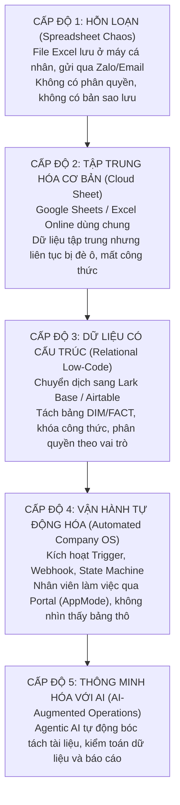

# CHƯƠNG 1: "CÁI CHẾT TRẮNG" CỦA NHỮNG FILE EXCEL 100 CỘT

---

## 1. CÂU CHUYỆN CHIẾN TRƯỜNG (THE WAR STORY)

9 giờ 15 phút sáng thứ Hai. 

Tại phòng họp của một chuỗi bán lẻ 25 chi nhánh tại Hà Nội, không khí đặc quánh như trước một cơn giông. Trên màn hình máy chiếu là một file Excel có tên `Bao_cao_Doanh_thu_Kho_Tong_T9_FINAL_v2_sua_chot.xlsx`. 

Ở dòng 842, cột "Tồn kho thực tế" báo về con số 0. Nhưng ở cột "Đã xuất bán", hệ thống ghi nhận 1,200 sản phẩm. Điều kỳ lạ là trong tài khoản ngân hàng, dòng tiền tương ứng với 1,200 sản phẩm đó hoàn toàn bốc hơi. Số tiền chênh lệch lên tới gần 400 triệu đồng.

Tổng Giám đốc đập tay xuống bàn: *"Ai là người cập nhật con số này cuối cùng?"*

Trưởng phòng Kinh doanh chỉ sang Kế toán trưởng: *"Bên em nhập liệu từ thứ Sáu tuần trước, số liệu lúc đó hoàn toàn khớp. Chắc bên Kế toán kéo công thức đè lên."*

Kế toán trưởng đỏ bừng mặt, mở lịch sử chỉnh sửa trên Google Drive: *"Bên em chỉ đối soát công nợ. Có ai đó đã mở file trên điện thoại vào lúc 11 giờ đêm Chủ nhật và xóa mất cột 'Hàng trả về'."*

Không ai biết người đó là ai. File Excel được chia sẻ cho 45 nhân sự trong công ty với quyền "Chỉnh sửa" (Editor) bằng một đường link chung. Bất kỳ ai có link đều có thể vô tình nhấn phím Backspace, kéo nhầm một dải ô (cell range), hoặc gõ đè một con số mà không để lại bất kỳ dấu vết nào. 

Cuộc họp kéo dài 3 tiếng đồng hồ không tìm ra thủ phạm. Kết cục: Kế toán trưởng nộp đơn xin nghỉ việc hai ngày sau đó vì áp lực; Giám đốc Kinh doanh và Giám đốc Vận hành bằng mặt nhưng không bằng lòng; và doanh nghiệp mất đứt 2 tuần lễ chỉ để cho 10 nhân sự ngồi kiểm kê lại từng hóa đơn giấy nhằm tìm ra 400 triệu đồng đang thất lạc ở đâu.

Đây không phải là một bi kịch hiếm gặp. Trong suốt 18 tháng trực tiếp đi tư vấn và triển khai chuyển đổi số cho hơn 65 doanh nghiệp vừa và nhỏ (SME), tôi đã chứng kiến kịch bản này lặp đi lặp lại hàng trăm lần. Nó diễn ra ở các công ty thời trang, chuỗi F&B, đơn vị logistics, agency truyền thông cho đến các nhà máy sản xuất.

Tất cả đều bắt đầu từ một niềm tin ngây thơ: **"Công ty mình còn nhỏ, dùng Excel là đủ rồi, cần gì hệ thống phức tạp."**

---

## 2. BẮT BỆNH NGUYÊN LÝ GỐC (ROOT-CAUSE DIAGNOSIS)

Tại sao những người thông minh, có bằng đại học, điều hành những doanh nghiệp tạo ra hàng chục tỷ đồng doanh thu mỗi tháng lại liên tục rơi vào cái bẫy này?

Câu trả lời nằm ở sự nhầm lẫn tai hại về **bản chất công cụ**.

### 2.1. Bản chất của Excel: Công cụ tính toán cá nhân, không phải hệ thống cộng tác
Microsoft Excel (và sau này là Google Sheets) là một trong những phát minh vĩ đại nhất của lịch sử phần mềm văn phòng. Nó được sinh ra để làm gì? Để phục vụ **một cá nhân thực hiện các phép tính tài chính phức tạp trên một màn hình phẳng**.

Excel là một "Chiếc máy tính bỏ túi đa năng" (Personal Calculator). Nó tuyệt vời khi bạn dùng để lập ngân sách cá nhân, phân tích báo cáo tài chính cuối năm, hoặc mô phỏng dòng tiền. Nhưng nó **hoàn toàn không được thiết kế để trở thành Hệ điều hành Doanh nghiệp (Operating System)** nơi 50 con người cùng lúc tương tác, phân quyền, phê duyệt và giao dịch mỗi phút.

Khi bạn ép một chiếc máy tính cá nhân phải gánh vác vai trò của một hệ thống cơ sở dữ liệu doanh nghiệp, sự sụp đổ là điều chắc chắn xảy ra.

```
       BẢNG TÍNH PHẲNG (EXCEL / SHEETS)               HỆ THỐNG CƠ SỞ DỮ LIỆU (DATABASE / BASE)
┌──────────────────────────────────────────────┐      ┌──────────────────────────────────────────────┐
│  • Tự do định dạng, gõ gì vào ô cũng được    │  vs  │  • Dữ liệu có cấu trúc, chuẩn hóa chặt chẽ   │
│  • Công thức nằm lẫn lộn trong ô dữ liệu     │      │  • Công thức tách rời, áp dụng cho cả cột    │
│  • Ai có quyền mở là sửa được tất cả         │      │  • Phân quyền chi tiết từng dòng, từng trường│
│  • Không có khái niệm trạng thái bản ghi     │      │  • Vận hành theo luồng (State Machine)       │
│  • Lịch sử chỉnh sửa sơ sài, dễ ghi đè       │      │  • Lưu vết kiểm toán (Audit Log) vĩnh viễn   │
└──────────────────────────────────────────────┘      └──────────────────────────────────────────────┘
```

### 2.2. Ba "Cái Bẫy Chết Người" của Doanh nghiệp dùng Bảng tính

#### Cái bẫy thứ nhất: "Bẫy phiên bản" (The Version Hell)
Ban đầu, file chỉ có tên `Ke_hoach_kinh_doanh.xlsx`. 
Sau khi gửi qua Zalo cho sếp duyệt, nó thành `Ke_hoach_kinh_doanh_sep_sua.xlsx`. 
Phòng Kế toán thêm số liệu vào, nó thành `Ke_hoach_kinh_doanh_sep_sua_KT_chot.xlsx`. 
Đến cuối tháng, trong nhóm chat xuất hiện: `Ke_hoach_kinh_doanh_FINAL_v2_chot_dung_xoa.xlsx`.

Hậu quả là gì? Nhân viên kinh doanh nhìn vào bản V1 để bán hàng; Kế toán nhìn vào bản V2 để xuất hóa đơn; Giám đốc nhìn vào bản Final để ra quyết định. Ba con người trong cùng một công ty đang nhìn vào ba "thực tại" hoàn toàn khác nhau. Sự thật bị xé nhỏ.

#### Cái bẫy thứ hai: "Bẫy con tin công nghệ" (The Single Point of Failure)
Trong mọi công ty sống nhờ Excel, luôn có một nhân vật quyền lực ngầm: "Bạn chuyên viên làm file". Đó thường là một bạn kế toán hoặc admin kỳ cựu, người duy nhất hiểu được tại sao ô `AA34` lại nhân với ô `F12`, tại sao macro này chạy được và tại sao dải ô màu vàng kia tuyệt đối không được chạm vào.

Toàn bộ quy trình vận hành của một công ty 100 người bị "cầm tù" trong bộ não của một cá nhân duy nhất. Ngày bạn nhân viên đó ốm, công ty tê liệt. Ngày bạn đó nộp đơn xin nghỉ việc, ban giám đốc rơi vào hoảng loạn tột độ. Đây chính là điểm gãy chết người: **Doanh nghiệp không sở hữu quy trình; doanh nghiệp chỉ đang thuê một người giữ hộ mớ hỗn độn.**

#### Cái bẫy thứ ba: "Bẫy dữ liệu rác" (Garbage In, Disaster Out)
Trên một bảng tính phẳng, không có bất kỳ rào cản nào ngăn người dùng nhập sai. 
- Người thứ nhất nhập số điện thoại: `0901234567`.
- Người thứ hai nhập: `901234567` (mất số 0).
- Người thứ ba nhập: `o90.123.4567` (chữ o thay cho số 0).
- Người thứ tư gõ thêm dấu cách ở cuối: `0901234567 `.

Khi bạn muốn lọc ra danh sách khách hàng để gửi tin nhắn chăm sóc tự động, hệ thống báo lỗi 50%. Khi bạn muốn tổng hợp doanh thu theo khách hàng, công thức `VLOOKUP` trả về `#N/A` vì sự sai lệch của một dấu cách vô hình. Hàng nghìn giờ lao động bị ném qua cửa sổ chỉ để ngồi "làm sạch dữ liệu" thủ công.

---

## 3. KHUNG KIẾN TRÚC GIẢI PHÁP (ARCHITECTURAL BLUEPRINT)

Để cứu doanh nghiệp thoát khỏi "Cái chết trắng" của những file Excel, bạn không cần phải chi hàng tỷ đồng để mua những hệ thống ERP cồng kềnh như SAP hay Oracle. 

Giải pháp nằm ở việc **thay đổi nhận thức về cấu trúc dữ liệu**. Bạn cần đưa doanh nghiệp tiến lên bậc thang trưởng thành về quản trị dữ liệu:



Bước chuyển dịch quan trọng nhất của một doanh nghiệp là bước chuyển từ **Cấp độ 2 lên Cấp độ 3**: Từ bỏ bảng tính phẳng để bước vào thế giới của **Cơ sở dữ liệu quan hệ (Relational Database)**.

Khi bước sang Cấp độ 3, bạn sẽ thiết lập 3 nguyên tắc bất di bất dịch:
1. **Dữ liệu và Giao diện phải tách rời**: Nhân viên không bao giờ được phép thao tác trực tiếp trên "bảng dữ liệu thô". Họ chỉ được tương tác qua **Biểu mẫu (Form)** để nhập và **Cổng thông tin (AppMode/Portal)** để xem.
2. **Công thức là thuộc tính của cột, không phải của ô**: Không ai có thể "vô tình xóa mất công thức" ở dòng 412, bởi vì công thức được cấu hình ở cấp độ trường (Field-level) và tự động áp dụng cho 1 triệu bản ghi.
3. **Mọi thay đổi đều phải để lại dấu vết (Audit Trail)**: Ai tạo bản ghi, ai sửa trường nào, vào lúc mấy giờ, từ trạng thái nào chuyển sang trạng thái nào — hệ thống tự động ghi nhận vĩnh viễn vào nhật ký hệ thống mà không một ai có thể tẩy xóa.

---

## 4. HƯỚNG DẪN DỰNG THỰC TẾ & PROMPTS AI (EXECUTION & PROMPTS)

Nếu công ty bạn đang có một file Excel 100 cột đang phình to, làm thế nào để "giải cứu" nó trong vòng 48 giờ? Dưới đây là quy trình 4 bước chuẩn hóa dữ liệu:

### Bước 1: Phẫu thuật giải phẫu file Excel (Column Deconstruction)
Mở file Excel của bạn ra và lấy bút dạ tô màu các cột thành 3 nhóm:
- **Nhóm 1 (Màu Xanh lá - Master Data/DIM)**: Những thông tin ít thay đổi (Tên khách hàng, Số điện thoại, Địa chỉ, Mã sản phẩm, Đơn giá niêm yết).
- **Nhóm 2 (Màu Vàng - Giao dịch/FACT)**: Những thông tin phát sinh theo từng sự kiện (Ngày đặt hàng, Số lượng mua, Trạng thái đơn, Nhân viên phụ trách).
- **Nhóm 3 (Màu Đỏ - Tính toán/Calculation)**: Những cột được tính bằng công thức (`Thành tiền = Số lượng * Đơn giá`, `Chiết khấu`, `Thuế VAT`).

### Bước 2: Tách thành các bảng độc lập
- Nhóm 1 tách thành bảng: `[DIM] Khách Hàng` và `[DIM] Sản Phẩm`.
- Nhóm 2 tách thành bảng: `[FACT] Đơn Hàng`.
- Nhóm 3: **Xóa bỏ hoàn toàn khỏi file import**. Chúng ta sẽ dùng trường Công thức (Formula) của Lark Base để tự động tính lại, đảm bảo dữ liệu sạch 100%.

### 🤖 Prompt AI hỗ trợ phân tích cấu trúc file Excel:
Khi bạn có một file Excel phức tạp và không biết tách bảng thế nào, hãy dùng prompt dưới đây để yêu cầu AI phân tích kiến trúc:

```markdown
Bạn là một Chuyên gia Kiến trúc Dữ liệu Doanh nghiệp (Enterprise Data Architect). 
Tôi có một file bảng tính quản lý vận hành đang bị phình to với danh sách các cột dưới đây:

[DÁN DANH SÁCH TÊN CÁC CỘT CỦA FILE EXCEL VÀO ĐÂY]

Hãy giúp tôi thực hiện chuẩn hóa dữ liệu theo nguyên lý OLTP Company OS:
1. Xác định đâu là các thực thể độc lập cần tách thành bảng Danh mục (DIM Tables).
2. Xác định đâu là bảng giao dịch phát sinh (FACT Table) và chỉ ra các trường khóa ngoại (Foreign Keys) để liên kết với các bảng DIM.
3. Chỉ ra những cột nào là cột tính toán thừa thãi (Redundant Calculated Fields) cần xóa bỏ để thay bằng Formula/Rollup tự động.
4. Xuất ra sơ đồ quan hệ thực thể (ERD) dạng Mermaid để tôi hình dung luồng dữ liệu liên kết.
```

---

## 5. BẢNG KIỂM NGHIỆM THU (PRACTITIONER'S CHECKLIST)

Trước khi đóng file Excel lại và chuyển sang chương tiếp theo, hãy tự chấm điểm cho doanh nghiệp của bạn bằng Bảng kiểm soát 5 câu hỏi dưới đây:

| STT | Câu hỏi tự kiểm tra | Đạt (Có) | Rủi ro (Không) |
| :-: | :--- | :-: | :-: |
| 1 | **Tính độc lập của dữ liệu**: Nếu một nhân viên quản lý file Excel đột ngột nghỉ việc hôm nay, công ty có tiếp tục vận hành trơn tru mà không cần người đó bàn giao công thức không? | ⬜ | 🟥 |
| 2 | **Tính toàn vẹn của công thức**: Có cơ chế kỹ thuật nào ngăn chặn nhân viên vô tình gõ đè số lên ô chứa công thức tính toán không? | ⬜ | 🟥 |
| 3 | **Phân quyền trường dữ liệu**: Bạn có thể ẩn cột "Giá vốn" hoặc "Lợi nhuận" đối với nhân viên bán hàng trên cùng một màn hình làm việc không? | ⬜ | 🟥 |
| 4 | **Lịch sử vết kiểm toán**: Khi một con số bị thay đổi từ 100 thành 50, bạn có biết chính xác ai đã đổi, đổi vào giây thứ mấy và lý do đổi là gì không? | ⬜ | 🟥 |
| 5 | **Nguồn sự thật duy nhất (Single Source of Truth)**: Thông tin của 1 khách hàng có đang chỉ được lưu tại duy nhất một nơi trong toàn công ty không? | ⬜ | 🟥 |

> **Quy tắc đánh giá**:  
> • Nếu bạn có từ **2 dấu 🟥 trở lên**: Doanh nghiệp của bạn đang ngồi trên một "quả bom nổ chậm" về vận hành. Đã đến lúc bạn cần đọc tiếp **Chương 2: Tư duy Bảng phẳng vs. Mô hình Quan hệ** để bắt đầu tái cấu trúc lại toàn bộ hệ thống!
