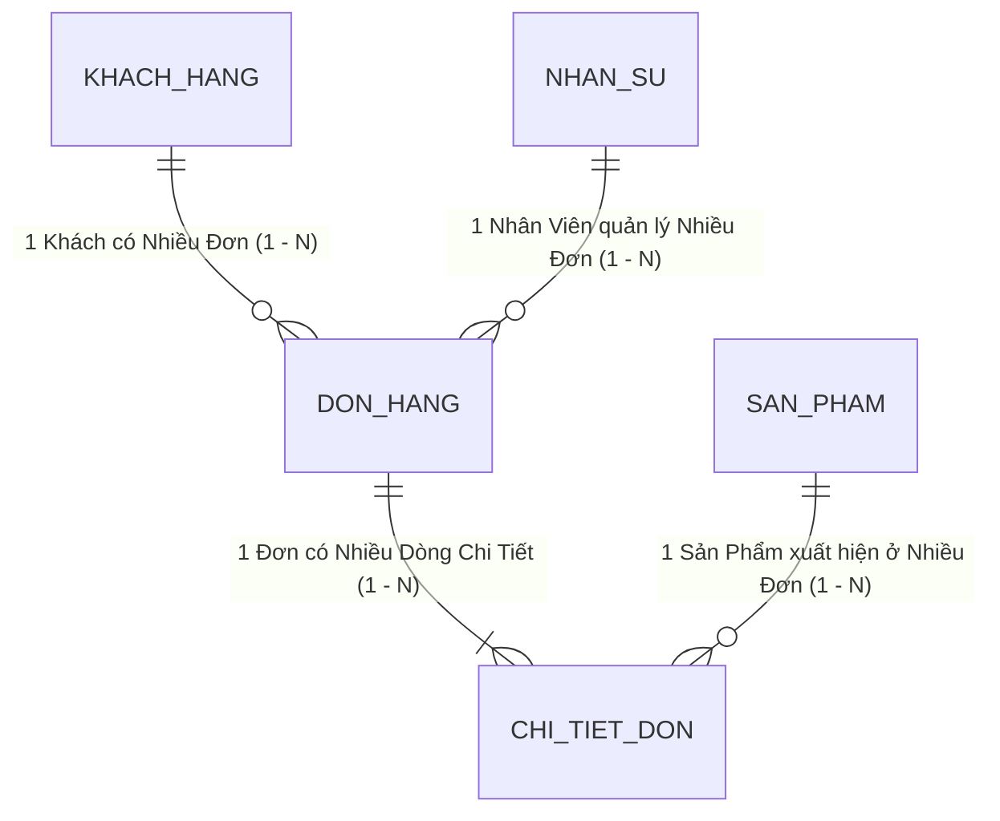

# CHƯƠNG 2: TƯ DUY BẢNG PHẲNG VS. MÔ HÌNH QUAN HỆ (FIRST PRINCIPLES)

---

## 1. CÂU CHUYỆN CHIẾN TRƯỜNG (THE WAR STORY)

Tháng 3 năm 2026, tôi nhận được lời mời tư vấn khẩn cấp từ một doanh nghiệp cung cấp thiết bị công nghiệp tại Hải Phòng. Họ có 3,000 khách hàng B2B, 500 danh mục linh kiện máy móc và 40 kỹ sư kinh doanh (Sales Engineers).

Khi bước vào phòng họp, Giám đốc Kinh doanh tự hào mở chiếc màn hình 34-inch cong để khoe file theo dõi bán hàng của công ty:
*"Bên anh quản lý cực kỳ chi tiết. Mỗi khách hàng anh lưu 50 thông tin: từ người liên hệ, số thuế, công nợ, đến từng mã phụ tùng họ từng hỏi giá."*

Tôi nhìn vào màn hình. Đó là một sheet Excel trải dài từ cột A đến cột AZ, với hơn 15,000 dòng. 

Tôi hỏi ngẫu nhiên: *"Anh có thể lọc cho em xem trong quý vừa rồi, khách hàng 'Công ty Nhiệt điện Phả Lại' đã mua những mã phụ tùng nào không?"*

Anh Giám đốc gõ tìm kiếm: *"Phả Lại"*.
Hệ thống trả về 14 kết quả khác nhau nằm rải rác:
- Dòng 112: `Cty Nhiệt Điện Phả Lại` (Người phụ trách: Tuấn)
- Dòng 540: `CTY CO PHAN NHIET DIEN PHA LAI` (Người phụ trách: Hoàng)
- Dòng 1,890: `Nhiệt điện Phả lại - Anh Nam` (Người phụ trách: Linh)
- Dòng 4,120: `Pha Lai Power Plant` (Người phụ trách: Giám đốc)

Mỗi nhân viên kinh doanh khi mở file ra đều tự gõ tên khách hàng theo trí nhớ của mình. Hậu quả là cùng một nhà máy, 4 nhân viên kinh doanh khác nhau đang cùng chào giá 4 mức chiết khấu chọi nhau, khiến khách hàng khiếu nại kịch liệt vì sự thiếu chuyên nghiệp.

Tệ hơn nữa, mỗi khi nhà máy đó thay đổi kế toán trưởng hoặc đổi địa chỉ xuất hóa đơn, công ty phải cho người đi tìm hàng trăm dòng trong Excel để sửa thủ công. Và dĩ nhiên, họ luôn sửa sót.

Tôi nhìn anh Giám đốc và nói: *"Vấn đề của anh không phải là nhân viên thiếu cẩn thận. Vấn đề là anh đang bắt một bảng tính 2 chiều (Flat Sheet) gánh vác một bài toán không gian 3 chiều của thực tế kinh doanh."*

---

## 2. BẮT BỆNH NGUYÊN LÝ GỐC (ROOT-CAUSE DIAGNOSIS)

Tại sao hiện tượng này luôn xảy ra ở các doanh nghiệp dùng bảng tính phẳng?

### 2.1. Bản chất của "Bảng tính phẳng" (Flat Table)
Một bảng tính phẳng là một lưới ô 2 chiều gồm Hàng (Rows) và Cột (Columns). Trong tư duy bảng phẳng, **mỗi dòng phải chứa toàn bộ vũ trụ thông tin của một sự việc**.

Nếu một khách hàng mua 10 đơn hàng, trong bảng phẳng bạn có 2 cách làm:
1. **Cách 1 (Nhân bản dòng)**: Tạo 10 dòng riêng biệt, mỗi dòng lặp lại tên khách hàng, số điện thoại, địa chỉ, mã số thuế $\rightarrow$ Dẫn đến dữ liệu bị phình to gấp 10 lần, nguy cơ gõ sai tên ở các dòng sau.
2. **Cách 2 (Mở rộng cột)**: Thêm cột `Đơn_hàng_1`, `Đơn_hàng_2`... `Đơn_hàng_10` $\rightarrow$ Khi khách mua đơn thứ 11, bảng bị vỡ cấu trúc và các công thức tổng hợp tê liệt hoàn toàn.

Cả hai cách đều vi phạm nguyên lý cốt lõi của công nghệ thông tin: **Sự thật bị phân mảnh (Redundant Data)**.

### 2.2. Nguyên lý Chuẩn hóa Dữ liệu (First Principles of Relational Data)
Trong thế giới công nghệ, các kỹ sư từ thập niên 1970 đã giải quyết bài toán này bằng lý thuyết **Cơ sở dữ liệu quan hệ (Relational Database)** của Edgar F. Codd, với nguyên tắc **Chuẩn hóa bậc ba (Third Normal Form - 3NF)**.

Nói một cách bình dân và dễ hiểu nhất cho các nhà quản lý doanh nghiệp:

> **NGUYÊN TẮC VÀNG VỀ DỮ LIỆU CỦA COMPANY OS:**  
> *"Mỗi sự thật trong doanh nghiệp chỉ được phép tồn tại ở DUY NHẤT MỘT NƠI. Mọi nơi khác khi cần dùng đến nó chỉ được phép THAM CHIẾU (Link/Lookup), tuyệt đối không được gõ lại."*

- Tên khách hàng, mã số thuế chỉ được lưu tại: **Bảng Khách Hàng**.
- Thông tin sản phẩm, đơn giá niêm yết chỉ được lưu tại: **Bảng Sản Phẩm**.
- Khi khách mua hàng, chúng ta tạo một bản ghi tại **Bảng Đơn Hàng** và chỉ việc "gắn thẻ" (Link) khách hàng đó và sản phẩm đó vào.

```
TƯ DUY BẢNG PHẲNG (EXCEL / GOOGLE SHEETS)
┌───────────────────────────────────────────────────────────────────────────┐
│ [Mã Đơn] | [Tên Khách Hàng] | [SĐT]       | [Tên SP]     | [Đơn Giá] | SL │
│ HD001    | Cty Phả Lại      | 0901234567  | Máy bơm A1   | 10,000,000| 2  │  <-- Dữ liệu bị lặp lại!
│ HD002    | Cty Phả Lại      | 0901234567  | Van xả B2    |  2,000,000| 5  │  <-- Đổi SĐT phải sửa 2 nơi!
└───────────────────────────────────────────────────────────────────────────┘

TƯ DUY MÔ HÌNH QUAN HỆ (RELATIONAL LOW-CODE / LARK BASE)
┌──────────────────────┐         ┌──────────────────────┐         ┌──────────────────────┐
│ [DIM] KHÁCH HÀNG     │         │ [FACT] ĐƠN HÀNG      │         │ [DIM] SẢN PHẨM       │
├──────────────────────┤         ├──────────────────────┤         ├──────────────────────┤
│ • Mã KH: KH01        │<──Link──│ • Mã Đơn: HD001      │──Link──>│ • Mã SP: SP_A1       │
│ • Tên: Cty Phả Lại   │         │ • Khách Hàng: [KH01] │         │ • Tên: Máy bơm A1    │
│ • SĐT: 0901234567    │         │ • Sản Phẩm: [SP_A1]  │         │ • Giá: 10,000,000    │
└──────────────────────┘         │ • Số lượng: 2        │         └──────────────────────┘
                                 └──────────────────────┘
```

---

## 3. KHUNG KIẾN TRÚC GIẢI PHÁP (ARCHITECTURAL BLUEPRINT)

Để chuyển đổi từ tư duy bảng phẳng sang mô hình quan hệ, bạn cần thành thạo **3 loại quan hệ dữ liệu cơ bản**:



### 1. Quan hệ 1 - Nhiều (One-to-Many: $1 - N$):
- *Ví dụ*: Một Khách hàng có thể phát sinh nhiều Đơn hàng khác nhau; nhưng một Đơn hàng cụ thể chỉ thuộc về duy nhất một Khách hàng.
- *Cách thiết kế*: Trường `Khách Hàng` trong bảng Đơn Hàng là trường liên kết (Link Field) trỏ về bảng Khách Hàng.

### 2. Quan hệ Nhiều - Nhiều (Many-to-Many: $N - N$):
- *Ví dụ*: Một Đơn hàng có thể chứa nhiều Sản phẩm khác nhau; và một Sản phẩm có thể nằm trong nhiều Đơn hàng của nhiều khách.
- *Cách thiết kế*: Không bao giờ liên kết trực tiếp $N-N$. Bạn cần tạo một **Bảng nối trung gian (Junction Table)** mang tên `Chi Tiết Đơn Hàng`. Bảng này lưu: `Mã Đơn`, `Mã Sản Phẩm`, `Số Lượng`, `Đơn Giá Bán Thực Tế`.

---

## 4. HƯỚNG DẪN DỰNG THỰC TẾ & PROMPTS AI (EXECUTION & PROMPTS)

### Các bước thiết lập quan hệ trên Lark Base:
1. **Bước 1**: Tạo 2 bảng riêng biệt: Bảng `[DIM] Khách Hàng` và Bảng `[FACT] Đơn Hàng`.
2. **Bước 2**: Trong bảng `Đơn Hàng`, thêm trường mới kiểu **Link to another record (Một chiều hoặc Hai chiều)** và chọn trỏ đến bảng `Khách Hàng`.
3. **Bước 3**: Tạo trường **Lookup**: Khi đã chọn Khách hàng, tự động kéo `Số điện thoại` và `Địa chỉ xuất hóa đơn` sang bảng Đơn Hàng mà không cần gõ lại.
4. **Bước 4**: Tạo trường **Rollup** ở bảng `Khách Hàng`: Đếm tổng số đơn hàng khách đã mua (`COUNT`) và tính tổng doanh thu khách hàng đã mang lại (`SUM`).

### 🤖 Prompt AI thiết kế sơ đồ quan hệ ERD:
```markdown
Tôi muốn chuyển đổi quy trình quản lý bán hàng từ Excel sang hệ thống cơ sở dữ liệu quan hệ Lark Base.
Doanh nghiệp của tôi có các thông tin sau:
- Khách hàng (doanh nghiệp B2B và cá nhân)
- Hợp đồng / Đơn hàng
- Sản phẩm / Dịch vụ
- Nhân viên phụ trách (Sales / Kỹ thuật)
- Lịch sử thanh toán công nợ

Hãy đóng vai trò Kỹ sư Cơ sở Dữ liệu (Database Engineer):
1. Thiết kế danh sách các bảng chuẩn hóa (phân biệt rõ bảng DIM danh mục và bảng FACT giao dịch).
2. Liệt kê các trường (fields) cho từng bảng, chỉ rõ khóa chính (Primary Key) và trường liên kết (Link field).
3. Đưa ra cấu trúc các trường Lookup và Rollup cần thiết để báo cáo tự động nhảy số.
4. Vẽ sơ đồ quan hệ thực thể (ERD) bằng cú pháp Mermaid.
```

---

## 5. BẢNG KIỂM NGHIỆM THU (PRACTITIONER'S CHECKLIST)

| STT | Tiêu chí nghiệm thu kiến trúc quan hệ | Đạt (Pass) | Cần sửa (Fail) |
| :-: | :--- | :-: | :-: |
| 1 | **Không gõ trùng lặp**: Có trường nào bắt người dùng phải gõ lại thông tin đã tồn tại ở bảng khác không? | ⬜ Không gõ lại | 🟥 Vẫn đang gõ lại |
| 2 | **Cập nhật một nơi, nhảy số toàn bộ**: Khi đổi tên 1 khách hàng ở bảng Khách Hàng, tên đó có tự cập nhật trên 100 đơn hàng cũ không? | ⬜ Tự cập nhật | 🟥 Không tự nhảy |
| 3 | **Cấu trúc trường chuẩn**: Các trường số tiền, ngày tháng có được đặt đúng kiểu định dạng (Number, Date) thay vì Text không? | ⬜ Đúng kiểu | 🟥 Đang để Text |
| 4 | **Bảng nối rõ ràng**: Các mối quan hệ Nhiều - Nhiều (như Đơn hàng - Sản phẩm) đã được tách qua bảng chi tiết trung gian chưa? | ⬜ Đã tách | 🟥 Nhét chung 1 ô |
