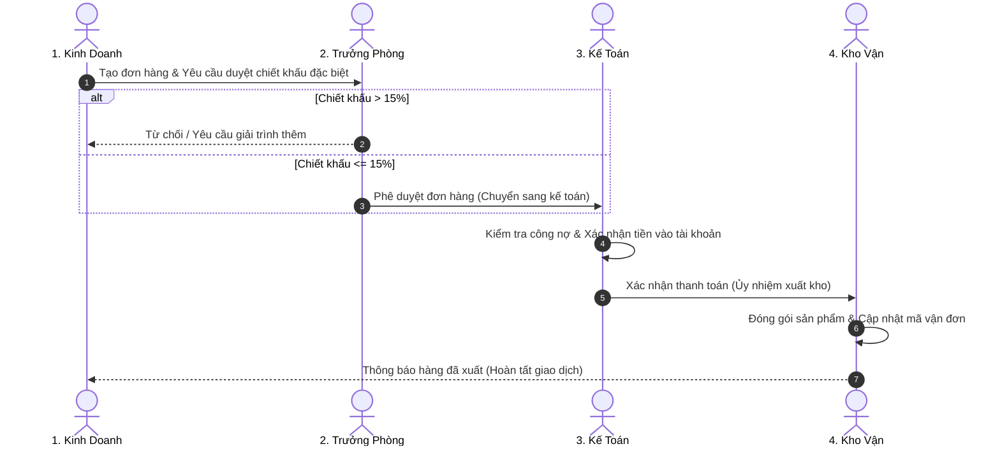

# CHƯƠNG 3: NGUYÊN LÝ GỐC: CHUẨN HÓA QUY TRÌNH TRƯỚC KHI MUA CÔNG CỤ

---

## 1. CÂU CHUYỆN CHIẾN TRƯỜNG (THE WAR STORY)

Đầu năm 2025, một người bạn là CEO của một công ty sản xuất đồ nội thất xuất khẩu với hơn 150 nhân sự gọi điện cho tôi với giọng đầy bức xúc:

*"Phúc ơi, anh vừa mất trắng 1.8 tỷ đồng và 8 tháng trời cho một dự án chuyển đổi số. Anh thuê một đơn vị triển khai phần mềm ERP ngoại nhập. Họ cài đặt xong xuôi, tổ chức đào tạo rầm rộ, nhưng đến tháng thứ hai sau khi nghiệm thu thì nhân viên đồng loạt bỏ không dùng. Đơn hàng vẫn trễ, kho vẫn lệch, và bây giờ họ quay lại chat Zalo gửi ảnh phiếu giao hàng viết tay. Anh có cảm giác công nghệ là một cú lừa!"*

Tôi đến nhà máy của anh vào một buổi chiều. Tôi không nhìn vào phần mềm tiền tỷ kia. Tôi chỉ hỏi 3 câu hỏi rất đơn giản với 3 người khác nhau:
1. Tôi hỏi bạn nhân viên kinh doanh: *"Khi khách chốt đơn, em gửi thông tin cho ai đầu tiên?"*  
   $\rightarrow$ Bạn trả lời: *"Em nhắn vào nhóm Zalo chung, ai đọc được thì làm ạ."*
2. Tôi hỏi bạn kế toán: *"Ai là người quyết định cho phép khách hàng nợ tiền trước khi xuất kho?"*  
   $\rightarrow$ Bạn trả lời: *"Thường thì sếp duyệt miệng, nhưng nếu sếp đi công tác thì anh Trưởng phòng kinh doanh gật đầu là em cho xuất."*
3. Tôi hỏi anh thủ kho: *"Khi nào anh được phép đóng gói và chuyển hàng đi?"*  
   $\rightarrow$ Anh trả lời: *"Khi nào thấy phiếu có chữ ký, hoặc có khi bạn kinh doanh chạy xuống giục gấp thì em xuất trước, giấy tờ bổ sung sau."*

Tôi quay sang anh CEO: *"Anh thấy không? Quy trình thực tế của anh vốn dĩ là một mớ bòng bong không có ranh giới trách nhiệm, không có điều kiện tiên quyết, và hoàn toàn dựa trên cảm tính. Khi anh mua phần mềm 1.8 tỷ đồng về, anh đã làm một việc vô cùng nguy hiểm: **Anh đã số hóa sự hỗn loạn**."*

> **ĐỊNH LUẬT BẤT HỦ CỦA BILL GATES:**  
> *"Quy tắc đầu tiên của bất kỳ công nghệ nào được áp dụng cho một doanh nghiệp là: Tự động hóa được áp dụng cho một quy trình hiệu quả sẽ khuếch đại hiệu quả. Quy tắc thứ hai là: Tự động hóa được áp dụng cho một quy trình kém hiệu quả sẽ khuếch đại sự kém hiệu quả."*

---

## 2. BẮT BỆNH NGUYÊN LÝ GỐC (ROOT-CAUSE DIAGNOSIS)

Tại sao các doanh nghiệp liên tục đốt tiền vào phần mềm rồi thất bại ê chề?

### 2.1. Căn bệnh "Ảo tưởng Công nghệ" (The Technology Silver Bullet)
Rất nhiều nhà lãnh đạo mắc phải một ảo tưởng: Nghĩ rằng công nghệ là một "viên đạn bạc" thần kỳ. Họ tin rằng chỉ cần bỏ tiền mua một phần mềm đắt đỏ, hiện đại của Mỹ hay Singapore về cài lên máy tính là doanh nghiệp tự khắc sẽ chuyên nghiệp, ngăn nắp và tự động hóa.

Nhưng phần mềm chỉ là cái vỏ. Nó là chiếc xe đua F1. Nếu con đường bạn đi đầy ổ gà, bùn lầy và tài xế không biết luật giao thông, đưa cho họ chiếc xe F1 chỉ khiến họ lao xuống vực nhanh hơn.

### 2.2. Khung Tư Duy 3 Tầng: People $\rightarrow$ Process $\rightarrow$ Tool
Mọi dự án chuyển đổi số thành công trong lịch sử đều tuân theo đúng thứ tự ưu tiên:

```
┌─────────────────────────────────────────────────────────────┐
│ 1. CON NGƯỜI (PEOPLE)                                       │
│    • Nhận thức nỗi đau, đồng thuận văn hóa, sẵn sàng kỷ luật │
└──────────────────────────────┬──────────────────────────────┘
                               │
                               ▼
┌─────────────────────────────────────────────────────────────┐
│ 2. QUY TRÌNH (PROCESS)                                      │
│    • Ranh giới trách nhiệm, tiêu chuẩn bàn giao, ma trận RACI│
└──────────────────────────────┬──────────────────────────────┘
                               │
                               ▼
┌─────────────────────────────────────────────────────────────┐
│ 3. CÔNG CỤ (TOOL)                                           │
│    • Low-code, Lark Base, ERP, AI Automation                │
└─────────────────────────────────────────────────────────────┘
```

Nếu bạn đảo ngược thứ tự: Mua **Công cụ** về trước $\rightarrow$ bắt ép **Quy trình** phải uốn theo $\rightarrow$ rồi cưỡng chế **Con người** phải dùng, tỷ lệ thất bại của bạn là 99%.

---

## 3. KHUNG KIẾN TRÚC GIẢI PHÁP (ARCHITECTURAL BLUEPRINT)

Làm thế nào để chuẩn hóa một quy trình từ con số 0 trước khi đụng vào bất kỳ phần mềm nào? Bạn cần sử dụng **Mô hình Swimlane (Làn bơi) kết hợp Ma trận RACI**.

### 3.1. Sơ đồ Luồng Trách nhiệm Liên phòng ban (Cross-Functional Swimlane)
Một quy trình chuẩn không bao giờ được viết dưới dạng danh sách gạch đầu dòng dài thượt. Nó phải được vẽ thành các làn bơi, nơi **mỗi phòng ban chỉ sở hữu một làn riêng** và quả bóng trách nhiệm được chuyền rõ ràng qua từng cửa ải:



### 3.2. Ma trận Phân định Trách nhiệm RACI
Tại mỗi bước của quy trình, bạn phải trả lời dứt khoát 4 câu hỏi:
- **R (Responsible - Người làm)**: Ai là người trực tiếp cầm chuột thao tác?
- **A (Accountable - Người chịu trách nhiệm cuối cùng)**: Ai là người ký duyệt và chịu phạt nếu xảy ra sự cố? *(Chỉ DUY NHẤT 1 người)*.
- **C (Consulted - Người được tham vấn)**: Ai cung cấp dữ liệu đầu vào?
- **I (Informed - Người được thông báo)**: Ai chỉ nhận thông báo kết quả sau khi xong?

Nếu một bước có 2 người cùng đóng vai trò **A (Accountable)**, bước đó sẽ thất bại vì "cha chung không ai khóc".

---

## 4. HƯỚNG DẪN DỰNG THỰC TẾ & PROMPTS AI (EXECUTION & PROMPTS)

### Khung Bóc tách Quy trình 7 Thành phần (The 7-Step Process Decomposition):
Trước khi tạo bảng trên Lark Base, hãy trả lời 7 câu hỏi trên giấy:
1. **Trigger (Cái gì kích hoạt quy trình?)**: Khách điền form, hợp đồng ký xong, hay nhân viên nộp đơn?
2. **Input (Dữ liệu đầu vào gồm những gì?)**: Tên, số điện thoại, giá trị, file đính kèm?
3. **Validation (Điều kiện hợp lệ là gì?)**: Thiếu trường nào thì hệ thống chặn không cho gửi?
4. **Approval (Ai duyệt và duyệt theo hạn mức nào?)**: Trên 10 triệu ai duyệt? Dưới 10 triệu ai duyệt?
5. **Action (Hành động kế tiếp là gì?)**: Gửi thông báo cho ai? Tạo task cho bộ phận nào?
6. **SLA (Thời gian cam kết hoàn thành là bao lâu?)**: 2 tiếng, 24 tiếng hay 3 ngày?
7. **Output (Đầu ra cuối cùng là gì?)**: Hóa đơn VAT, biên bản nghiệm thu, hay đơn hàng đã giao?

### 🤖 Prompt AI hỗ trợ chuẩn hóa quy trình thô thành chuẩn Swimlane & RACI:
```markdown
Tôi là Giám đốc Doanh nghiệp. Hiện tại quy trình xử lý đơn hàng của công ty tôi đang bị rối loạn như sau:
[MÔ TẢ QUY TRÌNH THỰC TẾ ĐANG CHẠY BẰNG LỜI CỦA BẠN]

Hãy đóng vai trò Chuyên gia Tái cấu trúc Quy trình Doanh nghiệp (Business Process Architect):
1. Phân tích các "điểm nghẽn" (Bottlenecks) và rủi ro thất thoát trong cách làm hiện tại.
2. Thiết kế lại quy trình chuẩn theo mô hình Cross-functional Swimlane phân rõ làn cho từng phòng ban (Sales, Kế toán, Kho, Ban giám đốc).
3. Lập ma trận trách nhiệm RACI cho từng bước.
4. Xác định rõ các điều kiện rẽ nhánh (Decision Gateways) và SLA thời gian cam kết.
5. Vẽ sơ đồ luồng quy trình bằng cú pháp Mermaid để tôi trình bày cho đội ngũ.
```

---

## 5. BẢNG KIỂM NGHIỆM THU (PRACTITIONER'S CHECKLIST)

| STT | Tiêu chí thẩm định quy trình trước khi số hóa | Đạt | Chưa đạt |
| :-: | :--- | :-: | :-: |
| 1 | **Ranh giới rõ ràng**: Từng bước trong quy trình có chỉ rõ đích danh chức danh nào chịu trách nhiệm không? | ⬜ | 🟥 |
| 2 | **Duy nhất một người duyệt**: Mỗi quyết định phê duyệt có duy nhất 1 người giữ vai trò Accountable không? | ⬜ | 🟥 |
| 3 | **Cam kết SLA thời gian**: Từng khâu chuyển tiếp có quy định rõ tối đa bao nhiêu giờ phải xử lý xong không? | ⬜ | 🟥 |
| 4 | **Kịch bản ngoại lệ (Exceptions)**: Nếu sếp vắng mặt hoặc khách hủy đơn giữa chừng, quy trình có chỉ rõ cách xử lý không? | ⬜ | 🟥 |
| 5 | **Sự đồng thuận của người thực thi**: Nhân viên trực tiếp làm việc có được tham gia đóng góp và đồng ý với quy trình mới không? | ⬜ | 🟥 |
