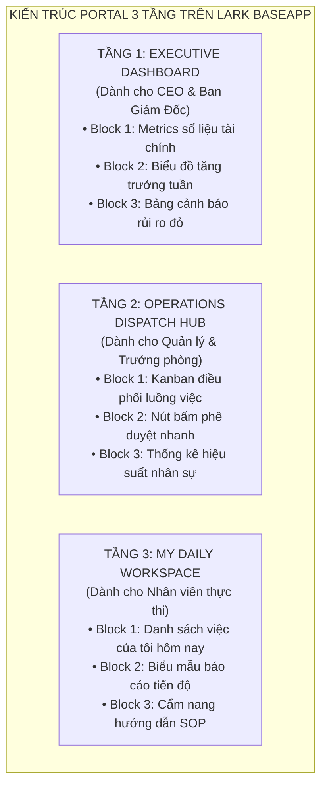

# CHƯƠNG 6: CỔNG THÔNG TIN THEO VAI TRÒ (ROLE-BASED BASEAPP & PORTAL)

---

## 1. CÂU CHUYỆN CHIẾN TRƯỜNG (THE WAR STORY)

Tháng 7 năm 2026, tôi đến thăm văn phòng của một agency truyền thông 50 người tại Hà Nội. Anh Tổng Giám đốc kéo tôi vào phòng làm việc, chỉ vào màn hình và thở dài não nề:

*"Phúc ơi, anh đầu tư làm hệ thống cơ sở dữ liệu bài bản lắm. Có đủ bảng khách hàng, chiến dịch, tác vụ, doanh thu. Nhưng lạ lùng là anh mở ra thì hoa mắt chóng mặt không hiểu gì, còn nhân viên của anh thì than phiền là nhìn hệ thống như một bãi tha ma thông tin."*

Tôi mở hệ thống của anh ra xem. Một bảng tính khổng lồ hiện ra với hơn 60 cột dữ liệu:
- Từ mã chiến dịch, ngân sách quảng cáo, hợp đồng, KPI, chi phí chạy ads...
- Cho đến mã màu thiết kế, link Figma, kích thước banner, số lượt chỉnh sửa của khách...

Tất cả 60 cột được phơi bày trần trụi trên cùng một màn hình.
- Khi anh Giám đốc mở ra, anh chỉ muốn biết: *"Hôm nay doanh thu bao nhiêu và chiến dịch nào đang bị lỗ?"* Nhưng anh phải cuộn chuột qua 40 cột chi tiết kỹ thuật mới tìm thấy con số mình cần.
- Khi một bạn Designer mở ra, bạn chỉ muốn biết: *"Hôm nay em phải thiết kế 3 banner nào?"* Nhưng bạn phải nhìn thấy cả ngân sách hàng trăm triệu của khách hàng và hợp đồng nhạy cảm của công ty.

Hậu quả là gì? Nhân viên cảm thấy bị "tra tấn thị giác". Họ mở hệ thống ra trong tâm trạng sợ hãi và chỉ muốn đóng lại ngay lập tức.

Tôi nói với anh Giám đốc: *"Anh đã có một Cơ sở Dữ liệu (Database) rất tốt. Nhưng anh chưa có một **Cổng Thông Tin Ứng Dụng (Application Portal)**. Anh đang bắt một hành khách đi máy bay phải ngồi trong buồng lái và nhìn hàng nghìn nút bấm phức tạp của phi công."*

---

## 2. BẮT BỆNH NGUYÊN LÝ GỐC (ROOT-CAUSE DIAGNOSIS)

Tại sao hầu hết các hệ thống Low-code bị người dùng tẩy chay sau giai đoạn hào hứng ban đầu?

Bởi vì người dựng hệ thống đã phạm phải một sai lầm chết người trong thiết kế trải nghiệm người dùng (UX/UI): **Đồng nhất "Nơi Lưu Dữ Liệu" với "Nơi Tương Tác Của Con Người".**

```
                     MÔ HÌNH THẤT BẠI: DỮ LIỆU ĐÈ LÊN CON NGƯỜI
┌─────────────────────────────────────────────────────────────────────────────┐
│ TẤT CẢ MỌI NGƯỜI (CEO, Quản lý, Nhân viên)                                  │
│                                    │                                        │
│                                    ▼                                        │
│ ┌─────────────────────────────────────────────────────────────────────────┐ │
│ │ BẢNG DỮ LIỆU THÔ (RAW DATA GRID - 60 CỘT, 10,000 DÒNG)                  │ │
│ │ (Hoa mắt, lộ thông tin nhạy cảm, tra tấn thị giác, sợ hãi nhập liệu)    │ │
│ └─────────────────────────────────────────────────────────────────────────┘ │
└─────────────────────────────────────────────────────────────────────────────┘

                  MÔ HÌNH THÀNH CÔNG: ROLE-BASED PORTAL (BASEAPP)
          ┌─────────────────────┬─────────────────────┐
          │                     │                     │
          ▼                     ▼                     ▼
┌──────────────────┐  ┌──────────────────┐  ┌──────────────────┐
│ 1. CEO PORTAL    │  │ 2. MANAGER HUB   │  │ 3. STAFF WORK    │
│ • Metrics/KPIs   │  │ • Kanban duyệt   │  │ • Form nhập tối  │
│ • Biểu đồ doanh thu│ • Phân bổ nguồn lực│   giản (3 trường) │
└─────────┬────────┘  └────────┬─────────┘  └────────┬─────────┘
          │                    │                     │
          └────────────────────┼─────────────────────┘
                               ▼
        ┌──────────────────────────────────────────────┐
        │ CƠ SỞ DỮ LIỆU NGẦM (BACKGROUND DATA ENGINE)  │
        │ • 4 Tầng: DIM - FACT - LOG - RP              │
        │ (Người dùng không cần nhìn thấy trực tiếp)   │
        └──────────────────────────────────────────────┘
```

Trong thực tế doanh nghiệp, **mỗi vị trí có một "nỗi khát khao thông tin" hoàn toàn khác nhau**:
1. **CEO / C-Level**: Họ không quan tâm hôm nay ai làm banner nào. Họ chỉ cần **3 con số trong 3 giây (3-Second Rule)**: Doanh thu thực tế, Điểm tắc nghẽn, và Rủi ro chi phí.
2. **Quản lý / Trưởng phòng**: Họ cần một **Bảng điều phối công việc trực quan (Kanban/Gantt)** để phân công tác vụ và duyệt nhanh trong 1 cú click.
3. **Nhân viên thực thi**: Họ chỉ cần một **Giao diện làm việc cá nhân hóa** trên điện thoại: Chỉ hiển thị những việc được giao cho chính họ hôm nay, kèm một **Biểu mẫu (Form) nhập liệu cực kỳ đơn giản**.

---

## 3. KHUNG KIẾN TRÚC GIẢI PHÁP (ARCHITECTURAL BLUEPRINT)

Để biến một Base khô khan thành một Hệ điều hành (Company OS) thân thiện mà ai cũng muốn mở ra mỗi sáng, bạn cần áp dụng kiến trúc **Cổng thông tin 3 Tầng trên Lark BaseApp / AppMode**:



### Các Khối Giao Diện Cốt Lõi (AppMode Blocks):
- **Metric Block (Khối Chỉ Số)**: Hiển thị các con số quan trọng nhất dưới dạng thẻ KPI to, rõ ràng kèm tỷ lệ tăng trưởng so với tuần trước.
- **Kanban Block (Khối Bảng Kéo Thả)**: Phân chia tác vụ theo các cột trạng thái (*Cần làm $\rightarrow$ Đang làm $\rightarrow$ Chờ duyệt $\rightarrow$ Hoàn thành*), cho phép quản lý kéo thả để phân việc.
- **Form Block (Khối Biểu Mẫu Nhập Liệu)**: Ẩn toàn bộ bảng dữ liệu phức tạp phía sau, chỉ đưa ra một biểu mẫu tinh gọn để nhân viên điền báo cáo trong 30 giây.

---

## 4. HƯỚNG DẪN DỰNG THỰC TẾ & PROMPTS AI (EXECUTION & PROMPTS)

### Quy tắc Vàng thiết kế Form nhập liệu (Zero-Friction Form):
1. **Quy tắc "Không quá 5 trường trên điện thoại"**: Nếu một form nhập liệu có trên 5 trường, nhân viên sẽ bắt đầu lười và nhập đối phó. Hãy dùng các trường Formula và Automation để tự động điền các thông tin như: Ngày giờ nhập, Tên người tạo, Phòng ban.
2. **Trường ẩn có điều kiện (Conditional Fields)**: Chỉ hiển thị trường `Lý do trễ hạn` nếu nhân viên chọn trạng thái `Trễ hạn`. Không để các trường thừa thãi làm rối mắt người dùng.
3. **Cấu hình Trang chào mừng (Landing Page)**: Khi nhân viên đăng nhập vào BaseApp, trang đầu tiên họ nhìn thấy luôn là trang `Việc của tôi hôm nay`, tuyệt đối không đưa họ vào trang dữ liệu tổng của công ty.

### 🤖 Prompt AI thiết kế giao diện BaseApp / AppMode:
```markdown
Tôi đã có cơ sở dữ liệu quản lý dự án và tác vụ trên Lark Base gồm 4 bảng: Dự Án, Tác Vụ, Nhân Sự, Báo Cáo KPI.
Bây giờ tôi muốn thiết kế giao diện ứng dụng BaseApp (AppMode Portal) cho 3 nhóm đối tượng:
1. Ban Giám Đốc (CEO / COO)
2. Trưởng Phòng Dự Án (Project Manager)
3. Kỹ sư thực thi (Team Members)

Hãy đóng vai trò Chuyên gia Thiết kế Trải nghiệm Ứng dụng Doanh nghiệp (Enterprise UX/UI Architect):
1. Thiết kế cấu trúc các Trang (Pages) và Khối (Blocks) cho từng vai trò trên Lark BaseApp.
2. Xác định các chỉ số Metrics cốt lõi cần đưa lên màn hình Dashboard của CEO.
3. Thiết kế luồng giao diện Kanban cho Trưởng phòng và Form nhập liệu tối giản cho nhân viên trên mobile.
4. Đưa ra các quy tắc phân quyền hiển thị (Visibility Rules) để bảo mật thông tin nội bộ.
```

---

## 5. BẢNG KIỂM NGHIỆM THU (PRACTITIONER'S CHECKLIST)

| STT | Tiêu chí nghiệm thu giao diện Cổng thông tin BaseApp | Đạt (Chuẩn UX) | Chưa đạt |
| :-: | :--- | :-: | :-: |
| 1 | **Quy tắc 3 giây**: Mở màn hình của CEO lên, có nắm được ngay doanh thu và điểm tắc nghẽn trong 3 giây không? | ⬜ Thấy ngay | 🟥 Phải cuộn tìm |
| 2 | **Nhân viên không thấy bảng thô**: Nhân viên có được điều hướng thẳng vào giao diện làm việc cá nhân thay vì bảng dữ liệu 60 cột không? | ⬜ Đúng chuẩn | 🟥 Vẫn thấy bảng thô |
| 3 | **Trải nghiệm trên điện thoại (Mobile Friendly)**: Biểu mẫu nhập liệu có thao tác mượt mà bằng 1 tay trên điện thoại không? | ⬜ Rất mượt | 🟥 Quá nhiều cột |
| 4 | **Bảo mật thông tin chéo**: Nhân viên phòng này có bị vô tình nhìn thấy dữ liệu nhạy cảm của phòng khác không? | ⬜ Đã phân tách | 🟥 Nhìn thấy hết |
