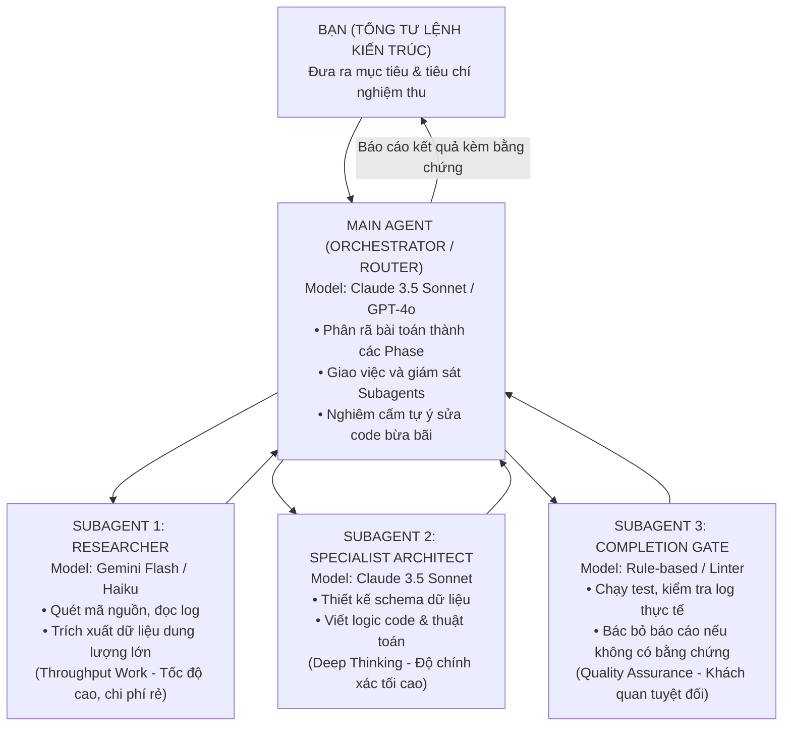

# CHƯƠNG 7: TỪ CHATBOT GIẢI TRÍ ĐẾN TỔNG CHỈ HUY ĐA TÁC NHÂN (AGENTIC AI)

---

## 1. CÂU CHUYỆN CHIẾN TRƯỜNG (THE WAR STORY)

Tháng 6 năm 2026, tôi tham gia một buổi tọa đàm kín về "Ứng dụng Trí tuệ Nhân tạo trong Doanh nghiệp" với sự tham gia của 20 chủ doanh nghiệp vừa và nhỏ.

Một anh Giám đốc công ty xuất nhập khẩu phát biểu với vẻ mặt đầy hoài nghi:
*"Nói thật với các anh, mấy tháng trước anh cũng mua tài khoản ChatGPT Plus cho cả công ty. Anh bảo nhân viên: 'Từ nay có AI rồi, làm việc nhanh lên nhé!'. Kết quả là gì? Nhân viên dùng nó để viết mấy bài thơ chúc mừng sinh nhật, soạn vài bài đăng Facebook nhạt nhẽo, hoặc nhờ nó viết hộ cái email xin nghỉ ốm. Còn những việc nặng như phân tích báo cáo tài chính, kiểm tra lỗi mã hàng, hay dựng hệ thống dữ liệu thì AI trả lời chung chung như một học sinh cấp hai làm văn. Anh thấy AI chỉ là đồ chơi giải trí, không ứng dụng được vào kinh doanh thật sự."*

Cả phòng họp gật gù đồng tình. 

Tôi xin phép đứng dậy, mở chiếc máy tính xách tay của mình và kết nối lên màn hình lớn. 

*"Em muốn mời các anh xem một cách làm việc khác với AI,"* tôi nói.

Tôi mở cửa sổ dòng lệnh (Terminal) của Antigravity và gõ một lệnh duy nhất: Yêu cầu hệ thống đọc một file biên bản họp ghi âm 60 phút của một khách hàng, tự động trích xuất các yêu cầu nghiệp vụ, phân rã thành sơ đồ thực thể ERD, thiết lập cấu trúc 7 bảng dữ liệu quan hệ, và tự động tạo toàn bộ các trường trên Lark Base qua API.

Trong vòng 3 phút, trước mắt 20 vị giám đốc:
- Một Agent đóng vai trò **Business Analyst** đọc lướt qua toàn bộ transcript và lọc ra 12 điểm nghẽn nghiệp vụ.
- Một Agent đóng vai trò **Data Architect** phân tích cấu trúc bảng và mô hình hóa quan hệ.
- Một Agent đóng vai trò **Code Reviewer / Gatekeeper** kiểm tra chéo các công thức để chống ảo giác.
- Và toàn bộ hệ thống cơ sở dữ liệu hoàn chỉnh được sinh ra trên màn hình mà không cần một cú nhấp chuột thủ công nào.

Cả phòng họp im lặng tuyệt đối. Anh Giám đốc xuất nhập khẩu tròn mắt hỏi: *"Cái này... cũng là AI à em? Sao nó khác hoàn toàn cái khung chat ChatGPT anh dùng hàng ngày vậy?"*

Tôi mỉm cười: *"Khác biệt ở chỗ: Anh đang dùng AI như một **Người đàm thoại giải trí (Chatbot)**, còn em đang điều khiển AI như một **Bộ chỉ huy Đa tác nhân tự chủ (Agentic AI Framework)**."*

---

## 2. BẮT BỆNH NGUYÊN LÝ GỐC (ROOT-CAUSE DIAGNOSIS)

Tại sao 90% doanh nghiệp và nhân sự hiện nay đều thất vọng với AI sau vài tuần thử nghiệm?

Bởi vì họ đang mắc kẹt ở **Cấp độ 1 của quá trình tiến hóa AI**:

```
                       CÁC CẤP ĐỘ TIẾN HÓA ỨNG DỤNG AI
┌─────────────────────────────────────────────────────────────────────────────┐
│ CẤP ĐỘ 1: CHATBOT ĐÀM THOẠI (CONVERSATIONAL AI)                             │
│ • Người dùng gõ một câu hỏi ngắn $\rightarrow$ AI trả lời một đoạn văn chung chung   │
│ • Không có ngữ cảnh, không có công cụ, không có khả năng tự sửa sai         │
└──────────────────────────────────────┬──────────────────────────────────────┘
                                       │
                                       ▼
┌─────────────────────────────────────────────────────────────────────────────┐
│ CẤP ĐỘ 2: TRỢ LÝ CÓ KỊCH BẢN (WORKFLOW AUTOMATION)                          │
│ • Nối các chuỗi Prompt (Prompt Chaining), dùng Zapier/Make                  │
│ • AI làm theo quy trình cố định, gặp trường hợp ngoại lệ là gãy             │
└──────────────────────────────────────┬──────────────────────────────────────┘
                                       │
                                       ▼
┌─────────────────────────────────────────────────────────────────────────────┐
│ CẤP ĐỘ 3: TỔNG CHỈ HUY ĐA TÁC NHÂN (AGENTIC AI ORCHESTRATION)               │
│ • Phân tách AI thành các vai trò chuyên môn (Subagents)                     │
│ • Tự chủ gọi công cụ (Tool Calling: đọc file, chạy code, gọi API, quét DB)  │
│ • Cơ chế kiểm chứng chéo độc lập (Verification Gate) chống ảo giác 100%    │
└─────────────────────────────────────────────────────────────────────────────┘
```

### Điểm khác biệt cốt lõi giữa "Chatbot" và "Agentic AI":
1. **Khả năng hành động trên thế giới thực (Tool Calling)**:  
   Chatbot chỉ biết nói (Text-in $\rightarrow$ Text-out). Còn Agentic AI có **"tay và mắt"**: Nó có thể tự mở terminal, tự đọc file log, tự chạy script Python, tự gọi API của Lark Suite để tạo bảng, gửi tin nhắn, và tự kiểm tra xem bảng đó đã được tạo thành công hay chưa.
2. **Cơ chế tự phản tỉnh và kiểm thử (Self-Reflection & Verification)**:  
   Chatbot một khi trả lời sai sẽ cố chấp bịa đặt thêm (ảo giác). Một Agentic AI chuyên nghiệp được trang bị cơ chế **Fail-Fast**: Sau khi làm xong, một Agent độc lập khác sẽ nhảy vào kiểm tra kết quả (Test Gate). Nếu kết quả không khớp với thực tế, nó lập tức rollback và thử lại theo phương án khác.

---

## 3. KHUNG KIẾN TRÚC GIẢI PHÁP (ARCHITECTURAL BLUEPRINT)

Để biến AI thành một "đội ngũ kỹ sư ảo" giúp bạn tăng năng suất gấp 5-10 lần, bạn cần thiết lập mô hình **Điều Phối Đa Tác Nhân Hai Tầng (Dual-Tier Multi-Agent Architecture)**:



### Nguyên tắc Vàng: Phân tầng Mô hình (Dual-Tier Model Routing)
- **Tầng Thực thi Khối lượng lớn (Throughput Work)**: Những việc như đọc 1,000 dòng log, quét toàn bộ thư mục, tìm kiếm tài liệu $\rightarrow$ Bắt buộc giao cho các mô hình nhỏ, siêu nhanh và chi phí rẻ (`Gemini Flash`, `Claude Haiku`).
- **Tầng Tư duy Sâu và Quyết định (Capability-First Work)**: Những việc như thiết kế kiến trúc ERD, viết thuật toán phức tạp, giải quyết nút thắt logic $\rightarrow$ Dành riêng cho các mô hình mạnh nhất (`Claude 3.5 Sonnet`, `GPT-4o`).

Cách làm này giúp bạn vừa đạt được tốc độ xử lý thần tốc, vừa tiết kiệm 80% chi phí API mà chất lượng đầu ra luôn đạt chuẩn kỹ sư cao cấp.

---

## 4. HƯỚNG DẪN DỰNG THỰC TẾ & PROMPTS AI (EXECUTION & PROMPTS)

### Kỹ thuật ra lệnh cho AI như một Tổng Tư Lệnh (Commander Framework):
Tuyệt đối không bao giờ hỏi AI: *"Hãy giúp tôi làm..."*. Hãy ra lệnh theo cấu trúc 4 phần chuẩn mực:
1. **Role Definition (Định danh vai trò & Ranh giới)**: *"Bạn là Senior Solutions Architect. Bạn chỉ được phép thiết kế, không được tự ý sửa file khi chưa có lệnh."*
2. **Context Injection (Nạp ngữ cảnh sạch)**: Đưa cấu trúc dữ liệu hiện tại, các ràng buộc kỹ thuật và file liên quan.
3. **Execution Protocol (Giao thức thực thi)**: Yêu cầu AI làm việc theo từng Phase, sau mỗi Phase phải dừng lại báo cáo bằng chứng trước khi chuyển bước.
4. **Output Contract (Khuôn khổ đầu ra)**: *"Chỉ trả về định dạng JSON hoặc sơ đồ Mermaid. Nghiêm cấm giải thích dài dòng bằng văn nói."*

### 🤖 Prompt Mẫu: Phân rã bài toán và điều phối Agentic AI:
```markdown
Bạn là Main Agent điều phối kiến trúc (Orchestrator). Mục tiêu của dự án là:
[MÔ TẢ BÀI TOÁN KỸ THUẬT / VẬN HÀNH CỦA BẠN]

Hãy tuân thủ nghiêm ngặt Giao thức Thực thi Phân tầng:
1. Phân rã công việc thành 3 Phase rõ ràng kèm tiêu chí nghiệm thu độc lập cho từng phase.
2. Với Phase 1: Chỉ thực hiện khảo sát và lập kế hoạch, không thực hiện bất kỳ lệnh thay đổi nào.
3. Sau khi khảo sát xong, xuất báo cáo Checkpoint theo cấu trúc 3 phần bắt buộc:
   - Đã làm gì (kèm bằng chứng cụ thể).
   - Tồn đọng & Điểm nghẽn rủi ro.
   - Kế hoạch Phase tiếp theo.
4. Dừng lại tại Cổng phê duyệt (Handoff Gate) để chờ tôi xác nhận trước khi tiếp tục.
```

---

## 5. BẢNG KIỂM NGHIỆM THU (PRACTITIONER'S CHECKLIST)

| STT | Tiêu chí đánh giá mức độ làm chủ Agentic AI | Đạt (Level Agent) | Chưa đạt (Level Chat) |
| :-: | :--- | :-: | :-: |
| 1 | **Tự động hóa hành động**: AI có khả năng tự gọi công cụ (quét file, gọi API, chạy lệnh) thay vì chỉ gõ văn bản không? | ⬜ Tự gọi tool | 🟥 Chỉ gõ chữ |
| 2 | **Cơ chế chống ảo giác**: Hệ thống có cổng kiểm chứng (Gate) bắt AI đưa ra bằng chứng log trước khi báo cáo hoàn thành không? | ⬜ Có bằng chứng | 🟥 Tin lời AI nói |
| 3 | **Phân chia vai trò**: Bạn có đang phân tách AI thành các vai trò chuyên môn khác nhau thay vì dùng 1 khung chat duy nhất? | ⬜ Đa tác nhân | 🟥 Dùng 1 chat |
| 4 | **Năng suất đột phá**: Bạn có thể một mình giải quyết khối lượng công việc của cả một team kỹ sư trong vài giờ nhờ AI không? | ⬜ X5 - X10 lần | 🟥 Vẫn làm thủ công |
