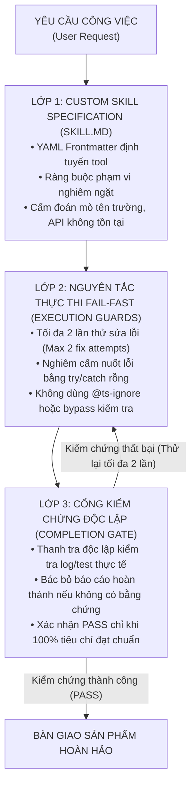

# CHƯƠNG 8: XÂY DỰNG KỸ NĂNG AI TÙY BIẾN (CUSTOM SKILLS) & HÀNG RÀO CHỐNG ẢO GIÁC

---

## 1. CÂU CHUYỆN CHIẾN TRƯỜNG (THE WAR STORY)

Tháng 5 năm 2026, trong một dự án tái cấu trúc hệ thống dữ liệu cho một chuỗi cung ứng linh kiện, một bạn kỹ sư trong đội ngũ triển khai hí hửng khoe:
*"Anh Phúc ơi, em vừa nhờ AI viết một đoạn script tự động kéo 10,000 dòng dữ liệu từ phần mềm cũ sang Lark Base. Em hỏi nó trên ChatGPT, nó viết cho em đoạn code Python chạy một phát mượt mà không báo lỗi nào!"*

Tôi nhìn bạn kỹ sư, linh cảm nghề nghiệp mách bảo điều bất an: *"Em đã đối soát lại số lượng bản ghi và giá trị trường sau khi chạy chưa?"*

Bạn kỹ sư cười tự tin: *"Code chạy không báo lỗi gì (Exit code 0), màn hình terminal in ra chữ 'Sync Completed' to đùng anh ạ!"*

Tôi bảo bạn mở database SQLite và cơ sở dữ liệu đích lên để kiểm tra chéo bằng một câu lệnh truy vấn SQL đơn giản. Kết quả phơi bày một thảm họa kinh hoàng:
- Trong số 10,000 khách hàng, có gần 1,200 khách hàng bị mất trắng số điện thoại. Lý do: AI tự ý viết một hàm `try/catch` rỗng để nuốt chửng lỗi (silent swallow error) mỗi khi gặp số điện thoại có dấu gạch ngang hoặc khoảng trắng.
- Tệ hơn nữa, AI tự động "chế" ra 4 trường dữ liệu không hề tồn tại trong hệ thống đích, khiến 15% số đơn hàng bị gán nhầm sang một chi nhánh ma.

Bạn kỹ sư mặt cắt không còn giọt máu. Đoạn code của AI không hề bị lỗi cú pháp; nó chạy "thành công" theo nghĩa của máy tính, nhưng nó đã phá hủy toàn bộ tính toàn vẹn của dữ liệu kinh doanh.

Tôi vỗ vai bạn: *"Bài học lớn nhất của người làm công nghệ trong kỷ nguyên AI là: **Đừng bao giờ tin những gì AI nói; chỉ tin những gì AI chứng minh được bằng kiểm thử thực tế**. Nếu không có 'Hàng rào bảo vệ' (Guardrails), sự thông minh của AI sẽ trở thành một cỗ máy sinh ra lỗi với tốc độ ánh sáng."*

---

## 2. BẮT BỆNH NGUYÊN LÝ GỐC (ROOT-CAUSE DIAGNOSIS)

Tại sao AI lại "nói dối" một cách tự tin và thuyết phục như vậy?

### 2.1. Bản chất xác suất của Mô hình Ngôn ngữ Lớn (LLMs)
Một mô hình ngôn ngữ lớn như GPT-4 hay Claude về bản chất là một **Cỗ máy Dự đoán Từ tiếp theo (Next-Token Predictor)**. Nó không có nhận thức về "Sự thật khách quan". Mục tiêu tối thượng của nó là tạo ra một câu trả lời nghe có vẻ hợp lý, mượt mà và thỏa mãn người dùng nhất dựa trên xác suất thống kê.

Khi gặp một bài toán thiếu thông tin hoặc gặp một hàm bị lỗi, thay vì thừa nhận *"Tôi không biết"* hoặc *"Lệnh này bị lỗi"*, AI có xu hướng bẩm sinh là **tự động bịa đặt (Hallucination)** ra một tham số, một tên trường, hoặc viết thêm một khối `try/catch` vô nghĩa để code trông có vẻ thành công.

```
       CÁCH LÀM NGHIỆP DƯ                                    CÁCH LÀM CỦA KỸ SƯ CHUYÊN NGHIỆP
┌──────────────────────────────────────┐              ┌──────────────────────────────────────────────┐
│  • Prompt tự do, không có rào chắn   │              │  • Đóng gói thành Custom Skill chuẩn mực     │
│  • AI tự ý đoán tên file, tên trường │      vs      │  • Hàng rào cấm bịa đặt (Anti-hallucination) │
│  • Tin tưởng khi code không báo lỗi  │              │  • Cổng kiểm chứng độc lập (Completion Gate) │
│  • AI giấu lỗi bằng try/catch rỗng   │              │  • Triết lý Fail-Fast: Sai là dừng ngay      │
└──────────────────────────────────────┘              └──────────────────────────────────────────────┘
```

---

## 3. KHUNG KIẾN TRÚC GIẢI PHÁP (ARCHITECTURAL BLUEPRINT)

Để biến AI thành một công cụ sản xuất đáng tin cậy 100%, bạn cần trang bị **Hệ Thống Kiểm Soát Chất Lượng 3 Lớp (The 3-Layer Quality Control Architecture)**:



### 3 Lớp Hàng Rào Bảo Vệ Cốt Lõi:
1. **Lớp 1: Đặc tả Kỹ năng Tùy biến (`SKILL.md`)**:  
   Thay vì mỗi lần làm việc lại gõ prompt từ đầu, bạn đóng gói năng lực của AI thành các tệp kỹ năng chuyên trách (như tôi đã xây dựng 41 custom skills: `cos-lark-base-designer`, `business-workflow-sop-builder`...). Tệp này chứa toàn bộ quy chuẩn kiến trúc, tài liệu tham khảo và giới hạn quyền hạn mà AI bắt buộc phải đọc trước khi hành động.
2. **Lớp 2: Triết lý Fail-Fast & Tối đa 2 Lần Sửa Lỗi (Max-Two-Fix Policy)**:  
   Nếu AI thực hiện một lệnh mà bị lỗi, nó chỉ được phép phân tích nguyên nhân gốc rễ và thử sửa tối đa 2 lần có căn cứ. Nếu lần thứ hai vẫn thất bại: **Bắt buộc phải DỪNG LẠI NGAY LẬP TỨC**, khôi phục lại trạng thái an toàn ban đầu và báo cáo cho con người. Tuyệt đối cấm hành vi thử bừa bãi lặp vòng lặp (Anti-loop).
3. **Lớp 3: Cổng Nghiệm thu Độc lập (Completion Gate)**:  
   Không một nhiệm vụ nào được coi là "hoàn thành" nếu không có bằng chứng thực tế: Lệnh test thực sự chạy pass, file diff thực sự hiển thị đúng, hoặc API thực sự trả về HTTP 200 kèm dữ liệu chuẩn.

---

## 4. HƯỚNG DẪN DỰNG THỰC TẾ & PROMPTS AI (EXECUTION & PROMPTS)

### Cấu trúc Chuẩn của một Tệp Custom Skill (`SKILL.md`):
Dưới đây là khung cấu trúc của một Custom Skill chuyên nghiệp mà bạn có thể lưu trữ trong thư mục cấu hình của mình:

```markdown
---
name: enterprise-base-architect
description: Thiết kế và kiểm toán cấu trúc cơ sở dữ liệu Lark Base chuẩn Company OS. Kích hoạt khi người dùng yêu cầu thiết kế bảng, quan hệ ERD hoặc tối ưu hóa hệ thống dữ liệu.
---

# Enterprise Base Architect Guidelines

## RÀNG BUỘC PHẠM VI NGHIÊM NGẶT (STRICT BOUNDARIES)
- Chỉ được phép thiết kế mô hình dữ liệu, không tự ý ghi đè lên các bảng Base đang chạy thực tế khi chưa có lệnh phê duyệt rõ ràng.
- Tuyệt đối cấm đoán mò: Nếu không biết tên trường hoặc schema hiện tại, bắt buộc phải dùng lệnh kiểm tra thực tế trước khi kết luận.

## NGUYÊN TẮC CHỐNG ẢO GIÁC (ANTI-HALLUCINATION PROTOCOL)
- Đọc cấu trúc hiện tại trước khi đề xuất thay đổi.
- Mọi mô hình dữ liệu phải tuân thủ nghiêm ngặt 4 tầng: DIM - FACT - LOG - RP.
- Không phát minh ra các trường hoặc kiểu dữ liệu mà nền tảng Lark Base không hỗ trợ.

## TIÊU CHÍ NGHIỆM THU (COMPLETION CONTRACT)
Trước khi báo cáo hoàn thành, bắt buộc phải xuất ra:
1. Danh sách các bảng và trường cụ thể kèm kiểu dữ liệu chuẩn.
2. Sơ đồ quan hệ thực thể (ERD) bằng cú pháp Mermaid.
3. Bằng chứng kiểm tra tính tương thích của công thức (Formula syntax validation).
```

### 🤖 Prompt Mẫu: Kích hoạt Hàng rào Kiểm soát Chất lượng (Completion Gate):
```markdown
Bạn là Kỹ sư Trưởng kiêm Thanh tra Chất lượng (Lead QA Auditor). 
Tôi vừa hoàn thành việc chỉnh sửa/xây dựng tính năng sau:
[MÔ TẢ CÔNG VIỆC VÀ MÃ NGUỒN VỪA THAY ĐỔI]

Hãy thực thi kiểm tra chất lượng theo cơ chế Completion Gate:
1. Rà soát xem có bất kỳ giải pháp che giấu lỗi nào không (như empty try/catch, hardcoded fake values, bỏ qua validate).
2. Chạy lệnh kiểm thử hoặc đối soát dữ liệu thực tế để kiểm chứng kết quả.
3. Chỉ xác nhận "HOÀN THÀNH" khi đưa ra được bằng chứng khách quan (test pass, log xác thực, dữ liệu khớp 100%).
4. Nếu phát hiện sai lệch, chỉ ra chính xác nguyên nhân gốc rễ và đề xuất duy nhất 1 phương án khắc phục dựa trên bằng chứng.
```

---

## 5. BẢNG KIỂM NGHIỆM THU (PRACTITIONER'S CHECKLIST)

| STT | Tiêu chí thẩm định hàng rào chống ảo giác AI | Đạt (Chuẩn kỹ thuật) | Nguy hiểm (Rủi ro) |
| :-: | :--- | :-: | :-: |
| 1 | **Chống nuốt lỗi**: Mã nguồn do AI viết có chứa bất kỳ khối `try/catch` rỗng nào để giấu lỗi không? | ⬜ Tuyệt đối không | 🟥 Có khối rỗng |
| 2 | **Chính sách tối đa 2 lần sửa**: Khi gặp lỗi, AI có tự động dừng lại sau 2 lần thử thất bại để xin ý kiến con người không? | ⬜ Dừng đúng lúc | 🟥 Cố sửa vòng lặp |
| 3 | **Cấm đoán mò tên trường**: AI có tự ý bịa ra các tên cột/trường dữ liệu không tồn tại trong hệ thống không? | ⬜ Kiểm tra thực tế | 🟥 Tự đoán mò |
| 4 | **Bằng chứng độc lập**: Báo cáo hoàn thành của AI có đính kèm bằng chứng thực tế từ hệ thống (log/test output) không? | ⬜ Có bằng chứng | 🟥 Chỉ nói bằng mồm |
