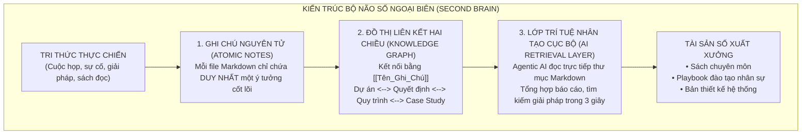

# CHƯƠNG 9: XÂY DỰNG BỘ NÃO SỐ NGOẠI BIÊN: KẾT HỢP MARKDOWN, PKM & AI

---

## 1. CÂU CHUYỆN CHIẾN TRƯỜNG (THE WAR STORY)

Tháng 4 năm 2026, một biến cố lớn xảy ra tại một công ty công nghệ y tế 60 người tại Hà Nội. Anh Kỹ sư trưởng kiêm Giám đốc Kỹ thuật (CTO) — người đã gắn bó 5 năm từ ngày đầu thành lập công ty — quyết định nộp đơn từ chức để sang định cư tại Canada.

Toàn bộ ban lãnh đạo rơi vào trạng thái tê liệt hoàn toàn. 

Lý do: Trong suốt 5 năm, toàn bộ kiến trúc hệ thống, logic kết nối các cổng thanh toán, cách xử lý các ca lỗi hóc búa, và các quyết định kỹ thuật sống còn... đều nằm trọn vẹn trong **bộ não sinh học của anh CTO**.

Họ mở máy tính của anh ra. Trong Google Drive và máy tính có khoảng 300 file Word, Google Docs nằm rải rác trong hàng chục thư mục con: `Tai_lieu_cu`, `Logic_tam_thoi`, `Ban_giao_2024`, `Note_chua_xong`. Không ai biết tài liệu nào là phiên bản mới nhất, không ai tìm thấy mối liên hệ giữa một lỗi phát sinh trên server với tài liệu giải pháp được viết cách đây 2 năm.

Công ty phải bỏ ra hơn 800 triệu đồng để thuê một đơn vị kiểm toán công nghệ vào "mò mẫm" lại toàn bộ hệ thống từ đầu trong suốt 6 tháng ròng rã.

Tổng Giám đốc nói trong cay đắng: *"Chúng tôi đã trả lương hàng trăm triệu mỗi tháng cho một nhân sự cấp cao, nhưng công ty không hề sở hữu một gram tài sản trí tuệ nào. Khi anh ấy bước chân ra khỏi cửa, toàn bộ tri thức của doanh nghiệp biến mất như một làn khói."*

Đây là căn bệnh nan y của 99% tổ chức hiện nay: **Sự thất thoát tri thức (Brain Drain)**. Con người đến rồi đi, nhưng nếu doanh nghiệp không có một **"Bộ Não Số Ngoại Biên" (External Second Brain)**, tổ chức sẽ mãi mãi là một đứa trẻ không bao giờ lớn, liên tục phải trả giá cho những bài học cũ.

---

## 2. BẮT BỆNH NGUYÊN LÝ GỐC (ROOT-CAUSE DIAGNOSIS)

Tại sao hầu hết các nỗ lực xây dựng "Kho tri thức công ty" (Knowledge Base) trên Word, Google Drive hay Notion đều nhanh chóng biến thành những "nghĩa địa tài liệu" bị lãng quên?

### 2.1. Lỗ hổng của Tư duy Thư mục phân cấp (The Folder Trap)
Bộ não con người không hoạt động theo kiểu cây thư mục: `Thư mục A $\rightarrow$ Thư mục con B $\rightarrow$ Thư mục con C`.
Não bộ con người hoạt động theo cơ chế **Mạng lưới Nơ-ron Liên kết (Associative Neural Network)**: Một ý tưởng về "Chính sách giá" sẽ liên kết với "Khách hàng VIP", đồng thời liên kết với "Quy trình duyệt hợp đồng", và liên kết với "Bài học từ sự cố quý trước".

Khi bạn ép một ý tưởng đa chiều vào một thư mục cứng nhắc duy nhất, bạn đã giết chết khả năng kết nối ngữ nghĩa của nó. Sau 3 tháng, chính người viết ra cũng không nhớ mình đã giấu file đó trong thư mục nào.

### 2.2. Cái bẫy "Định dạng Đóng" (Proprietary Lock-in)
Khi bạn viết tài liệu trên các nền tảng đóng:
- Nếu nền tảng đó tăng giá gấp 5 lần? Bạn bị cầm tù.
- Nếu mạng Internet bị mất hoặc nhà cung cấp khóa tài khoản? Toàn bộ tri thức biến mất.
- AI không thể quét và phân tích một cách cục bộ, bảo mật và siêu tốc trên hàng nghìn file tài liệu riêng tư của bạn.

```
       CÁCH QUẢN TRỊ TRI THỨC TRUYỀN THỐNG                   BỘ NÃO SỐ NGOẠI BIÊN (COMPANY OS PKM)
┌──────────────────────────────────────────────┐      ┌──────────────────────────────────────────────┐
│  • File Word / Google Docs đóng kín          │      │  • File thuần văn bản (Plaintext Markdown)   │
│  • Thư mục phân cấp sâu, dễ thất lạc         │  vs  │  • Liên kết mạng nhện hai chiều (Backlinks)  │
│  • Tri thức nằm phân mảnh trong đầu nhân sự  │      │  • Ghi chú nguyên tử (Atomic Notes)          │
│  • Phụ thuộc nền tảng đám mây bên thứ ba     │      │  • Lưu trữ cục bộ (Local-First), bảo mật 100%│
│  • AI khó tiếp cận hoặc tốn chi phí lớn      │      │  • AI quét tức thì hàng triệu từ trong vài giây
└──────────────────────────────────────────────┘      └──────────────────────────────────────────────┘
```

---

## 3. KHUNG KIẾN TRÚC GIẢI PHÁP (ARCHITECTURAL BLUEPRINT)

Để xây dựng một Bộ não số trường tồn, bạn cần kết hợp bộ ba: **Markdown + Quản trị Tri thức Cá nhân (Obsidian PKM) + Agentic AI**:



### 3 Nguyên tắc Vàng của Bộ Não Số Ngoại Biên:
1. **Nguyên lý Thuần văn bản (Plaintext Markdown - `.md`)**:  
   Dữ liệu được lưu dưới dạng file text đơn giản nhất trên ổ cứng của bạn. Nó có thể đọc được trên máy Mac, Windows, Linux, điện thoại, và quan trọng nhất: **Nó sẽ tồn tại 50 năm nữa mà không sợ bất kỳ công ty phần mềm nào phá sản**.
2. **Nguyên lý Ghi chú Nguyên tử (Atomic Concept)**:  
   Không viết những file dài 50 trang tổng hợp mọi thứ. Hãy chia nhỏ: Mỗi ghi chú chỉ giải quyết một khái niệm duy nhất (ví dụ: `[[Nguyen_ly_3NF]]`, `[[Quy_trinh_duyet_chiet_khau]]`, `[[Su_co_lech_kho_T9]]`). Sau đó, dùng cú pháp `[[...]]` để liên kết chúng lại với nhau.
3. **Cơ chế Cộng sinh với AI (AI-Augmented PKM)**:  
   Vì toàn bộ tri thức nằm dưới dạng Markdown cục bộ, các AI agents như Antigravity hay Claude có thể quét hàng triệu từ trong vài giây, tự động tìm ra các mối liên hệ ẩn mà não người đã lãng quên, và tự động soạn thảo sách hay tài liệu đào tạo từ chính ghi chú của bạn.

---

## 4. HƯỚNG DẪN DỰNG THỰC TẾ & PROMPTS AI (EXECUTION & PROMPTS)

### Cấu trúc Thư mục Vault Chuẩn mực của một Kiến trúc sư Hệ thống:
Trong dự án thực tế của tôi (nơi lưu trữ hơn 560,000 từ tri thức), tôi tổ chức theo cấu trúc tinh gọn gồm 5 thư mục:

```
📁 /My_Second_Brain/
├── 📁 00_Decisions/     # Biên bản ghi nhận quyết định kiến trúc (Architecture Decision Records - ADR)
├── 📁 01_Projects/      # Hồ sơ các dự án đang triển khai và bài học rút ra (Project Recaps)
├── 📁 02_Processes/     # Các quy chuẩn phê duyệt và SOP vận hành (Approval Queue)
├── 📁 03_Knowledge/     # Các khái niệm kỹ thuật và nguyên lý cốt lõi (Atomic Concepts)
└── 📁 04_Templates/     # Các biểu mẫu chuẩn để nhân bản nhanh
```

### 🤖 Prompt AI biến một cuộc họp hỗn loạn thành Ghi chú Nguyên tử Markdown:
```markdown
Dưới đây là bản ghi chép/bóc băng thô của một cuộc họp giải quyết sự cố vận hành:
[DÁN NỘI DUNG CUỘC HỌP THÔ VÀO ĐÂY]

Hãy đóng vai trò Kỹ sư Quản trị Tri thức (Knowledge Engineer):
1. Trích xuất quyết định cốt lõi đã được thống nhất dưới dạng Biên bản Quyết định Kiến trúc (ADR - Architecture Decision Record): Bối cảnh $\rightarrow$ Quyết định $\rightarrow$ Hệ quả.
2. Tách các bài học kinh nghiệm thành các Ghi chú Nguyên tử (Atomic Notes) bằng định dạng Markdown.
3. Đề xuất các liên kết hai chiều [[Tên_Khái_Niệm]] để kết nối ghi chú này vào mạng lưới tri thức doanh nghiệp.
```

---

## 5. BẢNG KIỂM NGHIỆM THU (PRACTITIONER'S CHECKLIST)

| STT | Tiêu chuẩn đánh giá Bộ não số ngoại biên | Đạt (Chuẩn PKM) | Chưa đạt |
| :-: | :--- | :-: | :-: |
| 1 | **Độc lập nền tảng**: Toàn bộ dữ liệu của bạn có được lưu trữ cục bộ dưới dạng file Markdown thuần túy không? | ⬜ 100% Cục bộ | 🟥 Kẹt trên đám mây |
| 2 | **Tốc độ truy xuất tri thức**: Khi gặp một sự cố cũ, bạn có tìm ra bài học giải pháp trong vòng 30 giây không? | ⬜ Dưới 30s | 🟥 Mất hàng giờ |
| 3 | **Khả năng kế thừa**: Nếu một nhân sự chủ chốt nghỉ việc, nhân sự mới có tự đọc mạng lưới ghi chú để nắm việc không? | ⬜ Kế thừa ngay | 🟥 Tê liệt công ty |
| 4 | **Khả năng AI thấu hiểu**: AI có thể đọc trực tiếp kho ghi chú để viết sách hoặc tạo tài liệu bàn giao tự động không? | ⬜ AI đọc mượt mà | 🟥 Không thể kết nối |
