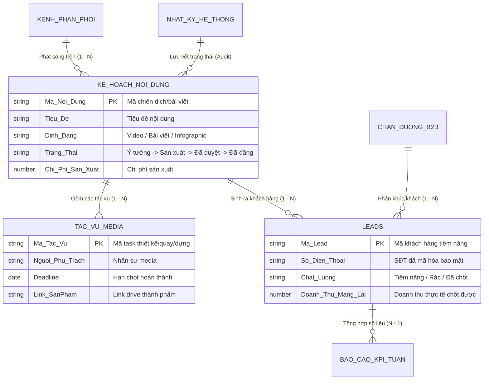

# CHƯƠNG 10: CASE STUDY 1 — SỐ HÓA VẬN HÀNH PHÒNG MARKETING & KÊNH BÁN HÀNG

---

## 1. CÂU CHUYỆN CHIẾN TRƯỜNG (THE WAR STORY)

Tháng 9 năm 2026, tôi bước vào văn phòng của một thương hiệu thời trang và mỹ phẩm phát triển nhanh với 15 nhân sự chuyên trách marketing tại Hà Nội. Trên bàn làm việc của Trưởng phòng Marketing là 3 cốc cà phê đã cạn và một bảng kế hoạch dán kín giấy nhớ màu vàng.

Cuộc họp giao ban đầu tuần bắt đầu lúc 8h30 sáng và kéo dài đến tận... 11h trưa. Toàn bộ thời gian cuộc họp trôi qua trong những cuộc đối thoại như thế này:
- *"Em ơi, video TikTok chiến dịch 10/10 quay xong chưa?"* $\rightarrow$ *"Dạ em quay xong rồi nhưng đang đợi bạn dựng video ghép nhạc ạ."*
- *"Thế bạn dựng video đâu?"* $\rightarrow$ *"Dạ hôm nay bạn ấy xin nghỉ ốm, file để trong máy cá nhân ở công ty không ai có pass ạ."*
- *"Còn bài viết Facebook hôm qua chạy ads được bao nhiêu số điện thoại?"* $\rightarrow$ *"Dạ em phải đợi bên Telesale xuất file Excel gửi sang thì em mới biết số nào là số thật, số nào là số rác ạ."*

Mỗi tháng công ty chi hơn 400 triệu đồng tiền quảng cáo trên Facebook và TikTok. Nhưng khi Tổng Giám đốc hỏi: *"Kênh nào mang lại tỷ suất lợi nhuận (ROAS) cao nhất và bài viết nào đang nuôi sống công ty?"*, không một ai trả lời được. 

Phòng Marketing đổ lỗi cho phòng Telesales chốt đơn kém; phòng Telesales đổ lỗi cho Marketing mang về số rác; còn đội ngũ Media và Content thì kiệt sức vì mỗi ngày phải làm hàng chục việc không tên nhưng không ai ghi nhận hiệu quả.

Họ không thiếu người tài. Họ thiếu một **Hệ Thống Dữ Liệu Vận Hành Marketing Khép Kín (Closed-Loop Marketing OS)**.

---

## 2. BẮT BỆNH NGUYÊN LÝ GỐC (ROOT-CAUSE DIAGNOSIS)

Tại sao hầu hết các phòng Marketing hiện nay đều rơi vào trạng thái "đốt tiền trong bóng tối"?

### Điểm gãy cốt lõi: Sự đứt gãy giữa 3 thế giới
Trong một phòng Marketing truyền thống, có 3 thế giới sống hoàn toàn tách biệt nhau:

```
┌───────────────────────────┐      ĐỨT GÃY      ┌───────────────────────────┐      ĐỨT GÃY      ┌───────────────────────────┐
│ 1. THẾ GIỚI SẢN XUẤT      │ ────────╳──────── │ 2. THẾ GIỚI PHÂN PHỐI     │ ────────╳──────── │ 3. THẾ GIỚI KINH DOANH    │
│ (Content, Media, Design)  │                   │ (Chạy Ads, Đăng bài)      │                   │ (Leads, Doanh thu, ROI)   │
│ • Quản lý trên Trello/Zalo│                   │ • Quản lý trên Ads Manager│                   │ • Quản lý trên Excel/CRM  │
└───────────────────────────┘                   └───────────────────────────┘                   └───────────────────────────┘
```

Vì 3 thế giới này không liên kết với nhau bằng một cơ sở dữ liệu quan hệ, ban lãnh đạo không thể nào biết được: **Một bài viết cụ thể của một bạn Content cụ thể đã mang về bao nhiêu tiền cho công ty**. Mọi đánh giá nhân sự đều dựa trên cảm tính ("bạn này chăm chỉ", "bạn kia nhiệt tình") thay vì con số kinh doanh thực tế.

---

## 3. KHUNG KIẾN TRÚC GIẢI PHÁP (ARCHITECTURAL BLUEPRINT)

Dưới đây là kiến trúc hệ thống thực tế mà tôi đã thiết kế và triển khai thành công cho đối tác (dựa trên cấu trúc chuẩn của hệ thống Base Marketing & Vận hành):

### Mô hình ERD 7 Bảng Khép Kín (The 7-Table Closed-Loop Architecture):



### 7 Bảng Nghiệp Vụ Cốt Lõi:
1. **`[DIM] Kênh Phân Phối & Tiếp Nhận`**: Quản lý các kênh phát sóng (Fanpage A, Kênh TikTok B, Website C, Kênh Bán buôn D).
2. **`[DIM] Chân Dung Khách Hàng B2B / Khách Mục Tiêu`**: Định vị các nhóm khách hàng mục tiêu để gán nhãn cho nội dung.
3. **`[FACT] Kế Hoạch & Lịch Nội Dung`**: Trục xương sống của phòng Marketing — quản lý toàn bộ các ý tưởng, bài viết, chiến dịch từ lúc thai nghén đến khi lên sóng.
4. **`[FACT] Tác Vụ Sản Xuất Media`**: Bảng phân rã chi tiết: Mỗi bài viết cần bao nhiêu ảnh, bao nhiêu video, ai quay, ai dựng, deadline mấy giờ.
5. **`[FACT] Khách Hàng Tiềm Năng (Leads)`**: Tích hợp tự động kéo số điện thoại từ quảng cáo hoặc form đăng ký về; liên kết trực tiếp với mã bài viết đã sinh ra lead đó.
6. **`[RP] Báo Cáo KPI Tuần`**: Bảng tổng hợp tự động bằng Rollup: Tuần này sản xuất bao nhiêu video? Mang về bao nhiêu lead? Tỷ lệ chốt đơn là bao nhiêu %?
7. **`[LOG] Nhật Ký Hệ Thống`**: Ghi vết ai duyệt bài, ai xuất bản, thời gian chính xác từng bước.

---

## 4. HƯỚNG DẪN DỰNG THỰC TẾ & PROMPTS AI (EXECUTION & PROMPTS)

### Quy trình 3 bước tự động hóa luồng Marketing:
1. **Tự động gắn mã UTM / Content Code**:  
   Mỗi bài viết trong bảng `Kế Hoạch Nội Dung` có một mã duy nhất: `CNT_2026_001`. Khi chạy quảng cáo, bắt buộc nhân viên phải gắn mã này vào link.
2. **Tự động liên kết Lead với Nội dung**:  
   Khi khách hàng điền form, webhook tự động đẩy dữ liệu vào bảng `Leads` kèm mã `CNT_2026_001`. Trường Link tự động kết nối khách hàng đó với bài viết ban đầu.
3. **Đo lường Doanh thu thực tế trên từng Content**:  
   Ở bảng `Kế Hoạch Nội Dung`, tạo trường Rollup:  
   `Doanh_Thu_Tao_Ra = SUM(Leads.Doanh_Thu_Mang_Lai)`  
   `ROI_Noi_Dung = ([Doanh_Thu_Tao_Ra] - [Chi_Phi_San_Xuat] - [Chi_Phi_Ads]) / ([Chi_Phi_San_Xuat] + [Chi_Phi_Ads])`.

Nhờ công thức này, sáng thứ Hai ban giám đốc chỉ cần mở BaseApp ra và thấy ngay: Bài viết nào có ROI dương cao nhất để tiếp tục bơm tiền quảng cáo!

---

## 5. BẢNG KIỂM NGHIỆM THU (PRACTITIONER'S CHECKLIST)

| STT | Tiêu chí đánh giá hệ thống Marketing khép kín | Đạt | Chưa đạt |
| :-: | :--- | :-: | :-: |
| 1 | **Đo lường đến từng bài viết**: Bạn có biết chính xác một video TikTok cụ thể đã mang về bao nhiêu doanh thu thực tế không? | ⬜ Đo được ngay | 🟥 Mù mờ số liệu |
| 2 | **Kiểm soát tiến độ sản xuất**: Trưởng phòng có nhìn thấy trạng thái của toàn bộ 30 video đang quay dựng trên một màn hình Kanban không? | ⬜ Thấy rõ ràng | 🟥 Phải đi hỏi từng người |
| 3 | **Báo cáo tự động**: Cuộc họp giao ban đầu tuần có cắt giảm được từ 2 tiếng xuống còn 15 phút nhờ số liệu tự nhảy không? | ⬜ Dưới 15 phút | 🟥 Vẫn họp 2 tiếng |
| 4 | **Đánh giá nhân sự minh bạch**: Bạn có thể khen thưởng nhân viên dựa trên doanh thu bài viết mang lại thay vì cảm tính không? | ⬜ Minh bạch 100% | 🟥 Theo cảm tính |
