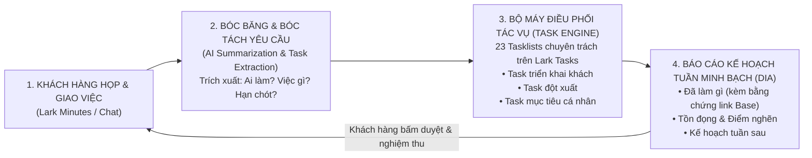

# CHƯƠNG 11: CASE STUDY 2 — ĐIỀU PHỐI DỰ ÁN KHÁCH HÀNG B2B DIỆN RỘNG

---

## 1. CÂU CHUYỆN CHIẾN TRƯỜNG (THE WAR STORY)

Tháng 9 năm 2026 là thời điểm cao điểm nhất trong sự nghiệp tư vấn của tôi. Trên hệ thống Lark IM của tôi có **65 nhóm chat dự án doanh nghiệp đang hoạt động song song**: từ các thương hiệu thời trang, chuỗi F&B, tập đoàn bất động sản cho đến các công ty sản xuất cơ khí.

Mỗi ngày, trung bình có khoảng 150 tin nhắn yêu cầu hỗ trợ, 5 cuộc họp tư vấn giải pháp trực tuyến (Lark Minutes), và hàng chục đầu việc phát sinh liên tục:
- Khách hàng A muốn thêm trường tính hoa hồng.
- Khách hàng B báo lỗi phân quyền nhân viên kho.
- Khách hàng C yêu cầu đào tạo gấp cho 20 nhân sự mới vào sáng mai.

Nếu theo cách làm việc truyền thống của hầu hết các công ty dịch vụ hiện nay (dùng nhóm chat Zalo, lưu ghi chú trên sổ tay hoặc giao việc bằng miệng), bạn sẽ rơi vào một cơn ác mộng kinh hoàng:
- Tin nhắn bị trôi sau 2 tiếng.
- Lời hứa với khách hàng bị lãng quên: *"Anh đợi em chút em kiểm tra"* $\rightarrow$ rồi 3 ngày sau khách hàng cáu giận đòi hủy hợp đồng vì không thấy hồi âm.
- Đội ngũ kỹ thuật kiệt sức vì không biết việc nào khẩn cấp, việc nào quan trọng, dẫn đến làm việc trong tâm trạng hoảng loạn tột cùng.

Nhưng trong suốt 18 tháng điều phối 65 khách hàng đó, tôi đã duy trì một chỉ số thực thi gần như không tưởng: **Hoàn thành 524/525 nhiệm vụ cam kết — đạt tỷ lệ 99.8%** mà không cần một đội ngũ trợ lý cồng kềnh.

Làm thế nào một người (hoặc một đội ngũ siêu tinh gọn) có thể điều phối hàng chục dự án B2B cùng lúc mà không bị trôi bất kỳ đầu việc nào? Bí mật nằm ở **Vòng lặp Vận hành Dự án Tự động hóa (The Closed-Loop Delivery Engine)**.

---

## 2. BẮT BỆNH NGUYÊN LÝ GỐC (ROOT-CAUSE DIAGNOSIS)

Tại sao hầu hết các dự án triển khai B2B đều bị chậm tiến độ, đội chi phí và làm khách hàng thất vọng?

### Căn bệnh "Ảo tưởng Nhóm Chat" (The Group Chat Trap)
Rất nhiều công ty coi "Nhóm chat" là công cụ quản lý dự án. Đây là một sai lầm chết người.

Nhóm chat (Chat Stream) là dòng chảy thông tin tuyến tính tạm thời (Ephemeral Stream). Nó sinh ra để **thảo luận tức thời**, không phải để **quản trị cam kết**. Khi bạn nhận một đầu việc từ khách hàng trên nhóm chat mà không biến nó thành một **Đối tượng Tác vụ có cấu trúc (Task Object)** trong vòng 60 giây:
- Quả bóng trách nhiệm sẽ rơi xuống đất.
- Khách hàng nghĩ bạn đang làm; bạn nghĩ khách hàng chưa chốt; và dự án trôi đi vô thời hạn.

```
       CÁCH QUẢN TRỊ DỰ ÁN TRUYỀN THỐNG                       VÒNG LẶP GIAO HÀNG ĐÓNG (DELIVERY ENGINE)
┌──────────────────────────────────────────────┐      ┌──────────────────────────────────────────────┐
│  • Chat Zalo/Lark trôi nổi                   │      │  • Cuộc họp Minutes tự động bóc băng yêu cầu │
│  • Giao việc bằng lời nói, sổ tay cá nhân    │  vs  │  • Tự động sinh Task Object có deadline & SLA│
│  • Khách hàng sốt ruột hỏi: "Tới đâu rồi em?"│      │  • Báo cáo kế hoạch tuần (DIA) tự động       │
│  • Dự án trễ hạn, đổ lỗi cho nhau            │      │  • Khách hàng bấm nút duyệt tiến độ minh bạch│
└──────────────────────────────────────────────┘      └──────────────────────────────────────────────┘
```

---

## 3. KHUNG KIẾN TRÚC GIẢI PHÁP (ARCHITECTURAL BLUEPRINT)

Để kiểm soát 65 dự án song song với tỷ lệ hoàn thành 99.8%, tôi xây dựng **Hệ thống Quản trị Dự án 4 Trục Khép Kín**:



### Kiến trúc 23 Tasklists Chuyên Trách:
Thay vì dồn toàn bộ 500 việc vào một danh sách dài vô tận, tôi phân bổ thành các **Ngăn kéo Tác vụ (Task Buckets)** rõ ràng:
- `Bucket 1: Task triển khai cho khách (Khẩn cấp & Tạo doanh thu)`: Chia theo từng khách hàng trọng điểm.
- `Bucket 2: Task hành chính & Nội bộ`: Xử lý hợp đồng, thanh toán.
- `Bucket 3: Task R&D & Kiến trúc`: Nghiên cứu công nghệ mới, nâng cấp custom skills.
- `Bucket 4: Task đột xuất (Buffer)`: Dành riêng cho các sự cố phát sinh cần xử lý dưới 2 tiếng.

---

## 4. HƯỚNG DẪN DỰNG THỰC TẾ & PROMPTS AI (EXECUTION & PROMPTS)

### Quy trình 3 bước "Không để lọt một việc" (Zero-Task-Drop Routine):

1. **Quy tắc 60 Giây từ Chat sang Task**:  
   Bất kỳ khi nào khách hàng nhắn một yêu cầu trên nhóm chat (ví dụ: *"Nhờ em chỉnh lại công thức cột hoa hồng"*), tôi lập tức dùng tính năng **Create Task from Message** trên Lark IM:
   - Gán deadline cụ thể (ví dụ: 17h00 chiều nay).
   - Gán mức độ ưu tiên (High / Normal).
   - Thả lại một reaction biểu tượng `Đã ghi nhận` để khách hàng yên tâm.
2. **Kỹ thuật Bóc băng Cuộc họp Tự động (Minutes to Tasks)**:  
   Sau mỗi phiên họp tư vấn 60 phút trên Lark Minutes, AI tự động quét toàn bộ bản ghi âm và trích xuất danh sách **Action Items**:
   - Việc gì cần làm?
   - Ai là người chịu trách nhiệm phía khách hàng? Ai chịu trách nhiệm phía tôi?
   - Thời hạn bàn giao là ngày nào?
3. **Báo cáo Tuần 3 Thành phần (Mandatory Checkpoint Report)**:  
   Vào 17h00 chiều thứ Sáu hàng tuần, một tin nhắn báo cáo tự động được gửi vào nhóm khách hàng theo cấu trúc chuẩn:
   - 🎯 **Đã hoàn thành trong tuần**: Kèm link bảng Base thực tế để khách kiểm tra.
   - ⚠️ **Điểm nghẽn & Đang chờ**: Nêu rõ khách hàng cần cung cấp thêm thông tin gì.
   - 🚀 **Kế hoạch tuần tới**: Danh mục 3 việc trọng tâm tuần sau.

---

## 5. BẢNG KIỂM NGHIỆM THU (PRACTITIONER'S CHECKLIST)

| STT | Tiêu chí đánh giá năng lực điều phối dự án | Đạt (Chuẩn 99%) | Rủi ro |
| :-: | :--- | :-: | :-: |
| 1 | **Chuyển hóa 100% yêu cầu**: Có yêu cầu nào của khách hàng nằm im trong tin nhắn chat mà không được chuyển thành Task không? | ⬜ 100% thành Task | 🟥 Bị trôi trong chat |
| 2 | **Tỷ lệ đúng hạn (On-time Delivery)**: Tỷ lệ hoàn thành công việc đúng hạn của bạn có đạt trên 95% không? | ⬜ Đạt trên 95% | 🟥 Dưới 80% |
| 3 | **Minh bạch tiến độ**: Khách hàng có tự xem được tiến độ dự án mà không cần phải nhắn tin hỏi dồn dập không? | ⬜ Tự xem được | 🟥 Liên tục bị giục |
| 4 | **Bằng chứng nghiệm thu**: Mọi đầu việc khi báo cáo "Đã xong" có luôn đi kèm link bằng chứng thực tế không? | ⬜ Luôn có link | 🟥 Chỉ nói bằng mồm |
