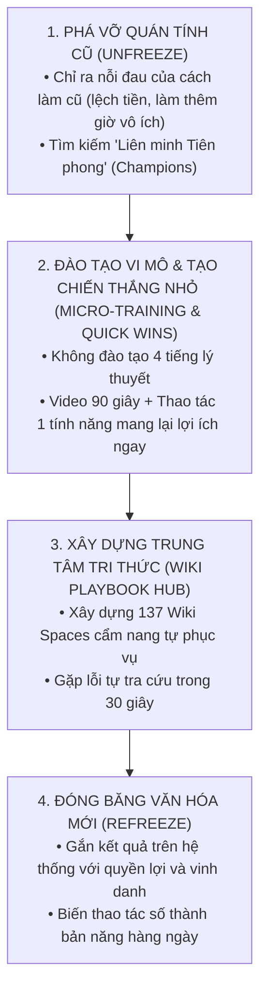

# CHƯƠNG 12: BỘ PLAYBOOK BÀN GIAO & CHUYỂN DỊCH VĂN HÓA SỐ DOANH NGHIỆP

---

## 1. CÂU CHUYỆN CHIẾN TRƯỜNG (THE WAR STORY)

Tháng 10 năm 2026, tại một doanh nghiệp phân phối thiết bị gia dụng 80 người ở TP.HCM. Hệ thống Company OS trên Lark Base đã được đội ngũ kỹ thuật dựng xong một cách hoàn hảo: 
- 8 bảng dữ liệu quan hệ được chuẩn hóa 100%.
- Tự động hóa liên kết từ đơn hàng đến kho vận và hoa hồng nhân viên.
- Toàn bộ các bài test kỹ thuật (UAT) đều chạy mượt mà không một hạt sạn.

Vào ngày công bố chuyển đổi toàn công ty, Tổng Giám đốc đứng trước toàn thể nhân viên tuyên bố dõng dạc: *"Từ ngày mai, toàn bộ công ty cấm dùng Zalo và Excel. Mọi người bắt buộc phải nhập liệu 100% trên hệ thống mới. Ai không làm sẽ bị trừ lương!"*

Kết quả của "mệnh lệnh hành chính" đó là gì?
- Ngày thứ nhất: Nhân viên nhăn nhó, vào hệ thống gõ vài chữ đối phó.
- Ngày thứ năm: Bắt đầu có những lời xì xào: *"Hệ thống này rắc rối quá, làm mất thời gian, không nhanh bằng chat Zalo."*
- Tuần thứ ba: Nhân viên ngấm ngầm tạo lại các nhóm Zalo "chui" để trao đổi công việc. Họ chỉ lên hệ thống mới nhập liệu vào chiều thứ Sáu để sếp không trừ lương. Dữ liệu trên hệ thống bị trễ 5 ngày so với thực tế và trở thành "dữ liệu chết".

Anh Giám đốc gọi cho tôi trong tâm trạng bất lực cùng cực: *"Anh đã mua công cụ tốt nhất, thuê chuyên gia giỏi nhất, ra chỉ thị sắt đá nhất. Tại sao nhân viên của anh lại chống đối và thù ghét chuyển đổi số đến như vậy?"*

Tôi nhìn anh và nói chân thành: *"Bởi vì anh đã quên mất một điều cốt tử: **Công nghệ là khoa học chính xác, nhưng áp dụng công nghệ vào doanh nghiệp là nghệ thuật tâm lý học hành vi**. Anh đang ép họ từ bỏ một thói quen 5 năm chỉ bằng một văn bản hành chính."*

---

## 2. BẮT BỆNH NGUYÊN LÝ GỐC (ROOT-CAUSE DIAGNOSIS)

Tại sao sự kháng cự thay đổi (Change Resistance) luôn là "sát thủ số một" giết chết mọi dự án chuyển đổi số?

### 2.1. Nỗi sợ vô thức của Người lao động
Khi ban giám đốc mang một hệ thống mới về, phản xạ đầu tiên của 90% nhân viên không phải là sự hào hứng. Phản xạ đầu tiên của họ là **NỖI SỢ**:
1. **Sợ bị kiểm soát và mất quyền lực ngầm**: Trước đây dữ liệu nằm trong tay họ, sếp muốn biết phải hỏi họ. Bây giờ hệ thống minh bạch từng giây, họ sợ bị lộ những khoảng thời gian lãng phí hoặc những sai sót thường ngày.
2. **Sợ bị coi là kém cỏi**: Những nhân sự lớn tuổi hoặc quen với thao tác cũ sợ rằng mình không học kịp công nghệ mới và sẽ bị đào thải.
3. **Cảm giác "tăng thêm việc nhưng không tăng lương"**: Họ nghĩ: *"Trước đây em chat Zalo 3 giây là xong, bây giờ bắt em mở app, chọn dropdown, bấm 5 nút, tại sao em phải khổ như vậy?"*

Nếu bạn không giải quyết được 3 nỗi sợ này, không một hệ thống công nghệ nào trên thế giới có thể sống sót trong doanh nghiệp của bạn.

---

## 3. KHUNG KIẾN TRÚC GIẢI PHÁP (ARCHITECTURAL BLUEPRINT)

Để chuyển dịch văn hóa làm việc thành công, bạn cần áp dụng **Mô hình Chuyển đổi 4 Giai đoạn (The 4-Stage Culture Shift Framework)** dựa trên nguyên lý của Kurt Lewin kết hợp với Phương pháp luận Company OS:

### 3 Trụ cột Bàn giao Vững chắc:
1. **Chiến lược "Liên minh Tiên phong" (The Champion Strategy)**:  
   Đừng cố gắng thuyết phục 100% nhân viên cùng lúc. Hãy chọn ra 2-3 bạn trẻ nhanh nhạy, nhiệt tình nhất trong phòng ban. Hướng dẫn kỹ cho họ, để họ dùng thử và thấy sướng trước. Khi đồng nghiệp thấy bạn bên cạnh làm việc nhàn hơn, về sớm hơn nhờ hệ thống mới, hiệu ứng lan tỏa tích cực sẽ tự động diễn ra.
2. **Đào tạo Vi mô (Micro-Learning)**:  
   Cấm tuyệt đối các buổi đào tạo lý thuyết kéo dài 3 tiếng vào chiều thứ Bảy. Không ai nhớ nổi. Hãy chia nhỏ thành các video màn hình **dưới 90 giây**: *Cách tạo 1 đơn hàng*, *Cách bấm nút xin nghỉ phép*, *Cách tra cứu tồn kho*.
3. **Trung tâm Tri thức Tự phục vụ (Self-Service Wiki Playbook)**:  
   Toàn bộ quy chuẩn bàn giao phải được đóng gói lên hệ thống Wiki (như mạng lưới 137 Wiki Spaces mà tôi đã xây dựng). Nhân viên mới vào chỉ cần đọc Wiki là có thể tự vận hành công việc trong 48 giờ mà không cần làm phiền người cũ.

---

## 4. HƯỚNG DẪN DỰNG THỰC TẾ & PROMPTS AI (EXECUTION & PROMPTS)

### Cấu trúc Bộ Playbook Bàn giao Chuẩn 5 Phần trên Lark Wiki:
Một trang cẩm nang bàn giao chuẩn mực cho một phòng ban bao gồm:
1. **Mục tiêu & Lợi ích cho chính nhân viên**: Hệ thống này giúp bạn tiết kiệm 1 tiếng mỗi ngày như thế nào?
2. **Quy trình 3 bước (Happy Path)**: Thao tác chuẩn từ A đến Z khi không có sự cố.
3. **Checklist tự kiểm tra trước khi gửi**: Tránh sai sót thường gặp.
4. **Xử lý sự cố thường gặp (FAQ & Troubleshooting)**: *"Nếu bấm nút duyệt bị báo lỗi thì làm thế nào?"*
5. **Video thị phạm 60 giây (Screen Recording)**: Quay trực tiếp thao tác thực tế trên màn hình.

---

## 5. BẢNG KIỂM NGHIỆM THU (PRACTITIONER'S CHECKLIST)

| STT | Tiêu chí đánh giá mức độ chuyển dịch văn hóa số | Đạt (Thành công) | Thất bại |
| :-: | :--- | :-: | :-: |
| 1 | **Tỷ lệ tự nguyện sử dụng**: Nhân viên có tự giác mở hệ thống làm việc mỗi sáng mà không cần sếp nhắc nhở không? | ⬜ Trên 90% | 🟥 Dưới 50% |
| 2 | **Tốc độ hòa nhập nhân sự mới (Onboarding)**: Một nhân viên mới vào có tự đọc Wiki và làm đúng việc trong 2 ngày không? | ⬜ Trong 2 ngày | 🟥 Mất cả tháng |
| 3 | **Khai tử thói quen cũ**: Các nhóm chat Zalo giao việc hoặc file Excel chui đã được xóa bỏ hoàn toàn chưa? | ⬜ Đã xóa sổ | 🟥 Vẫn dùng ngầm |
| 4 | **Nụ cười của người thực thi**: Nhân viên có cảm thấy công việc của họ bớt áp lực và minh bạch hơn không? | ⬜ Hài lòng cao | 🟥 Bức xúc than phiền |
